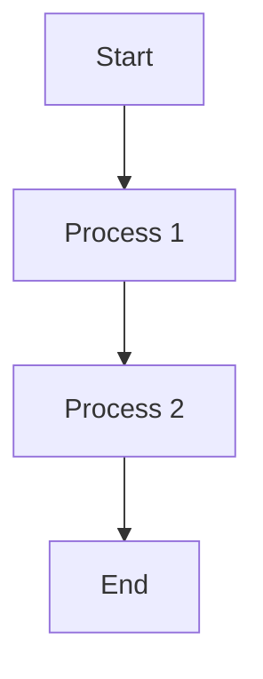
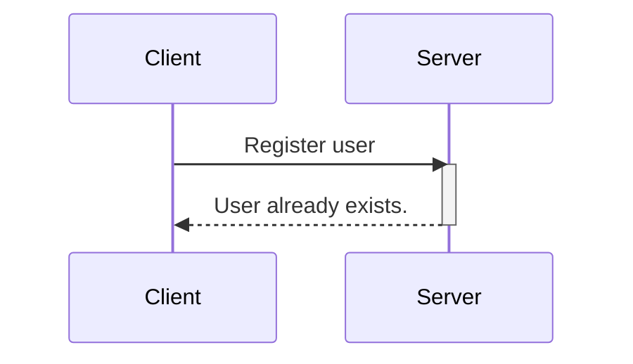
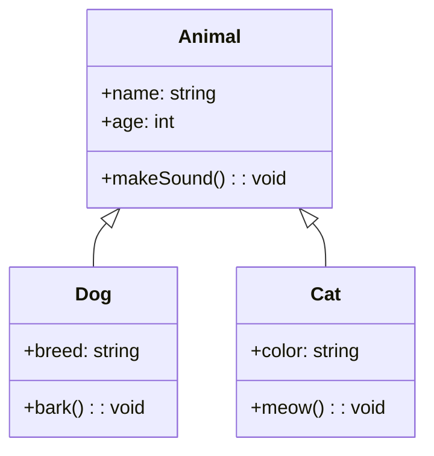
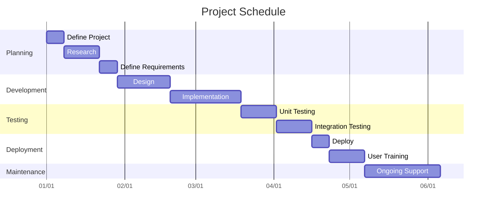
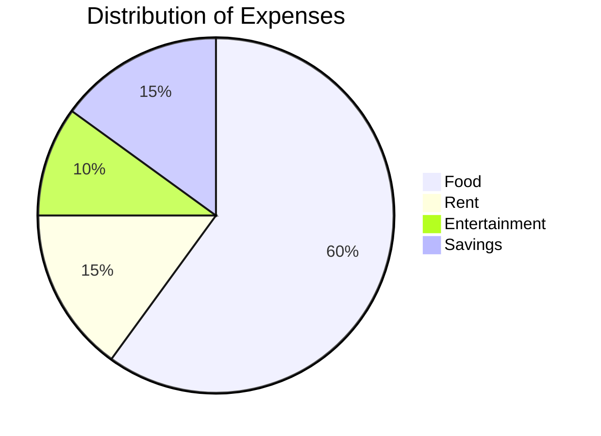

Diagrams are an important part of technical documentation. In this article we will explore how we can use code to generate diagrams and leverage them in Markdown.

Here is an example of how a code generated diagram looks like:


*Diagram generated by code*

No tools, no dragging, aligning and snapping shapes to places. Just code. Interesting right?

## Pre-requisites

To follow along with this tutorial, you should have the following:

* A basic understanding of Markdown. Have a look at [this guide](https://www.freecodecamp.org/news/markdown-cheat-sheet/) if you aren't familiar with Markdown.
    
* Visual Studio Code with a Markdown previewing extension (covered in detail in coming sections).
    
* GitHub, to understand how you can render diagrams there.
    

## Advantages of Generating Diagrams as Code

There are several advantages of generating diagrams as code rather than using traditional methods to manually 'create' diagrams. Let's see some of them:

* **Dynamic**: Code-generated diagrams are dynamic which means that you can easily update them by updating the code.
    
* **Editable**: With code-generated images, you are not relying on complex image generating tools. You can simply edit the code in a text editor and get an updated image.
    
* **Efficient**: Code-generated images are fast to load compared to static images. Also you don't need to host them separately as an image in your website.
    
* **Quick to create**: You can use a template and quickly come up with diagrams just using code. You don't need to invest the time and effort in learning image creation tools, that are usually overwhelming to start with.
    

## How to Render and View Mermaid Code

There are several ways you can create and view Mermaid diagrams.

### VSCode

First, install a Markdown previewer that has the support for Mermaid. Here is an example of such an extension: [Markdown Preview Mermaid Support](https://marketplace.visualstudio.com/items?itemName=bierner.markdown-mermaid).

Create an empty Markdown file using the extension `.md`. Write your code in this file and open the preview on the right pane:


*Code and preview in VSCode*

### StackEdit

[StackEdit](https://stackedit.io/) is an online, browser-based Markdown previewer. It provides an editor window and a preview on the right side.


*Code and preview in StackEdit*

### GitHub

You can add Mermaid diagrams to create compelling README files in GitHub. Simply edit the `README.md` or any other Markdown file in GitHub to render Mermaid diagrams.


*Edit code in GitHub*


*View and render Mermaid diagram in GitHub*

## How to Generate Diagrams as Code with Mermaid

Mermaid is a JavaScript-based tool that transforms Markdown-style text into dynamic diagrams, allowing you to create and modify them effortlessly.

Mermaid makes it easy to generate diagrams and visuals using simple text and code.

It follows a simple syntax:

````bash
```mermaid
	your code goes here
    .
    .
    .
 
```
````

With Mermaid, you can generate the following diagram types:

* Flowchart
    
* Sequence Diagram
    
* Class Diagram
    
* Gantt
    
* Pie Chart
    

Let's explore them one by one.

### How to Create a Flowchart

A flowchart is a picture that shows the steps of a process using symbols, helping to explain the process in a clear and organized way. A flow chart is composed of nodes that are connected by arrows.

You can render flowcharts in mermaid using this example:

````bash

````

**Result:**


*Flowcharts in mermaid*

**Syntax breakdown:**

* `flowchart`: This keyword tells that we are creating a flowchart.
    
* `TD`: this is the orientation of the flowchart and stands for Top to Down. The other FlowChart orientations are:  
    – `TB` - Top to bottom,same as TD.  
    – `BT` - Bottom to top  
    – `RL` - Right to left  
    – `LR` - Left to right
    
* `-->`: The direction of the arrow connecting the nodes.
    

### **How to Create a Sequence Diagram**

A sequence diagram is an illustrative representation of interactions between processes, demonstrating their operational flow and the sequence of execution.

You can render sequence diagrams in mermaid using this syntax:

````bash

````

**Result:**


*Sequence diagram in mermaid*

**Syntax breakdown:**

* `sequenceDiagram`: This keyword specifies that we are making a sequence diagram.
    
* `participant`: These are the participants or the actors in a sequence diagram.
    
* `activate/ deactivate`: It is possible to activate and deactivate an actor. Activation shows as a small rectangle between interactions.
    
* `-->>`: Connecting lines (dashed).
    
* `->`: Connecting lines (solid).
    

### **How to Create a Class Diagram**

Class diagrams are used to visualize the structure and relationships of classes, interfaces, and their interactions in object-oriented programming (OOP). You can render class diagrams in Mermaid using this syntax:

````bash

````

**Result:**


*Class diagram in mermaid*

**Syntax breakdown:**

* Defining classes: An individual class is defined with the `class` keyword followed by the class name.
    
* Adding class properties: Class properties are added with a `+` sign. In the example above, `+breed` is a property.
    
* Adding methods: Methods are recognized by mermaid using `()`, the round braces. Note that all the properties and methods are grouped under the same class using curly braces.
    
* Defining return types: Return types are defined after the method name/ class name. `string` and `void` are the return types in the above code.
    
* Defining relation ships: In OOP, relationships are the specific types of logical connections found on class and object diagrams. The following relationship types are supported in mermaid:
    

| **Type** | **Description** |
| --- | --- |
| &lt;|-- | Inheritance |
| \*-- | Composition |
| o-- | Aggregation |
| \--&gt; | Association |
| \-- | Link (Solid) |
| ..&gt; | Dependency |
| ..|&gt; | Realization |
| .. | Link (Dashed) |

Here is a quick implementation of inheritance:


*Inheritance*

### **How to Create a Gantt Chart**

A Gantt chart serves as a visual representation in the form of a bar chart. It effectively showcases a project's timeline, revealing the duration required for individual project components to reach completion.

You can render Gantt charts in Mermaid using this example:

````bash

````

**Result:**


*Gantt charts in mermaid*

**Syntax breakdown:**

* `gantt` specifies that you want to render a Gantt chart in mermaid.
    
* `title`represents the project title.
    
* `dateFormat YYYY-MM-DD` is the input date format for the chart.
    
* `axisFormat %m/%d` represents the shown date format, the output date, in the x-axis.
    
* `section` is used to separate different parts of the project.
    

The x axis represents time and the y records the different tasks and the order in which they are to be completed.

### **How to Create a Pie Chart**

A pie chart, also known as a circle chart, is a round visual representation used for displaying statistical data. It is divided into segments or slices to visually convey the numerical proportions of different categories or values.

Here is an example to create a pie chart in mermaid:

````bash

````

**Result:**


*Pie charts in mermaid*

**Syntax breakdown:**

In this example:

* `pie` indicates that we are creating a pie chart.
    
* `title` sets the title for the pie chart.
    
* The items in double quotes represent the categories (e.g., "Food," "Rent," "Entertainment," "Savings").
    
* The numbers after the colons represent the proportions or percentages for each category. In this case, "Food" occupies 60% of the chart, "Rent" 15%, "Entertainment" 10%, and "Savings" 15%.
    

## **Wrapping up**

In this article, we just scratched the surface of rendering diagrams in Mermaid. The diagrams are highly customizable and allow you to create very complex diagrams as well.

Mermaid supports even more types of diagrams that are not mentioned in this tutorial. To learn more about Mermaid, check out their [official documentation](https://web.archive.org/web/20240526110100/http://mermaid.js.org/).

I hope you found this article helpful. I would love to connect with you on any of these [platforms](https://web.archive.org/web/20240526110100/https://zaira_.bio.link/).

See you in the next tutorial, happy coding 😁
