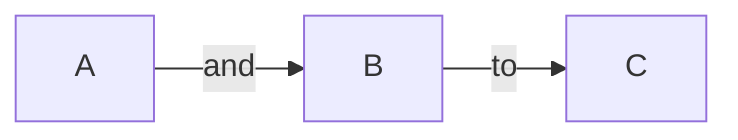

[Markdown](https://en.wikipedia.org/wiki/Markdown) is a lightweight, open-source, easy-to-read and easy-to-write method of formatting text that you can use as plain text in any IDE or editor.

When writing on GitHub, you can use Markdown syntax and HTML elements to extend Markdown's functionality. You can use Markdown syntax everywhere in GitHub, such as in the README file, wiki, comments, pull requests, and when creating issues.

For every software developer, learning markdown is an essential step along the path of your career.

To enhance Markdown's basic features, GitHub added some custom functionalities and created [GitHub-Flavored Markdown](https://docs.github.com/en/get-started/writing-on-github/getting-started-with-writing-and-formatting-on-github/about-writing-and-formatting-on-github). With this, you can easily interact with other users in pull requests and issues by mentioning user, issue, and PR references and adding emoji.

This tutorial teaches you the basics of GitHub-Flavored Markdown so you can start using it in your projects.

All the code is [available in the GitHub repository](https://github.com/officialrajdeepsingh/github-tutorial).

## GitHub-Flavored Markdown Syntax

GitHub Flavored Markdown syntax is divided into two parts.

1. [Basic Formatting Syntax](#basis-formatting-syntax)
2. [Advanced Formatting Syntax](#heading-advanced-formatting-syntax)

We'll look at each one in detail below.

### Basic Formatting Syntax

Basic formatting syntax applies to everyone. It contains fundamental essentials such as headings, code, images, quotes, links, and so on – things you'll need to know for writing.

1. [Headings](#heading-headings)
2. [Paragraphs](#heading-paragraphs)
3. [Comment](#comment)
4. [Styling text](#heading-styling-text)
5. [Quotes](#heading-quotes)
6. [Code](#heading-code)
7. [Links](#heading-links)
8. [Images](#heading-images)
9. [Lists](#heading-lists)
10. [Mentioning people and teams](#heading-mentioning-people-and-teams)
11. [Referencing issues and pull requests](#heading-referencing-issues-and-pull-requests)
12. [Using emojis](#using-emojis)
13. [Footnotes](#heading-footnotes)
14. [Alerts](#heading-alerts)

Note that the code samples mostly come from [GitHub's documentation](https://docs.github.com/en/get-started).

### Headings

You can use the `#` symbol to create headings. One `#` creates an H1 heading, two create an H2 heading, and so on, like this:

```markdown
# A first-level heading
## A second-level heading
### A third-level heading
#### A four-level heading
##### A five-level heading
###### A six-level heading
```

### Paragraphs

To create paragraphs, you can use a blank line to separate one or more lines of text or paragraphs.

```markdown
Lorem ipsum dolor sit amet, consectetur adipiscing elit. Etiam est odio, commodo id diam sed, pulvinar sagittis tortor. Nam vestibulum purus eros. Sed congue, mi id pretium auctor, nibh augue iaculis arcu, eu tristique quam dolor at erat.

Quisque vel odio condimentum, mollis sem vitae, porta diam. Praesent ligula elit, condimentum eget ex sed, commodo sollicitudin sapien.


Proin volutpat faucibus nulla. Nullam eros sem, ultricies gravida nunc nec, dapibus posuere nisl. Nunc lacinia elementum turpis in pharetra. Aenean eu neque eros.

```

### Comments

Comments are available in almost every programming language. They help developers write notes and add additional information to their code, helping other developers understand what's going on and how the code is working.

To add notes and additional information in Markdown, use the following syntax: `<!--- Wrap text --->`.

Here's an example:

```markdown
<!-- This content will not appear in the rendered Markdown -->

```

### Styling text

You can apply basic styles to your text, such as bold, italic, strikethrough, subscript, or superscript, to improve readability and convey your point more clearly.

1. For **Bold**, you can use the following syntax:  `**your text**`
2. For **_italics_**, you can use the following syntax:  `*your text* or _your text_.`
3. For **strikethrough**, you can use the following syntax: `~~your text~~`
4. For **subscript**, you can use the following syntax:  `The subscript <sub> text </sub> is here.`
5. For **superscript**, you can use the following syntax:  `The superscript <sup> text </sup> is here.`

```markdown
## Bold

**your text**

## italics

*your text*
_your text_

## strikethrough

~~your text~~

## subscript

The subscript <sub> text </sub> is here.

## superscript

The subscript <sup> text </sup> is here.

```

### Quotes

A blockquote or quote is a sentence or paragraph formatted to let the reader know that you're quoting someone. To create a blockquote in Markdown, you can use the `>` symbol.

```markdown
> Text that is a quote

```

### Code

Markdown files support two types of code samples: **inline** and **code block**.

1. To add a code block in a Markdown file, use the following syntax: ` ``` your code ``` `.
2. To add inline code to the Markdown file, use the following syntax: `` `your code` ``.

```markdown
## Code Block

```
// ES5 syntax
var multiply = function(x, y) {
  return x * y;
};

// ES6 arrow function
var multiply = (x, y) => { return x * y; };

// Or even simpler
var multiply = (x, y) => x * y;
```

## Inline code 

JavaScript provides three different value comparison operations: strict equality using `===`, loose equality using `==`, and the `Object.is()` method.


```

To support code highlighting in a code block, you can add an optional language identifier after your triple backticks (like JavaScript in the example below):

```markdown
## Code Block

```javascript

// ES5 syntax
var multiply = function(x, y) {
  return x * y;
};

// ES6 arrow function
var multiply = (x, y) => { return x * y; };

// Or even simpler
var multiply = (x, y) => x * y;   

```
```

### Links

A markdown file divides links into two categories: **inline** and **relative**.

#### Inline links

To create an inline link in a Markdown file, wrap the link text in brackets `[ ]` followed immediately by the URL in parentheses `( )`.

```markdown
This site was built using [GitHub Pages](https://pages.github.com/).


```

#### Relative links

Relative links are defined similarly to inline links but they change in the `[]` section: the `[]` section contains the path of the file in your repository. 

You use relative links to link two files: for example, to link the CONTRIBUTING file into the README file.

```markdown
[Contribution guidelines](docs/CONTRIBUTING.md)
```

Relative links starting with `/` will be relative to the repository root. You can use all relative link operands, such as `./` and `../.`:

```markdown
[Contribution guidelines](../docs/CONTRIBUTING.md)
```

### Images

To add an image in a markdown file, add a `!` and then wrap the alt text in `[]`. Then, wrap the image link with parentheses `()`.

It looks like this:

```markdown


```

### Lists 

A list helps record essential information in order, which can be vital for the reader and makes it easy for people to understand and find information. 

Markdown files support three types of lists:

1. Ordered list
2. Unordered list
3. Task list

#### Ordered list

The first type is an ordered list. To create an ordered list, start with numbers followed by periods.

```markdown
1. one
2. two
3. three
4. four
```

#### Unordered list

The second type is an unordered list. To create an unordered list, use `-`, `+` or `*` (depending on your preference - they'll all render as an unordered list):

```markdown
* First item
* Second item
* Third item
* Fourth item


- First item
- Second item
- Third item
- Fourth item

+ First item
+ Second item
+ Third item
+ Fourth item
```

#### Task list

The third type is a task list. To create a task list, list items start with a hyphen, followed by a space, followed by square brackets `[]`. You can use an `x` in the bracket `[x]` to mark a task as complete.

```markdown
- [x] #739
- [ ] https://github.com/octo-org/octo-repo/issues/740
- [ ] Add delight to the experience when all tasks are complete :tada:
```

### Mentioning people and teams


_Mentioning users and teams in markdown_

To mention a person or team in a GitHub markdown file, type `@`  and write the username or team username.

```markdown
## person or individual username

@officialrajdeepsingh, check out the following change.

## Team or company
The section blog theme is maintained by @frontendweb 
```

### Referencing issues and pull requests


_Issues and pull requests_

To mention issues and pull requests in a GitHub markdown file, type a `#`, then type the issue or pull request number or title. Then press either tab or enter to complete the highlighted result.

```markdown
Remove the default _target blank in logo #93
```

### Using emoji


_Adding emoji in markdown._

To add an emoji to your writing, type the emoji's code between two colons. If you just type `:`, a list of suggested emojis on GitHub will appear. 

Once you find the emoji you're looking for, press Tab or Enter to choose the highlighted result.

```markdown
Don't forget to leave a star on our repository! :star:
```

### Footnotes

To add a footnote reference, add a caret and an identifier inside brackets `([^1])` using the following syntax:

```markdown
Here's a simple footnote,[^1] and here's a longer one.[^bignote]

[^1]: This is the first footnote.

[^bignote]: Here's one with multiple paragraphs and code.
```

### Alerts

Alerts are a Markdown extension based on the block quote syntax that you can use to emphasize important information.

GitHub Flavored Markdown supports five types of alerts: `[!NOTE]`, `[!TIP]`, `[!IMPORTANT]`, `[!WARNING]`, and `[!CAUTION]`. You can use any of them:

```markdown
> [!NOTE]
> Useful information that users should know, even when skimming content.

> [!TIP]
> Helpful advice for doing things better or more easily.

> [!IMPORTANT]
> Key information users need to know to achieve their goal.

> [!WARNING]
> Urgent info that needs immediate user attention to avoid problems.

> [!CAUTION]
> Advises about risks or negative outcomes of certain actions.
```

The Alert syntax looks like this in the browser:


_Adding alert example in markdown._

## Advanced Formatting Syntax

This advanced formatting syntax section contains advanced use cases, such as adding diagrams and tables, collapsed sections, mathematical expressions, and more.

1. [Creating a table](#heading-creating-a-table)
2. [Creating a collapsed section](#heading-creating-a-collapsed-section)
3. [Creating diagrams](#heading-creating-diagrams)
4. [Mathematical expressions](#heading-mathematical-expressions)

### Creating a table

To create tables in Markdown, you can use pipes `|` and hyphens `-`. Hyphens are used to create a column's header, while pipes are used to separate columns.

```markdown
| First Header  | Second Header |
| ------------- | ------------- |
| Content Cell  | Content Cell  |
| Content Cell  | Content Cell  |
```

The table looks like this in the browser:


_Table example in markdown._

### Creating a collapsed section

To create a collapsed section in a markdown file, you can use the `<details>` tag. This tag is an HTML element that you can easily use to extend the functionality of GitHub Flavored Markdown. Here's how it works:

```markdown
<details>
  <summary>Click to here. </summary>
   
   ### You can add a message here

   You can add text within a collapsed section. 

   You can add an image or a code block, too.

   ```ruby
     puts "Hello World"
   ```
  
</details>
```

The collapsed syntax looks like this in the browser:


_Collapsed example in markdown._

### Creating diagrams

To add diagrams to a Markdown file, use triple backticks and wrap them inside quadruple backticks. Then, tell which identifier (Mermaid, GeoJSON, TopJSON, ASCII STL) you used for the diagram.

GitHub supports diagrams using four syntaxes: mermaid, geoJSON, topoJSON, and ASCII STL.

1. [Mermaid](#heading-mermaid) 
2. [GeoJSON and TopoJSON](#heading-geojson-and-topojson)
3. [ASCII STL](#heading-ascii-stl)

#### Mermaid 

[Mermaid](https://mermaid.js.org) is a Markdown-inspired tool that renders text into diagrams. You can create flow charts, sequence diagrams, pie charts, and more with Mermaid.

The GitHub-flavored Markdown has extended the functionality of using Mermaid with Markdown.

You can create flow charts, sequence diagrams, pie charts, and so on inside Markdown. GitHub handles the rest of that. So how do you render diagrams on the screen?

```markdown

```

The mermaid syntax looks like this in the browser.


_Mermaid example in markdown._

#### GeoJSON and TopoJSON

You can use [GeoJSON](https://geojson.org/) or [TopoJSON](https://github.com/topojson/topojson) to add an interactive map to a GitHub repository in a README file or GitHub Wiki.

You can use code block syntax to add an interactive map.

1. GeoJSON can create a map by specifying coordinates. To add an interactive map, use the following syntax:  ` ```geojson  your code ``` `
2. TopoJSON can create a map by specifying coordinates and shapes. To add an interactive map, use the following syntax: ` ```topojson  your code ``` `

**Example using GeoJSON:**

```markdown
```geojson
{
  "type": "FeatureCollection",
  "features": [
    {
      "type": "Feature",
      "id": 1,
      "properties": {
        "ID": 0
      },
      "geometry": {
        "type": "Polygon",
        "coordinates": [
          [
              [-90,35],
              [-90,30],
              [-85,30],
              [-85,35],
              [-90,35]
          ]
        ]
      }
    }
  ]
}
```
```

**Example of TopJSON:**

```markdown
```topojson
{
  "type": "Topology",
  "transform": {
    "scale": [0.0005000500050005, 0.00010001000100010001],
    "translate": [100, 0]
  },
  "objects": {
    "example": {
      "type": "GeometryCollection",
      "geometries": [
        {
          "type": "Point",
          "properties": {"prop0": "value0"},
          "coordinates": [4000, 5000]
        },
        {
          "type": "LineString",
          "properties": {"prop0": "value0", "prop1": 0},
          "arcs": [0]
        },
        {
          "type": "Polygon",
          "properties": {"prop0": "value0",
            "prop1": {"this": "that"}
          },
          "arcs": [[1]]
        }
      ]
    }
  },
  "arcs": [[[4000, 0], [1999, 9999], [2000, -9999], [2000, 9999]],[[0, 0], [0, 9999], [2000, 0], [0, -9999], [-2000, 0]]]
}
```

```

### ASCII STL

GitHub Flavored Markdown supports STL syntax. STL syntax allows you to add interactive 3D models in markdown. You can use the following syntax: ` ```stl your code.``` `

```markdown
```stl
solid cube_corner
  facet normal 0.0 -1.0 0.0
    outer loop
      vertex 0.0 0.0 0.0
      vertex 1.0 0.0 0.0
      vertex 0.0 0.0 1.0
    endloop
  endfacet
  facet normal 0.0 0.0 -1.0
    outer loop
      vertex 0.0 0.0 0.0
      vertex 0.0 1.0 0.0
      vertex 1.0 0.0 0.0
    endloop
  endfacet
  facet normal -1.0 0.0 0.0
    outer loop
      vertex 0.0 0.0 0.0
      vertex 0.0 0.0 1.0
      vertex 0.0 1.0 0.0
    endloop
  endfacet
  facet normal 0.577 0.577 0.577
    outer loop
      vertex 1.0 0.0 0.0
      vertex 0.0 1.0 0.0
      vertex 0.0 0.0 1.0
    endloop
  endfacet
endsolid
```
```

The STL syntax looks like this in the browser:


_STL example in markdown._

### Mathematical expressions

You can add mathematical expressions, such as equations, terms, formulas, and so on, to a GitHub markdown file. GitHub uses [LaTeX](https://www.cmor-faculty.rice.edu/~heinken/latex/symbols.pdf) formatted within Markdown. There are two ways to add these expressions:

1. Writing inline math expressions
2. Writing math expressions as code blocks

#### Writing inline math expressions

An inline math expression starts with `$` and ends with `$`. 

```markdown
Inline math expression example: $\sqrt{3x-1}+(1+x)^2$

```

The inline math syntax looks like this in the browser:


_Inline math expression example_

#### Writing math expressions as code blocks

To add a math expression's code block to the Markdown file, use the ` ```math` code block and wrap it inside ` ``` ` backticks to display the expression as a block.

To add a math expression's code block to the Markdown file, use the ````math code block and wrap it inside triple backticks to display the expression as a block.

```markdown
```math
\left( \sum_{k=1}^n a_k b_k \right)^2 \leq \left( \sum_{k=1}^n a_k^2 \right) \left( \sum_{k=1}^n b_k^2 \right)
```
```

The math code block syntax looks like this in the browser:


_Code block math expression example_

## Conclusion

Markdown syntax works well in GitHub and all other central Git servers, such as GitLab, Gitea, and so on.

Different tools name their markdown differently. For example, GitHub extends markdown functionality in its own way and builds GitHub Flavored Markdown. GitLab also extends markdown functionality and builds and creates a GitLab-flavored markdown.

Markdown syntax is mostly the same in every Git service. But alerts, diagrams, and a few other features only work in GitHub Flavored Markdown.

## Reference

* GitHub docs – [quickstart for writing on GitHub](https://docs.github.com/en/get-started/writing-on-github/getting-started-with-writing-and-formatting-on-github/quickstart-for-writing-on-github)
* GitHub docs  – [basic syntax](https://docs.github.com/en/get-started/writing-on-github/getting-started-with-writing-and-formatting-on-github/basic-writing-and-formatting-syntax)
* Tutorial about [rendering STL in Markdown on GitHub](https://www.vanderveer.io/github-markdown-render-stl/)

