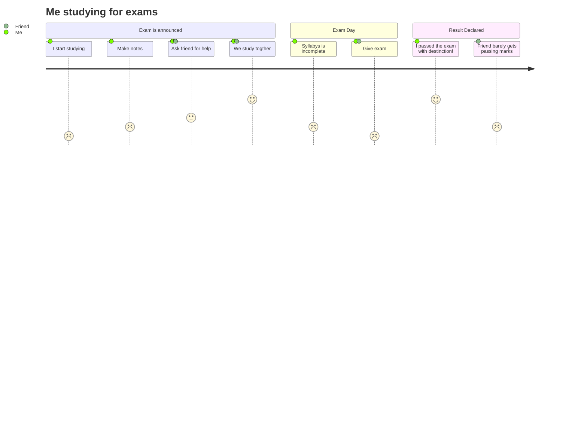

Previously, if you wanted to include a diagram in your GitHub README file, you would've needed to add it like an image created with third-party software. 

This worked, and let us complete our tasks – but why settle for less when you can create a diagram within the README file itself? Well, now you can.

On February 14th, GitHub gifted a new feature to all _devlovers_. Mermaid syntax is now supported by default in GitHub Markdown. This means that we can now create and edit diagrams in the native markdown file.

But first, what is Mermaid?

## What is Mermaid? 🧜‍♀️ 

[Mermaid](https://mermaid-js.github.io/) is a tool that renders diagrams based on markdown-like text content. It helps us visualize documentation and catch it up with development by dynamically creating and modifying diagrams in the browser. 

Mermaid supports various types of diagrams, such as UML diagrams, Gantt charts, Git Graphs, and User Journey Diagrams.

## How Does Mermaid Work? 🤔

According to the official GitHub blog, when a code block marked as `mermaid` is encountered, the raw mermaid syntax in the block is passed to Mermaid.js and an iframe is generated. The iframe is injected into the page, pointing `src` to the Viewscreen service. Viewscreen is GitHub's internal file rendering service which is partially responsible for this whole process.

The entire process is explained well in the official announcement blog. Here's a representation of how the Mermaid code block is dynamically rendered in the browser:


_rendering Mermaid code_

## Mermaid Demo 🧐 

To integrate Mermaid in your README, you don't need to add any external thing whatsoever! You just have to make a code block with the `mermaid` language designation.

But don't worry – you don't need to learn a new language or script. If you have an idea about markdown and supported diagrams, you won't find it too hard to get started.

Sounds simple? Let's make a user journey diagram of me studying for exams.

In your GitHub Web, open any markdown file. Paste the below code into the write section and hit preview.


```

Don't forget to enclose it in code blocks and add `mermaid` at the beginning.  
Like this:


  
When rendered, it will look something like this:


_User Diagram created with Mermaid in GitHub README_

> Fun fact: The sequence diagram depicting the rendering Mermaid syntax above is also rendered with the new feature. You can find the code [here](https://gist.github.com/martinwoodward/8ad6296118c975510766d80310db71fd).

## Final Words 👋 

Mermaid integration allows you to keep your diagrams close to the documentation, saving time and effort spent managing a separate software. 

You can read the original GitHub blog [here](https://github.blog/2022-02-14-include-diagrams-markdown-files-mermaid/) or have a look at [Mermaid](https://mermaid-js.github.io/)'s official documentation.

## Before We End ✨ 

I was inspired to write this article because I was eager to try out this feature as soon as I heard about its release. I hope you found this article helpful. I have my own [personal blog](https://clumsycoder.hashnode.dev/) where I talk about web development and my experiences.

My DMs are always open if you want to say hello. I am most active on [Twitter](https://twitter.com/clumsy_coder), [LinkedIn](https://www.linkedin.com/in/7JKaushal/), and [Showwcase](https://www.showwcase.com/). See you there!

Till then, happy documenting! 📃


