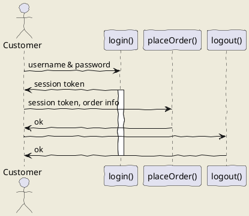
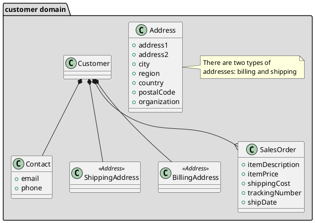
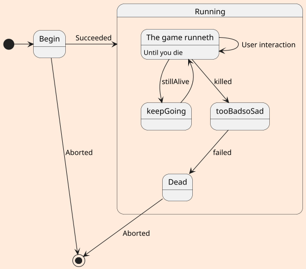

By Jeff M Lowery

Do you hate drawing [diagrams](https://en.wikipedia.org/wiki/Sequence_diagram) for technical documentation?  Seems like no sooner you finish a draft, new refinements come along, forcing you to change not only the text but the picture as well. If you're using a traditional drawing tool, that can be tedious.

## UML

UML is the acronym for Universal Modeling Language, an effort to standardize an iconography for software design that first appeared 25 years ago. Though perhaps it has not lived up to the [larger ambitions](https://www.eclipse.org/umlgen/) of its [designers](https://www.pearson.com/us/higher-education/program/Booch-Unified-Modeling-Language-User-Guide-The-2nd-Edition/PGM206461.html), it still offers a consistent way to visualize various facets of software design.

### PlantUML

Drawing UML diagrams is tedious, but what if you could instead describe a UML diagram textually, in a way that you could include it directly in a Markdown-based document, see both diagrams and formatted text in a preview as your are editing it, and in addition can export the Markdown as HTML or PDF?  Your text and diagrams are seamlessly integrated in one file. That's where [PlantUML](http://plantuml.com/) comes in...

## VS Code

Visual Studio Code (a.k.a. VS Code) has become a popular editor for various computer languages, including [**Markdown**](https://en.wikipedia.org/wiki/Markdown).  With a single extension, you can visualize UML diagrams in VS Code's preview panel.

That extension is called **plantuml**, and you can install it either by searching for it in the extensions panel (click on the extension icon): 


then clicking install, or simply by running the following from a terminal pane (Ctrl+' gets you one):

`ext install plantuml`

You'll also need to have some version of Java installed, with `JAVA_HOME` environment variable set or an executable path with the **java** binary location in it.

## Adding PlantUML to your Markdown

With the extension installed, you can now insert UML diagrams using PlantUML language. An example:

```markdown
## uml: sequence diagram
Here I will embed PlantUML markup to generate a sequence diagram.

I can include as many plantuml segments as I want in my Markdown, and the diagrams can be of any type supported by PlantUML.


```

And now when I open the VS Code's Preview pane:


_Markdown document on left, Preview on right_

What's more, the diagram in the Preview pane is kept in sync with the UML as described the Markdown document. No need to refresh the Preview pane.

That's great, but what if you want to export a diagram from within the Markdown? For that you'll need a little help from your friends...

## Exporting to SVG or PNG

In order to export individual diagrams, I need to install **[GraphViz](https://www.graphviz.org/)**, which is "open source graph visualization software". It works in conjunction with the **plantuml** extension installed earlier. Unlike plantuml, it is not a VS Code extension, but an [executable](https://graphviz.gitlab.io/download/).

To export to SVG or PNG:

1. place your cursor within the desired PlantUML text, 
2. open the command palette (Ctrl-Shift-P on my PC); or right click and select Command Palette...
3. Choose "PlantUML: Export Current Diagram"

You can choose PNG, SVG, or other formats.** Here's the PNG and SVG versions of the diagram shown in the Preview pane, above:


_PNG_


_SVG_

You also have the option to export all diagrams within a Markdown document (command palette option "PlantUML: Export Current File Diagrams"), which will create separate image files for each diagram. For instance, my Markdown doc is named `basic.md` and when I export all diagrams (there are three) as SVG, three image files are generated: 

* basic.svg  (the sequence diagram already shown)
* basic-1.svg (a class diagram)

```
### uml: class diagram

```


* basic-2.svg (a state diagram)

```
## uml: state diagram

```


---

** Other formats I've tried to export using just this extension are HTML, which failed with a Java error:

`java.lang.UnsupportedOperationException: HTML`

and PDF, which fails with a similar error.  No worries! I have workarounds, as will be shown.

## Further functionality

There is another useful VS Code extension called **[Markdown Preview Enhanced](https://shd101wyy.github.io/markdown-preview-enhanced/#/)**. This adds a second preview pane in addition to VS Code's native Preview pane. 

For some reason, two versions show up in my Extension pane when I searched for it; I chose the latest:


Now you will see two preview controls above your Markdown document: 


_That first icon activates the new Markdown Preview Enhanced pane_

With the pane open, you can now right click on it and export to various formats, such as HTML or PDF. 

### Export to PDF

Markdown Preview Enhanced is able to work with the Chrome browser to generate PDF documents, through the [Puppeteer](https://developers.google.com/web/tools/puppeteer/) driver. All you need to do is provide some _front matter_ in your markdown that directs Puppeteer how to layout the PDF:

```
---
puppeteer:
    landscape: true
    format: "letter"
    timeout: 3000 # <= wait 3 seconds before rendering in browser
---

# Overview
This walks through a few of use cases, linking them to "classes", which are either simple data objects or objects with methods. 

---
# UML Diagrams
...

```

The front matter will not appear in the either the regular VS Code Preview pane, nor the Markdown Preview Enhanced pane.

To export simply right click in the Markdown Preview Enhanced pane and select Chome (Puppeteer) -> PDF:


It takes a few seconds, but the PDF will eventually be generated and your default browser will open (not necessarily Chrome) with the PDF document displayed.

---

UML is a rich language, and [PlantUML supports much of it, in addition to some non-UML diagrams](http://plantuml.com/).  You don't have to be a UML expert to convey ideas through diagrams, but you will find your diagrams easier to modify through text than though a drawing tool. On top of that, the ability to embed diagrams in your Markdown documentation and export it in different formats is a big plus.


