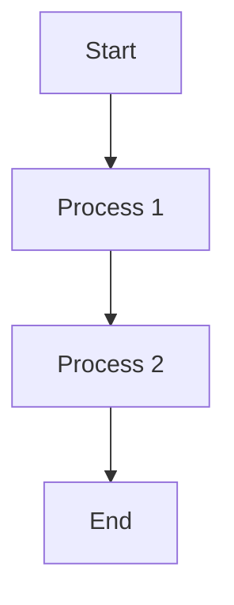
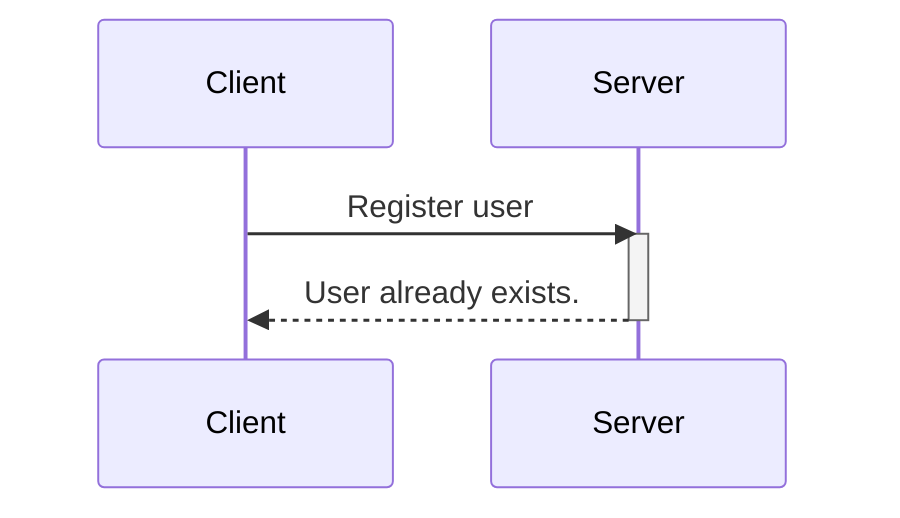
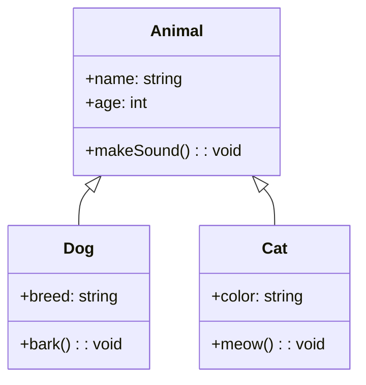
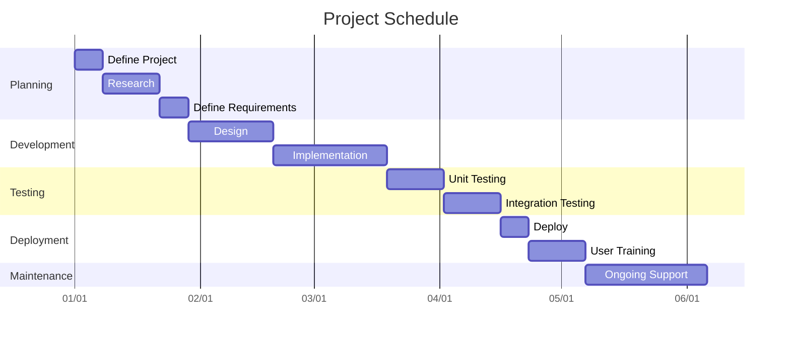
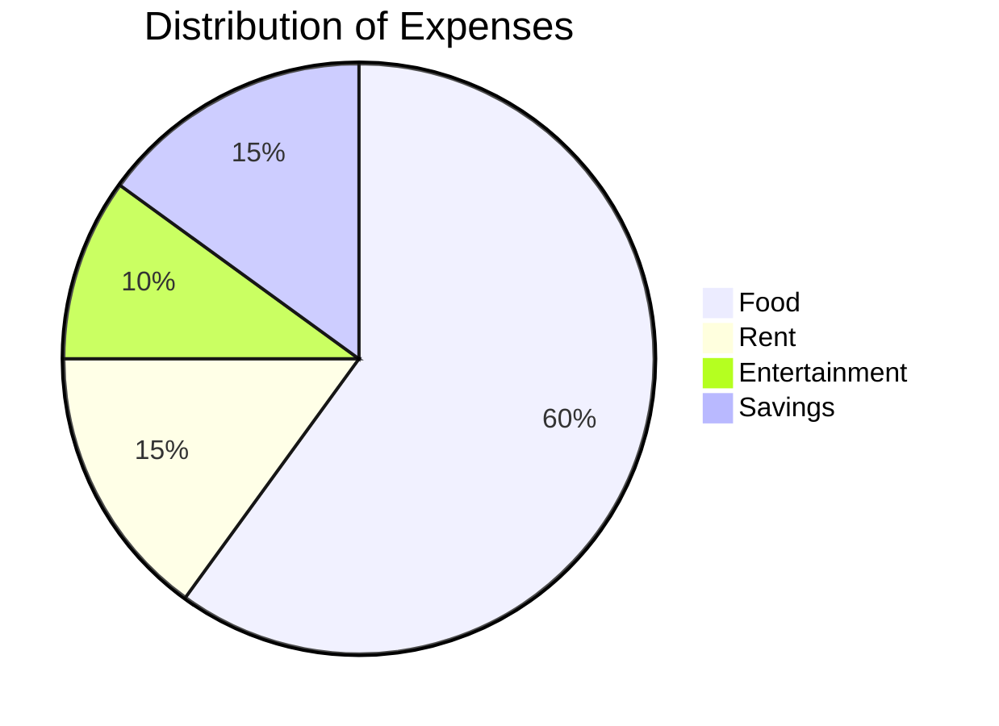

Les diagrammes sont une partie importante de la documentation technique. Dans cet article, nous allons explorer comment utiliser du code pour générer des diagrammes et les exploiter dans Markdown.

Voici un exemple de l'apparence d'un diagramme généré par du code :


*Diagramme généré par du code*

Pas d'outils, pas de glisser-déposer, d'alignement ou d'accrochage de formes. Juste du code. Intéressant, n'est-ce pas ?

## Prérequis

Pour suivre ce tutoriel, vous devez avoir les éléments suivants :

* Une compréhension de base de Markdown. Consultez [ce guide](https://www.freecodecamp.org/news/markdown-cheat-sheet/) si vous n'êtes pas familier avec Markdown.

* Visual Studio Code avec une extension de prévisualisation Markdown (détaillée dans les sections suivantes).

* GitHub, pour comprendre comment vous pouvez rendre des diagrammes là-bas.

## Avantages de la génération de diagrammes en tant que code

Il existe plusieurs avantages à générer des diagrammes en tant que code plutôt que d'utiliser des méthodes traditionnelles pour les créer manuellement. Voici quelques-uns d'entre eux :

* **Dynamique** : Les diagrammes générés par du code sont dynamiques, ce qui signifie que vous pouvez facilement les mettre à jour en mettant à jour le code.

* **Modifiable** : Avec des images générées par du code, vous ne dépendez pas d'outils complexes de génération d'images. Vous pouvez simplement modifier le code dans un éditeur de texte et obtenir une image mise à jour.

* **Efficace** : Les images générées par du code sont rapides à charger par rapport aux images statiques. De plus, vous n'avez pas besoin de les héberger séparément en tant qu'image sur votre site web.

* **Rapide à créer** : Vous pouvez utiliser un modèle et rapidement créer des diagrammes en utilisant simplement du code. Vous n'avez pas besoin d'investir du temps et des efforts pour apprendre des outils de création d'images, qui sont généralement écrasants au début.

## Comment rendre et visualiser le code Mermaid

Il existe plusieurs façons de créer et de visualiser des diagrammes Mermaid.

### VSCode

Tout d'abord, installez un visualiseur Markdown qui prend en charge Mermaid. Voici un exemple d'une telle extension : [Markdown Preview Mermaid Support](https://marketplace.visualstudio.com/items?itemName=bierner.markdown-mermaid).

Créez un fichier Markdown vide en utilisant l'extension `.md`. Écrivez votre code dans ce fichier et ouvrez l'aperçu dans le panneau de droite :


*Code et aperçu dans VSCode*

### StackEdit

[StackEdit](https://stackedit.io/) est un visualiseur Markdown en ligne, basé sur un navigateur. Il fournit une fenêtre d'éditeur et un aperçu sur le côté droit.


*Code et aperçu dans StackEdit*

### GitHub

Vous pouvez ajouter des diagrammes Mermaid pour créer des fichiers README convaincants dans GitHub. Il vous suffit de modifier le fichier `README.md` ou tout autre fichier Markdown dans GitHub pour rendre les diagrammes Mermaid.


*Modifier le code dans GitHub*


*Visualiser et rendre le diagramme Mermaid dans GitHub*

## Comment générer des diagrammes en tant que code avec Mermaid

Mermaid est un outil basé sur JavaScript qui transforme du texte de style Markdown en diagrammes dynamiques, vous permettant de créer et de modifier des diagrammes sans effort.

Mermaid facilite la génération de diagrammes et de visuels en utilisant du texte et du code simples.

Il suit une syntaxe simple :

````bash
```mermaid
\tyour code goes here
    .
    .
    .
 
```
````

Avec Mermaid, vous pouvez générer les types de diagrammes suivants :

* Organigramme

* Diagramme de séquence

* Diagramme de classe

* Gantt

* Camembert

Explorons-les un par un.

### Comment créer un organigramme

Un organigramme est une image qui montre les étapes d'un processus en utilisant des symboles, aidant à expliquer le processus de manière claire et organisée. Un organigramme est composé de nœuds qui sont connectés par des flèches.

Vous pouvez rendre des organigrammes dans Mermaid en utilisant cet exemple :

````bash

````

**Résultat :**


*Organigrammes dans Mermaid*

**Analyse de la syntaxe :**

* `flowchart` : Ce mot-clé indique que nous créons un organigramme.

* `TD` : il s'agit de l'orientation de l'organigramme et signifie de haut en bas. Les autres orientations de l'organigramme sont :
  – `TB` - De haut en bas, identique à TD.
  – `BT` - De bas en haut
  – `RL` - De droite à gauche
  – `LR` - De gauche à droite

* `-->` : La direction de la flèche reliant les nœuds.

### **Comment créer un diagramme de séquence**

Un diagramme de séquence est une représentation illustrative des interactions entre les processus, démontrant leur flux opérationnel et la séquence d'exécution.

Vous pouvez rendre des diagrammes de séquence dans Mermaid en utilisant cette syntaxe :

````bash

````

**Résultat :**


*Diagramme de séquence dans Mermaid*

**Analyse de la syntaxe :**

* `sequenceDiagram` : Ce mot-clé spécifie que nous créons un diagramme de séquence.

* `participant` : Ce sont les participants ou les acteurs dans un diagramme de séquence.

* `activate/deactivate` : Il est possible d'activer et de désactiver un acteur. L'activation apparaît sous la forme d'un petit rectangle entre les interactions.

* `-->>` : Lignes de connexion (en pointillés).

* `->` : Lignes de connexion (solides).

### **Comment créer un diagramme de classe**

Les diagrammes de classe sont utilisés pour visualiser la structure et les relations des classes, des interfaces et leurs interactions en programmation orientée objet (POO). Vous pouvez rendre des diagrammes de classe dans Mermaid en utilisant cette syntaxe :

````bash

````

**Résultat :**


*Diagramme de classe dans Mermaid*

**Analyse de la syntaxe :**

* Définition des classes : Une classe individuelle est définie avec le mot-clé `class` suivi du nom de la classe.

* Ajout des propriétés de classe : Les propriétés de classe sont ajoutées avec un signe `+`. Dans l'exemple ci-dessus, `+breed` est une propriété.

* Ajout de méthodes : Les méthodes sont reconnues par Mermaid en utilisant `()`, les parenthèses rondes. Notez que toutes les propriétés et méthodes sont regroupées sous la même classe en utilisant des accolades.

* Définition des types de retour : Les types de retour sont définis après le nom de la méthode/nom de la classe. `string` et `void` sont les types de retour dans le code ci-dessus.

* Définition des relations : En POO, les relations sont les types spécifiques de connexions logiques trouvées sur les diagrammes de classe et d'objet. Les types de relations suivants sont pris en charge dans Mermaid :

| **Type** | **Description** |
| --- | --- |
| &lt;|-- | Héritage |
| \*-- | Composition |
| o-- | Agrégation |
| \--&gt; | Association |
| \-- | Lien (Solide) |
| ..&gt; | Dépendance |
| ..|&gt; | Réalisation |
| .. | Lien (Pointillé) |

Voici une implémentation rapide de l'héritage :


*Héritage*

### **Comment créer un diagramme de Gantt**

Un diagramme de Gantt sert de représentation visuelle sous la forme d'un graphique à barres. Il présente efficacement le calendrier d'un projet, révélant la durée nécessaire pour que les composants individuels du projet atteignent leur achèvement.

Vous pouvez rendre des diagrammes de Gantt dans Mermaid en utilisant cet exemple :

````bash

````

**Résultat :**


*Diagrammes de Gantt dans Mermaid*

**Analyse de la syntaxe :**

* `gantt` spécifie que vous souhaitez rendre un diagramme de Gantt dans Mermaid.

* `title` représente le titre du projet.

* `dateFormat YYYY-MM-DD` est le format de date d'entrée pour le graphique.

* `axisFormat %m/%d` représente le format de date affiché, la date de sortie, dans l'axe des x.

* `section` est utilisé pour séparer les différentes parties du projet.

L'axe des x représente le temps et l'axe des y enregistre les différentes tâches et l'ordre dans lequel elles doivent être complétées.

### **Comment créer un camembert**

Un camembert, également connu sous le nom de graphique circulaire, est une représentation visuelle ronde utilisée pour afficher des données statistiques. Il est divisé en segments ou en parts pour représenter visuellement les proportions numériques de différentes catégories ou valeurs.

Voici un exemple pour créer un camembert dans Mermaid :

````bash

````

**Résultat :**


*Camemberts dans Mermaid*

**Analyse de la syntaxe :**

Dans cet exemple :

* `pie` indique que nous créons un camembert.

* `title` définit le titre pour le camembert.

* Les éléments entre guillemets doubles représentent les catégories (par exemple, "Food", "Rent", "Entertainment", "Savings").

* Les nombres après les deux-points représentent les proportions ou les pourcentages pour chaque catégorie. Dans ce cas, "Food" occupe 60 % du graphique, "Rent" 15 %, "Entertainment" 10 % et "Savings" 15 %.

## **Conclusion**

Dans cet article, nous n'avons fait qu'effleurer la surface du rendu des diagrammes dans Mermaid. Les diagrammes sont hautement personnalisables et vous permettent également de créer des diagrammes très complexes.

Mermaid prend en charge encore plus de types de diagrammes qui ne sont pas mentionnés dans ce tutoriel. Pour en savoir plus sur Mermaid, consultez leur [documentation officielle](https://web.archive.org/web/20240526110100/http://mermaid.js.org/).

J'espère que vous avez trouvé cet article utile. J'adorerais entrer en contact avec vous sur l'une de ces [plateformes](https://web.archive.org/web/20240526110100/https://zaira_.bio.link/).

À bientôt dans le prochain tutoriel, bon codage 😁