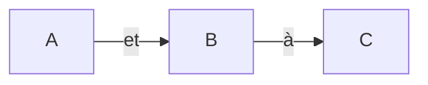

[Markdown](https://en.wikipedia.org/wiki/Markdown) est une méthode légère, open-source, facile à lire et à écrire pour formater du texte que vous pouvez utiliser en tant que texte brut dans n'importe quel IDE ou éditeur.

Lorsque vous écrivez sur GitHub, vous pouvez utiliser la syntaxe Markdown et les éléments HTML pour étendre les fonctionnalités de Markdown. Vous pouvez utiliser la syntaxe Markdown partout sur GitHub, comme dans le fichier README, le wiki, les commentaires, les pull requests et lors de la création d'issues.

Pour chaque développeur de logiciels, apprendre Markdown est une étape essentielle sur le chemin de votre carrière.

Pour améliorer les fonctionnalités de base de Markdown, GitHub a ajouté certaines fonctionnalités personnalisées et a créé [GitHub-Flavored Markdown](https://docs.github.com/en/get-started/writing-on-github/getting-started-with-writing-and-formatting-on-github/about-writing-and-formatting-on-github). Avec cela, vous pouvez facilement interagir avec d'autres utilisateurs dans les pull requests et les issues en mentionnant des utilisateurs, des issues et des références de PR, et en ajoutant des emojis.

Ce tutoriel vous apprend les bases de GitHub-Flavored Markdown afin que vous puissiez commencer à l'utiliser dans vos projets.

Tout le code est [disponible dans le dépôt GitHub](https://github.com/officialrajdeepsingh/github-tutorial).

## Syntaxe de GitHub-Flavored Markdown

La syntaxe GitHub Flavored Markdown est divisée en deux parties.

1. [Syntaxe de mise en forme de base](#syntaxe-de-mise-en-forme-de-base)
2. [Syntaxe de mise en forme avancée](#syntaxe-de-mise-en-forme-avancee)

Nous allons examiner chacune d'elles en détail ci-dessous.

### Syntaxe de mise en forme de base

La syntaxe de mise en forme de base s'applique à tout le monde. Elle contient des éléments fondamentaux essentiels tels que les titres, le code, les images, les citations, les liens, etc. – des choses que vous devez savoir pour écrire.

1. [Titres](#titres)
2. [Paragraphe](#paragraphe)
3. [Commentaire](#commentaire)
4. [Style du texte](#style-du-texte)
5. [Citations](#citations)
6. [Code](#code)
7. [Liens](#liens)
8. [Images](#images)
9. [Listes](#listes)
10. [Mentionner des personnes et des équipes](#mentionner-des-personnes-et-des-equipes)
11. [Référencer des issues et des pull requests](#referencer-des-issues-et-des-pull-requests)
12. [Utiliser des emojis](#utiliser-des-emojis)
13. [Notes de bas de page](#notes-de-bas-de-page)
14. [Alertes](#alertes)

Notez que les exemples de code proviennent principalement de la [documentation de GitHub](https://docs.github.com/en/get-started).

### Titres

Vous pouvez utiliser le symbole `#` pour créer des titres. Un `#` crée un titre H1, deux créent un titre H2, et ainsi de suite, comme ceci :

```markdown
# Un titre de premier niveau
## Un titre de deuxième niveau
### Un titre de troisième niveau
#### Un titre de quatrième niveau
##### Un titre de cinquième niveau
###### Un titre de sixième niveau
```

### Paragraphe

Pour créer des paragraphes, vous pouvez utiliser une ligne vide pour séparer une ou plusieurs lignes de texte ou de paragraphes.

```markdown
Lorem ipsum dolor sit amet, consectetur adipiscing elit. Etiam est odio, commodo id diam sed, pulvinar sagittis tortor. Nam vestibulum purus eros. Sed congue, mi id pretium auctor, nibh augue iaculis arcu, eu tristique quam dolor at erat.

Quisque vel odio condimentum, mollis sem vitae, porta diam. Praesent ligula elit, condimentum eget ex sed, commodo sollicitudin sapien.


Proin volutpat faucibus nulla. Nullam eros sem, ultricies gravida nunc nec, dapibus posuere nisl. Nunc lacinia elementum turpis in pharetra. Aenean eu neque eros.

```

### Commentaire

Les commentaires sont disponibles dans presque tous les langages de programmation. Ils aident les développeurs à écrire des notes et à ajouter des informations supplémentaires à leur code, aidant ainsi d'autres développeurs à comprendre ce qui se passe et comment le code fonctionne.

Pour ajouter des notes et des informations supplémentaires en Markdown, utilisez la syntaxe suivante : `<!--- Enveloppez le texte --->`.

Voici un exemple :

```markdown
<!-- Ce contenu n'apparaîtra pas dans le Markdown rendu -->

```

### Style du texte

Vous pouvez appliquer des styles de base à votre texte, tels que gras, italique, barré, indice ou exposant, pour améliorer la lisibilité et transmettre votre point plus clairement.

1. Pour le **gras**, vous pouvez utiliser la syntaxe suivante : `**votre texte**`
2. Pour les **_italiques_**, vous pouvez utiliser la syntaxe suivante : `*votre texte*` ou `_votre texte_`.
3. Pour le **barré**, vous pouvez utiliser la syntaxe suivante : `~~votre texte~~`
4. Pour l'**indice**, vous pouvez utiliser la syntaxe suivante : `Le texte <sub> indice </sub> est ici.`
5. Pour l'**exposant**, vous pouvez utiliser la syntaxe suivante : `Le texte <sup> exposant </sup> est ici.`

```markdown
## Gras

**votre texte**

## Italique

*votre texte*
_votre texte_

## Barré

~~votre texte~~

## Indice

Le texte <sub> indice </sub> est ici.

## Exposant

Le texte <sup> exposant </sup> est ici.

```

### Citations

Un bloc de citation ou une citation est une phrase ou un paragraphe formaté pour informer le lecteur que vous citez quelqu'un. Pour créer un bloc de citation en Markdown, vous pouvez utiliser le symbole `>`.

```markdown
> Texte qui est une citation

```

### Code

Les fichiers Markdown supportent deux types d'exemples de code : **en ligne** et **bloc de code**.

1. Pour ajouter un bloc de code dans un fichier Markdown, utilisez la syntaxe suivante : ` ``` votre code ``` `.
2. Pour ajouter du code en ligne au fichier Markdown, utilisez la syntaxe suivante : `` `votre code` ``.

```markdown
## Bloc de code

```
// Syntaxe ES5
var multiply = function(x, y) {
  return x * y;
};

// Fonction fléchée ES6
var multiply = (x, y) => { return x * y; };

// Ou encore plus simple
var multiply = (x, y) => x * y;
```

## Code en ligne 

JavaScript fournit trois opérations de comparaison de valeurs différentes : égalité stricte utilisant `===`, égalité lâche utilisant `==`, et la méthode `Object.is()`.


```

Pour supporter la coloration syntaxique dans un bloc de code, vous pouvez ajouter un identifiant de langage optionnel après vos triples backticks (comme JavaScript dans l'exemple ci-dessous) :

```markdown
## Bloc de code

```javascript

// Syntaxe ES5
var multiply = function(x, y) {
  return x * y;
};

// Fonction fléchée ES6
var multiply = (x, y) => { return x * y; };

// Ou encore plus simple
var multiply = (x, y) => x * y;   

```
```

### Liens

Un fichier markdown divise les liens en deux catégories : **en ligne** et **relatifs**.

#### Liens en ligne

Pour créer un lien en ligne dans un fichier Markdown, enveloppez le texte du lien dans des crochets `[ ]` suivi immédiatement par l'URL entre parenthèses `( )`.

```markdown
Ce site a été construit en utilisant [GitHub Pages](https://pages.github.com/).


```

#### Liens relatifs

Les liens relatifs sont définis de manière similaire aux liens en ligne, mais ils changent dans la section `[]` : la section `[]` contient le chemin du fichier dans votre dépôt.

Vous utilisez des liens relatifs pour lier deux fichiers : par exemple, pour lier le fichier CONTRIBUTING dans le fichier README.

```markdown
[Lignes directrices de contribution](docs/CONTRIBUTING.md)
```

Les liens relatifs commençant par `/` seront relatifs à la racine du dépôt. Vous pouvez utiliser tous les opérandes de lien relatif, tels que `./` et `../.` :

```markdown
[Lignes directrices de contribution](../docs/CONTRIBUTING.md)
```

### Images

Pour ajouter une image dans un fichier markdown, ajoutez un `!` puis enveloppez le texte alternatif dans `[]`. Ensuite, enveloppez le lien de l'image avec des parenthèses `()`.

Cela ressemble à ceci :

```markdown


```

### Listes 

Une liste aide à enregistrer des informations essentielles dans l'ordre, ce qui peut être vital pour le lecteur et facilite la compréhension et la recherche d'informations.

Les fichiers Markdown supportent trois types de listes :

1. Liste ordonnée
2. Liste non ordonnée
3. Liste de tâches

#### Liste ordonnée

Le premier type est une liste ordonnée. Pour créer une liste ordonnée, commencez par des nombres suivis de points.

```markdown
1. un
2. deux
3. trois
4. quatre
```

#### Liste non ordonnée

Le deuxième type est une liste non ordonnée. Pour créer une liste non ordonnée, utilisez `-`, `+` ou `*` (selon votre préférence - ils seront tous rendus comme une liste non ordonnée) :

```markdown
* Premier élément
* Deuxième élément
* Troisième élément
* Quatrième élément


- Premier élément
- Deuxième élément
- Troisième élément
- Quatrième élément

+ Premier élément
+ Deuxième élément
+ Troisième élément
+ Quatrième élément
```

#### Liste de tâches

Le troisième type est une liste de tâches. Pour créer une liste de tâches, les éléments de la liste commencent par un tiret, suivi d'un espace, suivi de crochets `[]`. Vous pouvez utiliser un `x` dans le crochet `[x]` pour marquer une tâche comme complète.

```markdown
- [x] #739
- [ ] https://github.com/octo-org/octo-repo/issues/740
- [ ] Ajouter de la joie à l'expérience lorsque toutes les tâches sont terminées :tada:
```

### Mentionner des personnes et des équipes


_Mentionner des utilisateurs et des équipes dans le markdown_

Pour mentionner une personne ou une équipe dans un fichier markdown GitHub, tapez `@` et écrivez le nom d'utilisateur ou le nom d'utilisateur de l'équipe.

```markdown
## Personne ou nom d'utilisateur individuel

@officialrajdeepsingh, consultez le changement suivant.

## Équipe ou entreprise
Le thème de la section blog est maintenu par @frontendweb 
```

### Référencer des issues et des pull requests


_Issues et pull requests_

Pour mentionner des issues et des pull requests dans un fichier markdown GitHub, tapez un `#`, puis tapez le numéro ou le titre de l'issue ou de la pull request. Ensuite, appuyez sur tabulation ou entrée pour compléter le résultat mis en évidence.

```markdown
Supprimer le _target blank par défaut dans le logo #93
```

### Utiliser des emojis


_Ajouter des emojis dans le markdown._

Pour ajouter un emoji à votre écriture, tapez le code de l'emoji entre deux deux-points. Si vous tapez simplement `:`, une liste d'emojis suggérés sur GitHub apparaîtra.

Une fois que vous avez trouvé l'emoji que vous cherchez, appuyez sur Tab ou Entrée pour choisir le résultat mis en évidence.

```markdown
N'oubliez pas de laisser une étoile sur notre dépôt ! :star:
```

### Notes de bas de page

Pour ajouter une référence de note de bas de page, ajoutez un circonflexe et un identifiant à l'intérieur de crochets `([^1])` en utilisant la syntaxe suivante :

```markdown
Voici une note de bas de page simple,[^1] et voici une plus longue.[^bignote]

[^1]: Ceci est la première note de bas de page.

[^bignote]: Voici une note avec plusieurs paragraphes et du code.
```

### Alertes

Les alertes sont une extension Markdown basée sur la syntaxe de citation de bloc que vous pouvez utiliser pour mettre en évidence des informations importantes.

GitHub Flavored Markdown supporte cinq types d'alertes : `[!NOTE]`, `[!TIP]`, `[!IMPORTANT]`, `[!WARNING]`, et `[!CAUTION]`. Vous pouvez utiliser l'un d'eux :

```markdown
> [!NOTE]
> Informations utiles que les utilisateurs doivent connaître, même en parcourant le contenu.

> [!TIP]
> Conseils utiles pour faire les choses mieux ou plus facilement.

> [!IMPORTANT]
> Informations clés que les utilisateurs doivent connaître pour atteindre leur objectif.

> [!WARNING]
> Informations urgentes nécessitant une attention immédiate de l'utilisateur pour éviter des problèmes.

> [!CAUTION]
> Avertit sur les risques ou les résultats négatifs de certaines actions.
```

La syntaxe des alertes ressemble à ceci dans le navigateur :


_Exemple d'alerte dans le markdown._

## Syntaxe de mise en forme avancée

Cette section de syntaxe de mise en forme avancée contient des cas d'utilisation avancés, tels que l'ajout de diagrammes et de tableaux, de sections repliées, d'expressions mathématiques, et plus encore.

1. [Créer un tableau](#creer-un-tableau)
2. [Créer une section repliée](#creer-une-section-repliee)
3. [Créer des diagrammes](#creer-des-diagrammes)
4. [Expressions mathématiques](#expressions-mathematiques)

### Créer un tableau

Pour créer des tableaux en Markdown, vous pouvez utiliser des pipes `|` et des tirets `-`. Les tirets sont utilisés pour créer l'en-tête d'une colonne, tandis que les pipes sont utilisés pour séparer les colonnes.

```markdown
| Premier En-tête  | Deuxième En-tête |
| ------------- | ------------- |
| Cellule de Contenu  | Cellule de Contenu  |
| Cellule de Contenu  | Cellule de Contenu  |
```

Le tableau ressemble à ceci dans le navigateur :


_Exemple de tableau dans le markdown._

### Créer une section repliée

Pour créer une section repliée dans un fichier markdown, vous pouvez utiliser la balise `<details>`. Cette balise est un élément HTML que vous pouvez facilement utiliser pour étendre les fonctionnalités de GitHub Flavored Markdown. Voici comment cela fonctionne :

```markdown
<details>
  <summary>Cliquez ici. </summary>
   
   ### Vous pouvez ajouter un message ici

   Vous pouvez ajouter du texte dans une section repliée. 

   Vous pouvez ajouter une image ou un bloc de code, aussi.

   ```ruby
     puts "Hello World"
   ```
  
</details>
```

La syntaxe repliée ressemble à ceci dans le navigateur :


_Exemple de section repliée dans le markdown._

### Créer des diagrammes

Pour ajouter des diagrammes à un fichier Markdown, utilisez des triples backticks et enveloppez-les à l'intérieur de quadruples backticks. Ensuite, indiquez quel identifiant (Mermaid, GeoJSON, TopJSON, ASCII STL) vous avez utilisé pour le diagramme.

GitHub supporte les diagrammes en utilisant quatre syntaxes : mermaid, geoJSON, topoJSON et ASCII STL.

1. [Mermaid](#mermaid) 
2. [GeoJSON et TopoJSON](#geojson-et-topojson)
3. [ASCII STL](#ascii-stl)

#### Mermaid 

[Mermaid](https://mermaid.js.org) est un outil inspiré de Markdown qui transforme du texte en diagrammes. Vous pouvez créer des organigrammes, des diagrammes de séquence, des camemberts, et plus encore avec Mermaid.

Le GitHub-flavored Markdown a étendu les fonctionnalités de l'utilisation de Mermaid avec Markdown.

Vous pouvez créer des organigrammes, des diagrammes de séquence, des camemberts, et ainsi de suite à l'intérieur de Markdown. GitHub gère le reste. Alors, comment affichez-vous des diagrammes à l'écran ?

```markdown

```

La syntaxe mermaid ressemble à ceci dans le navigateur.


_Exemple de Mermaid dans le markdown._

#### GeoJSON et TopoJSON

Vous pouvez utiliser [GeoJSON](https://geojson.org/) ou [TopoJSON](https://github.com/topojson/topojson) pour ajouter une carte interactive à un dépôt GitHub dans un fichier README ou un Wiki GitHub.

Vous pouvez utiliser la syntaxe de bloc de code pour ajouter une carte interactive.

1. GeoJSON peut créer une carte en spécifiant des coordonnées. Pour ajouter une carte interactive, utilisez la syntaxe suivante : ` ```geojson  votre code ``` `
2. TopoJSON peut créer une carte en spécifiant des coordonnées et des formes. Pour ajouter une carte interactive, utilisez la syntaxe suivante : ` ```topojson  votre code ``` `

**Exemple utilisant GeoJSON :**

```markdown
```geojson
{
  "type": "FeatureCollection",
  "features": [
    {
      "type": "Feature",
      "id": 1,
      "properties": {
        "ID": 0
      },
      "geometry": {
        "type": "Polygon",
        "coordinates": [
          [
              [-90,35],
              [-90,30],
              [-85,30],
              [-85,35],
              [-90,35]
          ]
        ]
      }
    }
  ]
}
```
```

**Exemple de TopJSON :**

```markdown
```topojson
{
  "type": "Topology",
  "transform": {
    "scale": [0.0005000500050005, 0.00010001000100010001],
    "translate": [100, 0]
  },
  "objects": {
    "example": {
      "type": "GeometryCollection",
      "geometries": [
        {
          "type": "Point",
          "properties": {"prop0": "value0"},
          "coordinates": [4000, 5000]
        },
        {
          "type": "LineString",
          "properties": {"prop0": "value0", "prop1": 0},
          "arcs": [0]
        },
        {
          "type": "Polygon",
          "properties": {"prop0": "value0",
            "prop1": {"this": "that"}
          },
          "arcs": [[1]]
        }
      ]
    }
  },
  "arcs": [[[4000, 0], [1999, 9999], [2000, -9999], [2000, 9999]],[[0, 0], [0, 9999], [2000, 0], [0, -9999], [-2000, 0]]]
}
```

```

### ASCII STL

GitHub Flavored Markdown supporte la syntaxe STL. La syntaxe STL vous permet d'ajouter des modèles 3D interactifs en markdown. Vous pouvez utiliser la syntaxe suivante : ` ```stl votre code.``` `

```markdown
```stl
solid cube_corner
  facet normal 0.0 -1.0 0.0
    outer loop
      vertex 0.0 0.0 0.0
      vertex 1.0 0.0 0.0
      vertex 0.0 0.0 1.0
    endloop
  endfacet
  facet normal 0.0 0.0 -1.0
    outer loop
      vertex 0.0 0.0 0.0
      vertex 0.0 1.0 0.0
      vertex 1.0 0.0 0.0
    endloop
  endfacet
  facet normal -1.0 0.0 0.0
    outer loop
      vertex 0.0 0.0 0.0
      vertex 0.0 0.0 1.0
      vertex 0.0 1.0 0.0
    endloop
  endfacet
  facet normal 0.577 0.577 0.577
    outer loop
      vertex 1.0 0.0 0.0
      vertex 0.0 1.0 0.0
      vertex 0.0 0.0 1.0
    endloop
  endfacet
endsolid
```
```

La syntaxe STL ressemble à ceci dans le navigateur :


_Exemple de STL dans le markdown._

### Expressions mathématiques

Vous pouvez ajouter des expressions mathématiques, telles que des équations, des termes, des formules, etc., à un fichier markdown GitHub. GitHub utilise [LaTeX](https://www.cmor-faculty.rice.edu/~heinken/latex/symbols.pdf) formaté dans Markdown. Il existe deux façons d'ajouter ces expressions :

1. Écrire des expressions mathématiques en ligne
2. Écrire des expressions mathématiques en tant que blocs de code

#### Écrire des expressions mathématiques en ligne

Une expression mathématique en ligne commence par `$` et se termine par `$`. 

```markdown
Exemple d'expression mathématique en ligne : $\sqrt{3x-1}+(1+x)^2$

```

La syntaxe mathématique en ligne ressemble à ceci dans le navigateur :


_Exemple d'expression mathématique en ligne_

#### Écrire des expressions mathématiques en tant que blocs de code

Pour ajouter un bloc de code d'expression mathématique au fichier Markdown, utilisez le bloc de code ` ```math` et enveloppez-le à l'intérieur de triples backticks pour afficher l'expression sous forme de bloc.

Pour ajouter un bloc de code d'expression mathématique au fichier Markdown, utilisez le bloc de code ````math et enveloppez-le à l'intérieur de triples backticks pour afficher l'expression sous forme de bloc.

```markdown
```math
\left( \sum_{k=1}^n a_k b_k \right)^2 \leq \left( \sum_{k=1}^n a_k^2 \right) \left( \sum_{k=1}^n b_k^2 \right)
```
```

Le bloc de code mathématique ressemble à ceci dans le navigateur :


_Exemple d'expression mathématique en bloc de code_

## Conclusion

La syntaxe Markdown fonctionne bien dans GitHub et tous les autres serveurs Git centraux, tels que GitLab, Gitea, et ainsi de suite.

Différents outils nomment leur markdown différemment. Par exemple, GitHub étend les fonctionnalités de markdown à sa manière et construit GitHub Flavored Markdown. GitLab étend également les fonctionnalités de markdown et construit et crée un markdown de style GitLab.

La syntaxe Markdown est principalement la même dans chaque service Git. Mais les alertes, les diagrammes et quelques autres fonctionnalités ne fonctionnent que dans GitHub Flavored Markdown.

## Référence

* Documentation GitHub – [guide de démarrage rapide pour écrire sur GitHub](https://docs.github.com/en/get-started/writing-on-github/getting-started-with-writing-and-formatting-on-github/quickstart-for-writing-on-github)
* Documentation GitHub – [syntaxe de base](https://docs.github.com/en/get-started/writing-on-github/getting-started-with-writing-and-formatting-on-github/basic-writing-and-formatting-syntax)
* Tutoriel sur le [rendu STL dans Markdown sur GitHub](https://www.vanderveer.io/github-markdown-render-stl/)