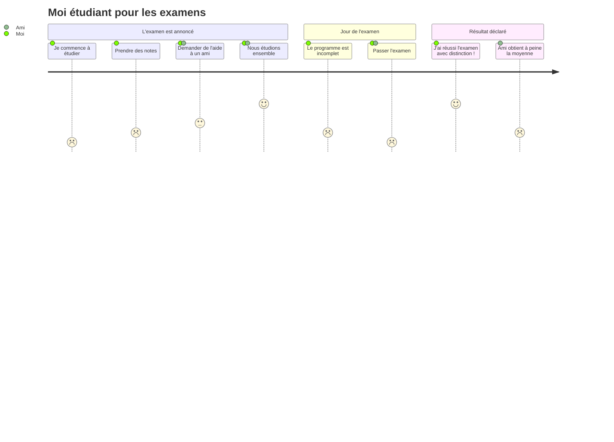

Auparavant, si vous souhaitiez inclure un diagramme dans votre fichier README de GitHub, vous auriez dû l'ajouter comme une image créée avec un logiciel tiers. 

Cela fonctionnait et nous permettait d'accomplir nos tâches – mais pourquoi se contenter de moins lorsque vous pouvez créer un diagramme directement dans le fichier README lui-même ? Eh bien, maintenant c'est possible.

Le 14 février, GitHub a offert une nouvelle fonctionnalité à tous les _devlovers_. La syntaxe Mermaid est désormais prise en charge par défaut dans GitHub Markdown. Cela signifie que nous pouvons maintenant créer et modifier des diagrammes dans le fichier markdown natif.

Mais d'abord, qu'est-ce que Mermaid ?

## Qu'est-ce que Mermaid ? 🧑‍🔬 

[Mermaid](https://mermaid-js.github.io/) est un outil qui génère des diagrammes basés sur un contenu textuel similaire au markdown. Il nous aide à visualiser la documentation et à la synchroniser avec le développement en créant et en modifiant dynamiquement des diagrammes dans le navigateur. 

Mermaid prend en charge divers types de diagrammes, tels que les diagrammes UML, les graphiques de Gantt, les graphiques Git et les diagrammes de parcours utilisateur.

## Comment fonctionne Mermaid ? 🤔

Selon le blog officiel de GitHub, lorsqu'un bloc de code marqué comme `mermaid` est rencontré, la syntaxe mermaid brute dans le bloc est transmise à Mermaid.js et un iframe est généré. L'iframe est injecté dans la page, pointant `src` vers le service Viewscreen. Viewscreen est le service de rendu de fichiers interne de GitHub qui est partiellement responsable de ce processus entier.

L'ensemble du processus est bien expliqué dans le blog officiel de l'annonce. Voici une représentation de la manière dont le bloc de code Mermaid est rendu dynamiquement dans le navigateur :


_rendu du code Mermaid_

## Démo Mermaid 🐬 

Pour intégrer Mermaid dans votre README, vous n'avez pas besoin d'ajouter quoi que ce soit d'externe ! Vous devez simplement créer un bloc de code avec la désignation de langage `mermaid`.

Mais ne vous inquiétez pas – vous n'avez pas besoin d'apprendre un nouveau langage ou script. Si vous avez une idée du markdown et des diagrammes pris en charge, vous ne trouverez pas cela trop difficile pour commencer.

Cela semble simple ? Faisons un diagramme de parcours utilisateur de moi étudiant pour les examens.

Dans votre GitHub Web, ouvrez n'importe quel fichier markdown. Collez le code ci-dessous dans la section d'écriture et cliquez sur aperçu.


```

N'oubliez pas de l'enfermer dans des blocs de code et d'ajouter `mermaid` au début. 
Comme ceci :


  
Lorsqu'il est rendu, cela ressemblera à quelque chose comme ceci :


_Diagramme utilisateur créé avec Mermaid dans GitHub README_

> Fait amusant : le diagramme de séquence représentant la syntaxe de rendu Mermaid ci-dessus est également rendu avec la nouvelle fonctionnalité. Vous pouvez trouver le code [ici](https://gist.github.com/martinwoodward/8ad6296118c975510766d80310db71fd).

## Mots de la fin 👋 

L'intégration de Mermaid vous permet de garder vos diagrammes proches de la documentation, économisant ainsi le temps et les efforts passés à gérer un logiciel séparé. 

Vous pouvez lire le blog officiel de GitHub [ici](https://github.blog/2022-02-14-include-diagrams-markdown-files-mermaid/) ou consulter la [documentation officielle de Mermaid](https://mermaid-js.github.io/).

## Avant de terminer ✨ 

J'ai été inspiré pour écrire cet article parce que j'avais hâte d'essayer cette fonctionnalité dès que j'ai entendu parler de sa sortie. J'espère que vous avez trouvé cet article utile. J'ai mon propre [blog personnel](https://clumsycoder.hashnode.dev/) où je parle de développement web et de mes expériences.

Mes messages directs sont toujours ouverts si vous voulez dire bonjour. Je suis le plus actif sur [Twitter](https://twitter.com/clumsy_coder), [LinkedIn](https://www.linkedin.com/in/7JKaushal/), et [Showwcase](https://www.showwcase.com/). À bientôt !

En attendant, bon documentation ! 📃