Au cours de l'année passée, j'ai exploré des outils et des pratiques qui aident les développeurs à construire un état d'esprit analytique. Un thème récurrent est la manière dont les programmeurs expérimentés décrivent souvent la compréhension du code comme la formation d'une image mentale – une carte conceptuelle du flux du programme.

En matière de développement logiciel, trouver des moyens de visualiser ces modèles mentaux est un fil conducteur commun. De nombreux développeurs décrivent le fait de schématiser des flux de travail ou de les imaginer mentalement pour raisonner à travers le code. Et dans ma propre expérience de travail avec des développeurs seniors et des architectes logiciels, cette habitude de visualisation est extrêmement courante.

Un article Quora de 2013 capture bien cela :

> « Un codeur de haut niveau voit un programme graphiquement (...) Une structure de données comme une hiérarchie de relations, un programme comme un réseau de tuyaux de données... La première et seule fois où il réduit les images en mots est lorsqu'il écrit du code. » — Rober Wagner

Il semble donc que développer notre capacité à reconnaître des motifs dans le code pourrait nous aider à développer notre expertise. Mais la programmation est rarement aussi simple – il existe souvent plusieurs façons de résoudre le même problème. Cela reflète également les habitudes personnelles, les expériences et les styles d'un développeur. Alors, quels motifs comptent, alors ?

Imaginez que vous assigniez la même tâche à cinq développeurs : construire un petit jeu en utilisant HTML, CSS et JavaScript. Chaque solution doit suivre les mêmes règles fonctionnelles. Quelles sont les chances que leur code se ressemble ?

Vous vous attendriez à ce que leurs implémentations diffèrent, mais la logique mentale sous-jacente – la logique interne qu'ils suivent – pourrait être remarquablement similaire. Si vous pouvez reconstruire ce flux mental à partir de chaque base de code, vous pouvez créer un point de référence partagé pour la comparaison. Une fois ce diagramme conceptuel en place, vous pouvez le « superposer » sur chaque base de code pour identifier où ils divergent en structure, en logique ou en abstraction.

Depuis que j'ai commencé à coder, repérer les « motifs » en comparant le code des autres m'a fasciné. J'ai trouvé le processus de comparaison du code non seulement éducatif mais aussi agréable.

Jusqu'à présent, je l'ai abordé principalement par intuition – mais j'ai toujours ressenti le besoin d'une méthode plus structurée. Cet article explore une approche plus systématique de la comparaison de code, réfléchissant à ce qui fonctionne bien et à ce qui peut être amélioré.

### **Comment lire cet article**

Cet article est intentionnellement complet. Au lieu de simplement montrer le résultat final, je vais vous guider à travers la méthodologie afin que vous puissiez la recréer ou l'adapter pour vos propres comparaisons de code.

Cela dit, il existe différentes façons d'aborder cet article, selon vos intérêts :

* **Simplement curieux de l'idée ?** L'argument principal est déjà présenté dans l'introduction. Peut-être lisez aussi la conclusion, et cela pourrait suffire à vos besoins.

* **Cherchez à améliorer votre portfolio ?** Parcourez les analyses. Si vous travaillez sur un projet de jeu, vous trouverez des comparaisons de cinq implémentations JavaScript de Pierre, Papier, Ciseaux. Cela peut vous donner des idées pratiques pour votre propre code.

* **Intéressé par l'analyse de code ?** Lisez le tout. Cet article approfondit pourquoi l'analyse de code est précieuse et présente une méthodologie pratique – y compris des outils – que vous pouvez appliquer.

### Voici ce que nous allons couvrir :

1. [Outils visuels pour la comparaison de code](#heading-outils-visuels-pour-la-comparaison-de-code) : Dans cette partie, nous parlerons des diagrammes et nous nous concentrerons sur celui que nous allons utiliser pour ce projet – le diagramme de blocs système piloté par les cas d'utilisation.

2. [Ce que nous allons faire](#heading-ce-que-nous-allons-faire) : ici, nous révélons le sujet de notre analyse, ce que nous prévoyons de faire, ce que nous prendrons en compte lors de la création des diagrammes, et une courte introduction à l'outil que nous allons utiliser pour cela, Mermaid.js.

3. [Cinq exemples de code de Pierre, Papier, Ciseaux](#heading-cinq-exemples-de-code-de-pierre-papier-ciseaux) : Ensuite, nous évaluerons le code JavaScript de cinq projets CodePen, en commençant par le plus simple et en terminant par le plus complexe. À chaque évaluation, nous ferons une comparaison avec les projets précédents.

* [« CPC Rock Paper Scissors » par Amit : Un projet avec des animations de feux d'artifice](#heading-cpc-rock-paper-scissors-par-amit-un-projet-avec-des-animations-de-feux-dartifice)

* [« Rock paper scissors game using native drag & drop » par Hmz C : Un projet utilisant l'élément HTML Drag](#heading-rock-paper-scissors-game-using-native-drag-amp-drop-par-hmz-c-un-projet-utilisant-lelement-html-drag)

* [« Rock Paper Scissors » par Brad Traversy : Un projet avec une modale et une réinitialisation](#heading-rock-paper-scissors-par-brad-traversy-un-projet-avec-une-modale-et-une-reinitialisation)

* [« Rock Paper Scissors OOP » par Damian : Un projet écrit en OOP](#heading-rock-paper-scissors-oop-par-damian-un-projet-ecrit-en-oop)

* [« Recurrent Neural Network - Rock, Paper, Scissors » par Andrew Worcerster : Un projet implémentant l'IA](#heading-recurrent-neural-network-rock-paper-scissors-par-andrew-worcerster-un-projet-implementant-lia)

4. [Réflexions finales](#heading-reflexions-finales)

Maintenant, plongeons-nous dans le sujet !

## **Outils visuels pour la comparaison de code**

Il existe de nombreux outils et approches pour l'analyse de code, et bien qu'il existe de plus en plus de moyens « automatiques » de le faire, les **diagrammes de flux** sont toujours incroyablement utiles. Malheureusement, bien qu'ils soient largement utilisés dans l'éducation et l'analyse de la programmation, leur utilisation pour comparer différentes implémentations est rarement discutée ou illustrée dans les tutoriels.

Pourtant, le potentiel est clair. Les diagrammes de flux capturent la structure et la logique sous une forme compacte et lisible. Ils sont largement utilisés dans la conception de compilateurs pour analyser le flux de contrôle, optimiser la logique et identifier les bugs.

Lorsqu'ils sont appliqués à l'analyse comparative, ils peuvent mettre en évidence les différences dans :

* La modularité et l'abstraction

* Le flux d'exécution

* La séparation des préoccupations ou la complexité inutile

Mais tous les types de diagrammes ne sont pas également efficaces à cette fin. Les organigrammes traditionnels plongent souvent trop profondément dans les détails, répétant la logique de bas niveau comme les branches if-else déjà visibles dans le code source. Bien qu'utiles pour comprendre un seul script, ils peuvent obscurcir les motifs de conception plus larges lors de la comparaison de plusieurs implémentations.

Lors de la comparaison de bases de code, une meilleure option est de se concentrer sur la structure du code : comment les fonctions, les modules et les portées se rapportent et interagissent. Pour cela, les **diagrammes de blocs système** sont mieux adaptés.

### **Pourquoi utiliser les diagrammes de blocs système ?**

Les diagrammes de blocs système visualisent un programme à un niveau plus élevé. Ils utilisent des blocs étiquetés pour représenter les principaux composants (fonctions, classes, modules) et des flèches pour montrer comment les données ou le contrôle circulent entre eux. Cela vous permet de vous concentrer sur l'architecture : quelle partie fait quoi, et comment travaillent-elles ensemble ?

Utilisés pour la comparaison de code, placer deux diagrammes de blocs système côte à côte met immédiatement en évidence les différences structurelles et de conception. Vous pouvez voir d'un coup d'œil comment une solution favorise la modularité, une autre intègre la logique dans moins de blocs, ou laquelle sépare mieux les préoccupations.

Pourtant, les diagrammes de blocs système peuvent être dessinés de différentes manières – certains mettant l'accent sur la structure, d'autres sur le flux de travail. Existe-t-il un format qui combine les deux ?

### **Le diagramme de blocs système piloté par les cas d'utilisation**

Un bon candidat est le **diagramme de blocs système piloté par les cas d'utilisation**. [Un exemple](https://www.clear.rice.edu/comp310/JavaResources/systemblockdiagrams.html) de cette variante est suggéré dans le cadre des ressources pour un cursus d'informatique (« Advanced Object-Oriented Programming and Design » COMP310) de l'Université Rice.

Contrairement aux diagrammes de cas d'utilisation (qui se concentrent uniquement sur les acteurs et les objectifs), les diagrammes de blocs système pilotés par les cas d'utilisation sont plus axés sur l'implémentation. Ils montrent toujours les modules et le flux de données, mais à travers le prisme de la fonctionnalité du système et de la logique pilotée par l'utilisateur.


Intéressamment, l'exemple ci-dessus illustre bien son utilisation pour **évaluer les architectures existantes**. Cela confirme l'adéquation de ce type de diagramme pour les comparaisons entre bases de code. Il suffit de dessiner un diagramme par implémentation, en cherchant à trouver leur même objectif fonctionnel. Ensuite, comparez leurs flux de travail et leurs structures côte à côte. Vous repérerez rapidement quelle solution est plus modulaire, plus efficace ou plus facile à maintenir.

## **Ce que nous allons faire**

Pour élaborer sur l'adéquation de cette méthodologie pour l'analyse de code, nous appliquerons les principes fondamentaux de la méthodologie des diagrammes de blocs système pilotés par les cas d'utilisation pour analyser le code de cinq projets JavaScript – chacun créé par un développeur différent – implémentant le jeu Pierre, Papier, Ciseaux sur [CodePen](https://codepen.io/).

Le jeu Pierre, Papier, Ciseaux (RPS) est un défi simple à deux joueurs où chaque participant montre simultanément soit une « pierre », un « papier » ou des « ciseaux » représentés par l'une de leurs mains, généralement après un compte à rebours. Ensuite, ils appliquent la règle suivante pour décider du « gagnant » :


* La pierre bat les ciseaux

* Les ciseaux battent le papier

* Le papier bat la pierre

Si les deux joueurs choisissent la même option, c'est un match nul.

Dans la plupart des versions programmées, le joueur affronte l'ordinateur, qui fait des choix aléatoires (ou pseudo-aléatoires). C'est un projet favori des débutants car il est facile à comprendre et amusant à construire.

### Les exemples de code

Nous allons comparer le code JavaScript (vanilla) des 5 projets suivants, classés par complexité :

1. **« CPC Rock Paper Scissors »** par Amit (@ghaste sur CodePen)

2. **« Rock Paper Scissor game using native drag & drop »** par Hmz C (@HmZ2 sur CodePen)

3. **« Rock Paper Scissors »** par Brad Traversy (@bradtraversy sur CodePen)

4. **« Rock Paper Scissors OOP »** par Damian (@CvtS sur CodePen)

5. **« Recurrent Neural Network - Rock, Paper, Scissors »** par Andrew Worscerter (@amwmedia sur CodePen)

Afin de garder l'article plus court, le code complet ne sera pas fourni ici, sauf pour quelques cas exceptionnels. Vous êtes encouragés à visiter les projets correspondants sur CodePen pour consulter le code en parallèle de l'analyse. Comme les auteurs peuvent mettre à jour ou même supprimer le code sur CodePen à tout moment, j'ajouterai également des liens vers des Gists contenant le code que j'ai analysé au moment de la rédaction de l'article.

Suivez ce lien : [https://gist.github.com/evaristoc/81dc9f508aa54c355f3f89b08a2450d5](https://gist.github.com/evaristoc/81dc9f508aa54c355f3f89b08a2450d5) si vous souhaitez trouver la copie des codes JavaScript utilisés pour cet article.

#### Comment choisir vos projets

Pour trouver les projets, j'ai recherché sur CodePen tout pen concernant « Rock Paper Scissors ». Ensuite, j'ai consulté les modifications de certains d'entre eux et j'ai choisi ceux que j'ai trouvés les plus intéressants. J'ai veillé à choisir des projets de complexités variées.


### **Le périmètre**

Tout d'abord, notre objectif ici n'est pas de juger la qualité des bases de code. Au contraire, il s'agit de démontrer comment nous pouvons utiliser cette méthodologie basée sur les diagrammes pour les comparer.

Les projets CodePen incluent souvent des démonstrations rapides, des expériences, voire des extraits générés par IA. Certains développeurs peuvent être plus intéressés par le HTML/CSS du projet. Mais bien qu'ils ne suivent pas toujours les meilleures pratiques, c'est ce qui rend cet exercice intéressant – la diversité des approches révèle des contrastes précieux à analyser.

### **La méthodologie**

Pour la comparaison, nous utilisons une méthodologie inspirée du cours COMP310 de l'Université Rice, qui suggère les étapes suivantes pour construire des diagrammes de blocs système pilotés par les cas d'utilisation :

1. **Ajouter tous les cas d'utilisation du système** à un seul diagramme. Ces cas d'utilisation seront similaires à des « étapes dans un flux de travail ».

2. **Grouper les cas liés** au sein d'opérations conceptuellement ou fonctionnellement liées.

3. **Encapsuler les groupes** en modules (ou blocs) basés sur les rôles et les responsabilités. Commencez à dessiner les relations (note : ce que nous devons comprendre pour l'encapsulation ici ne doit pas être confondu avec d'autres définitions comme celle donnée en OOP).

4. **Découpler les opérations** autant que possible – affiner la portée et minimiser les interconnexions.

Afin de permettre la comparaison entre les exemples de code, nous essaierons de trouver des cas (ou étapes), des modules et des relations qui sont constamment similaires entre chaque exemple de code, indépendamment de l'« architecture ».

Bien que la conformité UML soit encouragée dans le cours original, nous adopterons une approche plus légère – en préservant l'intention et la structure sans suivre strictement chaque règle UML.

### Comment nous allons construire les diagrammes

Le cours de Rice se concentre davantage sur **ce que** le diagramme doit montrer, mais pas tellement sur **comment** le construire réellement. Pour cela, je me réfère à un [article précédent](https://www.freecodecamp.org/news/how-to-make-flowcharts-with-mermaid/) où j'ai décomposé le processus de création de diagrammes. Voici comment les deux approches s'alignent :

| **Étape** (de l'article précédent) | **Correspond à** (méthodologie Rice) |
| --- | --- |
| Définir une portée | Identifier le but et le contexte de votre diagramme |
| Trouver le début et la fin du flux de travail | Identifier les cas d'utilisation (en fait, un balayage général du flux de travail) |
| Identifier les sections approfondies vs. généralisées | Identifier les groupes de cas. Préparer pour l'encapsulation modulaire |
| Affinement et généralisation itératifs | Appliqué tout au long pour améliorer la clarté des modules et le découplage |
| Améliorer et étendre | Équivalent à l'ajustement fin et à la rupture des dépendances |

N'hésitez pas à revisiter cet article si vous souhaitez un guide plus détaillé de ces étapes.

### Notre outil : Mermaid.js

Pour créer les diagrammes, nous utiliserons [**Mermaid.js**](https://mermaid.js.org/), une bibliothèque JavaScript qui convertit du texte en diagrammes. Elle est compatible Markdown, ce qui la rend particulièrement pratique pour les projets en ligne, les articles de blog et la documentation.

La principale raison pour laquelle j'ai choisi Mermaid.js est que les diagrammes sont facilement modifiables, donc nous pouvons :

* Nous concentrer sur la définition des relations au lieu de nous soucier de la mise en page

* Facilement itérer et mettre à jour au fur et à mesure que nous découvrons plus de structure dans le code

* Permet la réutilisabilité du code

Mermaid.js est également hautement configurable, permettant un certain niveau de personnalisation. Il a également été conçu pour le web, donc il est compatible avec JavaScript, CSS et Markdown. Mais ce n'est pas un outil parfait, et son utilisation pose des défis à la fois en raison des limitations de l'outil lui-même et même en raison des limitations de l'utilisation de diagrammes visuels pour l'analyse de code.

Si vous n'êtes pas familier avec l'utilisation de Mermaid.js, j'ai écrit [un tutoriel approfondi](https://www.freecodecamp.org/news/use-mermaid-javascript-library-to-create-flowcharts/) sur l'outil, ainsi que ses avantages et inconvénients. Bien que je m'abstienne de parler en profondeur de Mermaid.js ici, j'utiliserai quelques autres astuces qui n'étaient pas incluses dans les articles précédents.

Soyez conscient que pour maintenir la cohérence dans la taille et le titrage, tous les diagrammes résultants ont été soumis à un post-traitement, qui a également inclus un filtrage des couleurs pour améliorer le contraste.

## Cinq exemples de code de Pierre, Papier, Ciseaux

### 1. « CPC Rock Paper Scissors » par Amit : Un projet avec des animations de feux d'artifice

%[https://codepen.io/ghaste/pen/XWLxQEw]

Amit est un utilisateur prolifique de CodePen qui a téléchargé environ 2-3 projets par semaine depuis 2021. Ses projets les plus récents (année 2025) ont augmenté en complexité et en qualité tout en maintenant un taux de productivité élevé.

Mais en septembre 2024, Amit a créé une version simple (JavaScript) du jeu Pierre, Papier, Ciseaux. Ce code est une implémentation légère et conviviale avec des éléments visuels amusants comme l'affichage des résultats, des animations et des retours visuels pour les victoires et les défaites.

Les principales caractéristiques de ce projet sont :

* Il fournit un jeu complet de Pierre, Papier, Ciseaux avec un effet de rotation visuelle lorsque l'ordinateur sélectionne son choix.

* Le jeu a des feux d'artifice animés pour célébrer les victoires et change la couleur de fond en rouge pour les défaites.

* Le jeu garde l'interface interactive et amusante grâce à l'utilisation d'emojis, d'animations rapides et de retours visuels pour la performance du joueur.

### Analyse du projet

#### Découverte rapide du début et de la fin du flux de travail

Le code de ce pen s'exécute immédiatement une fois qu'il est appelé. Plusieurs variables sont initialisées (le `animationContainer`, les `choices`, le `emojiMap`, et ainsi de suite).

Amit a également créé trois fonctions séparées pour chaque élément (c'est-à-dire, « pierre », « papier » et « ciseaux »). Chacune d'elles sera ajoutée en tant qu'**événement de clic** à l'interface (le HTML) et elles exécuteront toutes la même fonction après le clic (`playGame`) chacune avec un argument différent basé sur ce que l'utilisateur a cliqué.

Après que l'interface soit nettoyée, certaines variables sont initialisées, et l'événement de clic est ajouté aux différents emojis. L'interface attendra les interactions de clic de l'utilisateur, qui déclencheront la fonction `playGame`.

Faisons un diagramme rapide montrant ce niveau élevé de généralisation :

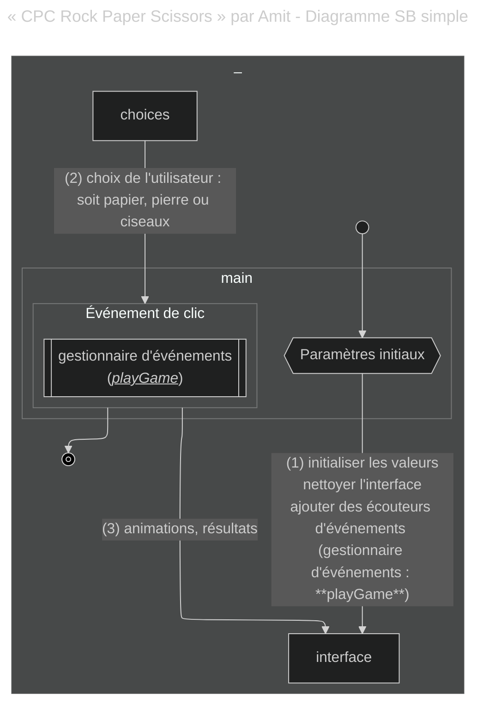


#### Le gestionnaire d'événements `playGame`

Examinons de plus près la fonction `playGame` :

```javascript
  function playGame(playerChoice) {
    const computerChoice = choices[Math.floor(Math.random() * choices.length)];
    const animationDiv = document.getElementById("animation");
    const resultDiv = document.getElementById("result");

    clearInterval(animationInterval);
    let currentIndex = 0;

    animationInterval = setInterval(() => {
      animationDiv.textContent = emojiMap[choices[currentIndex]];
      currentIndex = (currentIndex + 1) % choices.length;
    }, 100);

    setTimeout(() => {
      clearInterval(animationInterval);
      animationDiv.textContent = emojiMap[computerChoice];
      displayResult(playerChoice, computerChoice);
    }, 1500);
  }
```

Il semble qu'il se passe beaucoup de choses dans cette fonction qui pourraient être considérées comme des fonctionnalités séparées. Bien que ce ne soit pas explicite, il y a différentes sections :

* une dédiée au calcul du choix de l'ordinateur

* puis un `setInterval` pour gérer une animation

* puis un `setTimeout` pour effacer l'animation précédente et exécuter la fonction `displayResult`

#### Affinement

La première opération fonctionnelle facile à identifier dans l'ensemble du code, et qui pourrait être mise à part, est celle responsable de l'affichage des résultats : la fonction `displayResult`.

Mais nous devons clarifier les relations dans notre diagramme. La fonction `displayResult` n'est pas appelée après le gestionnaire d'événements mais est appelée par le gestionnaire d'événements lui-même. Nous pourrions dire que le gestionnaire d'événements *utilise* la fonction `displayResult`. Clarifions ces définitions sur le diagramme, et ajoutons également une légende :

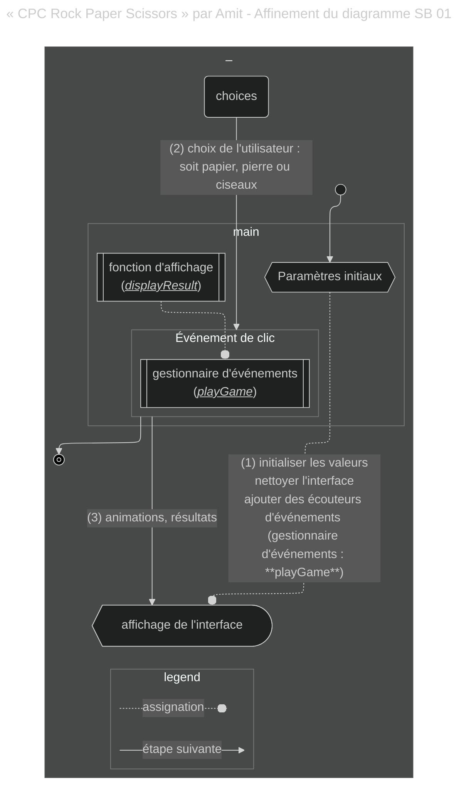


De même, la fonction `displayResult` utilise deux fonctions dédiées aux animations : `triggerFireworks` et `triggerLossBackground`. Toutes les fonctions sont déclarées dans la *portée principale*.

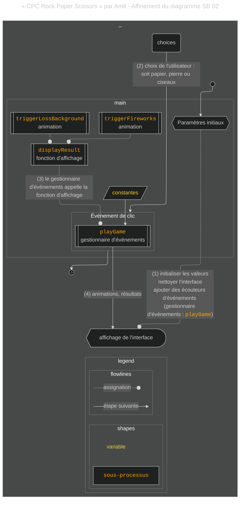


#### Programmation impérative

Ce code est très impératif. Voici une définition de la programmation impérative de Wikipedia :

> La programmation impérative se concentre sur la description *comment* un programme fonctionne étape par étape (généralement l'ordre des étapes étant déterminé dans le code source par le placement des instructions les unes sous les autres), plutôt que sur des descriptions de haut niveau de ses résultats attendus

Trouver que le projet suit un paradigme impératif est utile car cela donne une idée générale de ce à quoi nous pouvons nous attendre en termes de la manière dont le code est organisé et du type de logique que nous pourrions utiliser. Nous pouvons nous attendre à ce que la logique de calcul suive un certain flux de travail.

#### Finalisation du diagramme

Maintenant que nous avons découvert les modules les plus explicites et leurs relations, nous pouvons travailler sur l'identification des sections du code qui pourraient être considérées comme des unités fonctionnelles/opérationnelles séparées. Ces unités séparées peuvent être définies comme des « cas d'utilisation » et deviendront les étapes du flux de travail.

En tant que moyen d'améliorer le diagramme, j'ai différencié les étapes et les blocs de processus pour prévenir la confusion entre les « modules » et les « cas ».

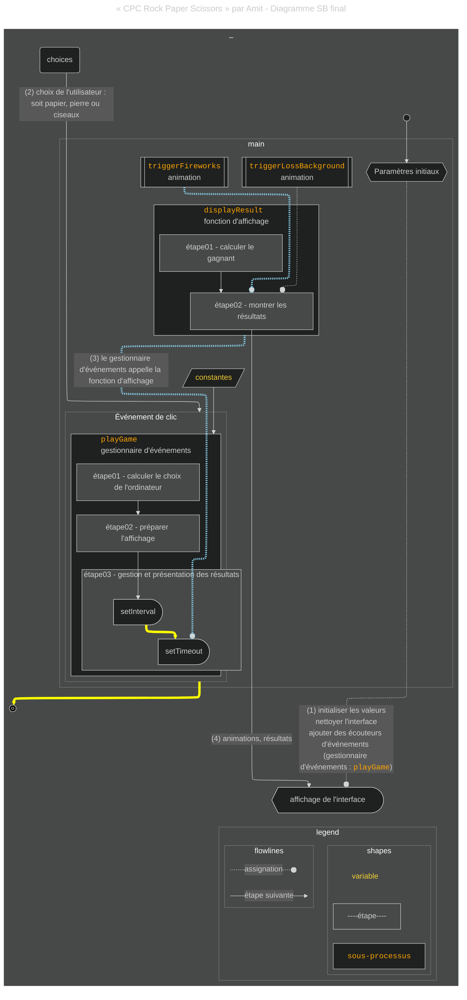


Résumé de ce qui se passe ici :

* Dans ce projet, une fonction agissant comme un gestionnaire d'événements contient la majeure partie de la logique du projet et assume la pleine responsabilité de l'exécution de certaines des étapes du flux de travail.

* Une fois que le gestionnaire d'événements est déclenché, le choix de l'utilisateur lui est passé et la même fonction calcule le choix de l'ordinateur.

* Ce calcul est suivi par une partie de la préparation de l'interface, puis une animation gérée par un `Interval` – suivie par une méthode JavaScript `Timeout` imbriquée.

* La méthode Timeout a la fonction `displayResult` comme fonction de rappel. Cette fonction prendra la responsabilité des étapes restantes.

* C'est à l'intérieur de `displayResult` que le calcul du gagnant a lieu. La même fonction contrôle le reste de l'affichage des résultats avec différents affichages délégués à deux autres fonctions en fonction de qui gagne le jeu.

### 2. « Rock paper scissors game using native drag & drop » par Hmz C : Un projet utilisant l'élément HTML Drag

%[https://codepen.io/HmZ2/pen/yLPGpg]

Hmz C n'a pas été aussi actif qu'Amit, avec seulement 7 projets sur CodePen sur 10 ans depuis 2014. Le pen que nous allons analyser est sa toute première contribution à CodePen. Le projet semble être une démonstration de l'[API HTML Drag and Drop](https://developer.mozilla.org/en-US/docs/Web/API/HTML_Drag_and_Drop_API) qui est venue avec HTML5 au moment de sa sortie. Le jeu offre une expérience propre et interactive de "Pierre, Papier, Ciseaux" en utilisant des gestes intuitifs de glisser-déposer, des effets visuels et des mises à jour de score en direct. Il se concentre sur l'expérience utilisateur et l'interactivité.

Les principales caractéristiques de ce projet sont :

* L'interaction de glisser-déposer, avec des animations simples mais propres.

* Le score est central dans cette application. Les scores de l'utilisateur et de l'ordinateur sont mis à jour et affichés en temps réel.

* Le jeu offre une interface très propre et facile à comprendre sans paraître statique.

### Analyse du projet

#### Découverte rapide du début et de la fin du flux de travail

En inspectant le code, vous pourrez réaliser que ce code suit un schéma général similaire à celui que nous avons examiné précédemment :

* Les variables et les états sont initialisés immédiatement lorsque le projet est accessible.

* De même, un gestionnaire d'événements est ajouté aux éléments de l'interface, mais cette fois, ils ne répondront pas aux événements de clic mais aux événements de **glisser-déposer**.

* Ce gestionnaire d'événements est celui qui démarre et coordonne le flux de travail.

* Le flux de travail se termine en affichant les résultats sur l'interface.

Étant donné les similitudes entre ce projet et le précédent à ce niveau d'analyse, j'ai réutilisé le script que j'ai créé pour le graphique précédent et je l'ai modifié en conséquence.

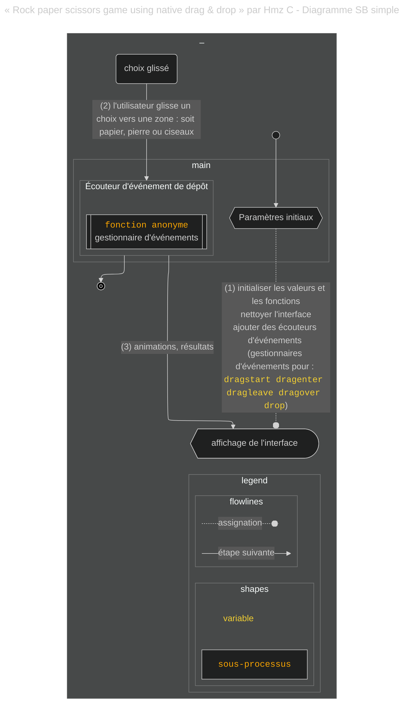


#### IIFE

Ce projet est le seul à utiliser un motif IIFE (Immediately Invoked Function Expression) pour enregistrer les écouteurs de glisser-déposer. C'est à l'intérieur de cette IIFE (`user`) que l'**écouteur de dépôt** est également déclaré.

```javascript
(function user() {

    for (var i = 0; i < hand.length; i++) {
        hand[i].ondragstart = dragStart;
    }

    function dragStart() {
        userChoice = this.getAttribute("data-hand");
    }

    userArea.addEventListener('dragenter', function(e) {
        e.preventDefault();
        this.style.borderColor = "red";
        user_icon.style.visibility = "hidden";
    });

    userArea.addEventListener('dragleave', function(e) {
        e.preventDefault();
        this.style.borderColor = "#dedede";
        user_icon.style.visibility = "initial";
    });

    userArea.addEventListener('dragover', function(e) {
        e.preventDefault();
    });

    userArea.addEventListener('drop', function(e) {
        e.preventDefault();
        computerChoice = cpu();
        user_icon.classList.remove("fa-spin");
        user_icon.className = "fa fa-hand-" + userChoice + "-o fa-2x fa-fw";
        computer_icon.className = "fa fa-hand-" + computerChoice + "-o fa-2x fa-fw";
        this.style.borderColor = "#dedede";
        user_icon.style.visibility = "initial";
        whowins(computerChoice, userChoice);
    });
})();
```

Ce projet a été complété avant la sortie d'ES6 en 2015. L'une des utilisations du motif est de garder les variables et les fonctions au sein de l'IIFE isolées de la portée globale. Bien que l'IIFE soit toujours une syntaxe valide, dans le JavaScript moderne, la plupart des opérations fonctionnelles où le motif IIFE est applicable peuvent désormais être implémentées avec l'utilisation de mots-clés spéciaux, d'opérations spéciales et de normes.

#### Affinement

En plus du gestionnaire d'événements, il y a deux autres fonctions – la fonction `cpu` et la fonction `whowins` – qui prendront en charge d'autres aspects de la fonctionnalité. Ces fonctions sont déclarées dans la portée globale.

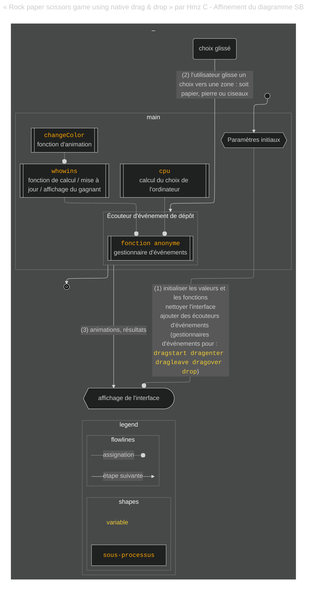


Maintenant que nous avons un aperçu de la manière dont les fonctions déclarées sont liées, identifions les opérations fonctionnelles dont elles s'occupent et ayons une meilleure idée du flux de travail complet.

#### Finalisation du diagramme et comparaison avec le projet précédent

Après avoir inspecté le code et fait plusieurs itérations sur le diagramme précédent, j'ai obtenu le résultat final suivant. Réutiliser des parties du script que j'ai fait pour le projet précédent m'a aidé à réduire le nombre d'itérations.

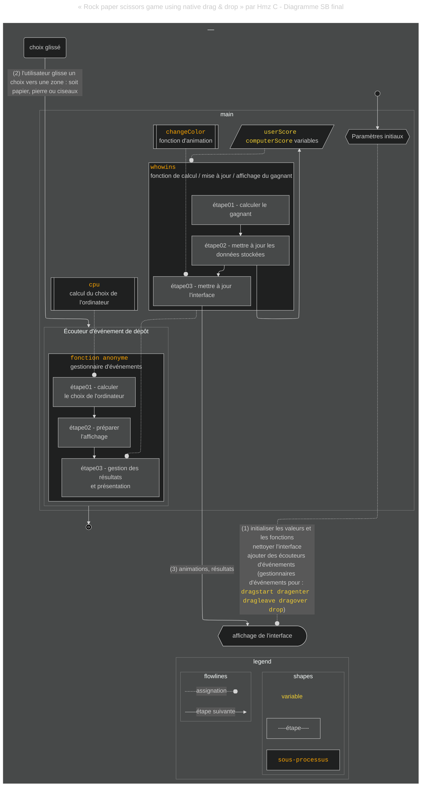


Remarquez les fortes similitudes entre ce projet et le précédent :

* L'ordre des étapes

* La structure de code impérative

* Le gestionnaire d'événements délègue les dernières étapes à une autre fonction

* Cette fonction (`whowins`) exécute le calcul du gagnant

* Cette même fonction délègue l'affichage des résultats à une autre fonction (`changeColor`)

* Il y a une préférence pour l'utilisation de fonctions et de variables déclarées dans la portée globale

Ce qui est différent dans ce projet :

* Le gestionnaire d'événements est déclaré comme une fonction de rappel anonyme directement dans l'écouteur

* Ce gestionnaire d'événements délègue l'exécution du calcul du choix de l'ordinateur à une autre fonction, la fonction `cpu`.

* Il n'y a pas de fonctionnalités asynchrones dans ce projet

* Différent du projet précédent, celui-ci a une gestion de données légèrement plus avancée. Les données étaient stockées dans des variables globales (`userScore`, `computerScore`) qui sont mises à jour juste après le calcul du gagnant.

### 3. « Rock Paper Scissors » par Brad Traversy : Un projet avec une modale et une réinitialisation

%[https://codepen.io/bradtraversy/pen/wLgPzr]

Si vous avez commencé à apprendre JavaScript par vous-même à un moment donné entre 2015 et aujourd'hui (2025), vous avez peut-être entendu parler de ce gars. [Brad Traversy](https://www.linkedin.com/in/bradtraversy) est une légende parmi ceux qui apprennent à coder et a également créé son propre programme d'apprentissage.

Le nombre de ressources produites par Brad est immense. Sa première contribution à CodePen remonte à 2017. Son activité sur CodePen a décliné avec le temps, mais il a continué à publier des ressources précieuses.

En 2019, il a créé ce jeu Pierre, Papier, Ciseaux. Ce code offre une implémentation simple mais engageante avec une interface utilisateur dynamique. L'intégration d'un choix d'ordinateur aléatoire, du suivi des scores et de l'affichage des résultats dans une modale crée une expérience interactive et visuellement attrayante pour les utilisateurs.

Les principales caractéristiques de ce projet sont :

* **Choix aléatoire de l'adversaire** : Le mouvement de l'ordinateur est aléatoire à chaque tour pour simuler un adversaire imprévisible.

* **Affichage modal dynamique** : Une fenêtre modale montre les résultats du tour pour une expérience utilisateur polie et conviviale.

* **Redémarrage du jeu**.

* **Persistance des scores entre les tours** : Le tableau des scores suit les scores jusqu'à ce que le jeu soit réinitialisé manuellement, permettant un jeu continu.

### Analyse du projet

#### Découverte rapide du début et de la fin du flux de travail

L'inspection de ce code révèle un schéma définitif dans la manière dont le jeu est conçu. De manière similaire aux projets précédents, dans celui-ci :

* il initialise les variables et les états immédiatement après que le projet est accessible

* il a des gestionnaires d'événements ajoutés aux éléments HTML correspondants dans l'interface

* une fonction est généralement associée au gestionnaire d'événements qui est celle qui coordonne le flux de travail – dans ce cas, la fonction `play`.

* le flux de travail se termine en affichant les résultats sur l'interface

De plus, ce projet implique un deuxième gestionnaire d'événements avec une fonction pour fermer une modale utilisée pour afficher les résultats. Un troisième gestionnaire d'événements est ajouté pour redémarrer le jeu.

Encore une fois, étant donné les similitudes entre ce projet et les précédents à ce niveau d'analyse, j'ai réutilisé le script que j'ai créé et je l'ai modifié en conséquence.

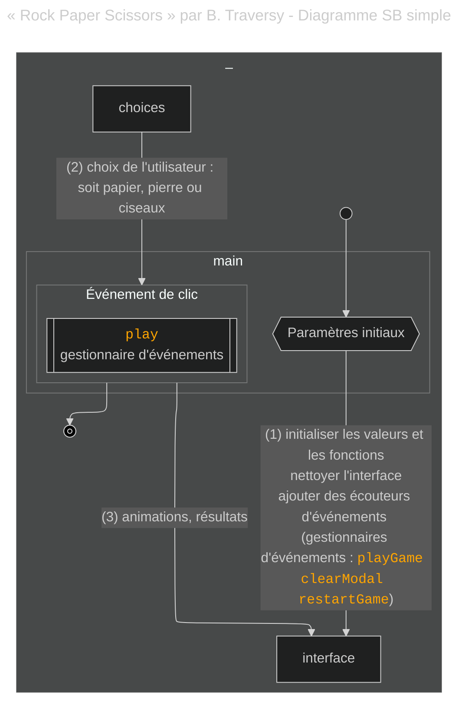


#### Affinement

Ce projet fait un pas en avant dans la conception d'un gestionnaire d'événements, la fonction `play`. Sa seule responsabilité serait de déléguer les opérations à d'autres fonctions.

Trois fonctions sont appelées à partir de ce gestionnaire d'événements :

* `getComputerChoice`

* `getWinner`

* `showWinner`

Remarquez que toutes ces fonctions sont déclarées dans la portée globale – mais cette fois, la fonction `play` est également dans la même portée.

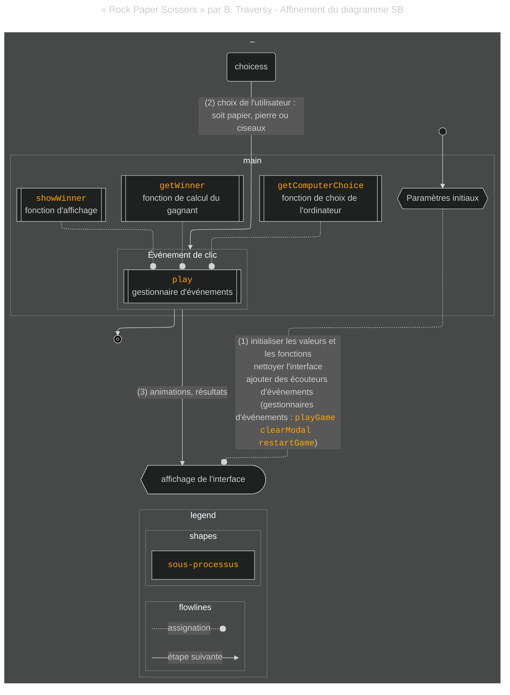


#### Le gestionnaire d'événements `play` en tant que contrôleur

Dans ce projet, la fonction `play` ressemble davantage à l'idée d'un **contrôleur**. Les tâches de ce gestionnaire d'événements sont réduites à agir en tant que délégateur, ce que nous n'avons pas vu pleinement implémenté dans les projets précédents.

```javascript
// Jouer au jeu
function play(e) {
  restart.style.display = 'inline-block';
  const playerChoice = e.target.id;
  const computerChoice = getComputerChoice();
  const winner = getWinner(playerChoice, computerChoice);
  showWinner(winner, computerChoice);
}
```

Le **modèle de contrôleur** est un modèle architectural courant utilisé dans les applications interactives pour gérer les entrées de l'utilisateur en les dirigeant vers d'autres composants pour le traitement et la coordination. Le contrôleur `play` sera celui qui coordonnera les actions une fois que l'utilisateur appellera la fonction depuis l'interface.

#### Modularité et séparation des préoccupations (SoC)

Cependant, celui-ci est très **modulaire**, suivant un flux procédural structuré.

Cette modularité pourrait être associée à une meilleure séparation des préoccupations, ou SoC. Le SoC implique la conception de code de sorte que chaque section du code soit gérée par une unité opérationnelle différente. Malgré sa taille, ce code montre une attention à ce principe sous forme de fonctions.

#### Programmation procédurale

La **programmation procédurale** est une forme de programmation impérative où les procédures sont déléguées à des fonctions. La manière dont le projet est conçu est plus conforme à ces pratiques.

#### Finalisation du diagramme et comparaison avec les projets précédents

Les opérations fonctionnelles des fonctions appelées par le contrôleur sont plus évidentes à partir du diagramme final de ce projet :

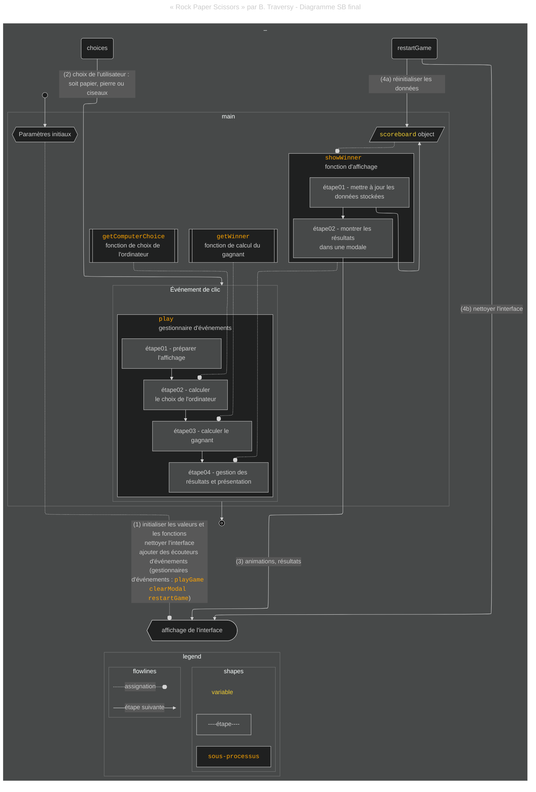


Mettons en évidence les différentes étapes réalisées par les fonctions déléguées :

* La fonction `getComputerChoice` est responsable du calcul du choix de l'ordinateur.

* Les résultats sont collectés par le contrôleur et passés à une autre fonction, `getWinner`, qui est responsable du calcul du gagnant.

* Ensuite, les résultats de la fonction `getWinner` sont collectés par le contrôleur et passés à la fonction suivante, `showWinner`.

* La fonction `showWinner` a une conception similaire à celle faite par Hmz C pour son projet. Elle n'aura qu'une responsabilité en moins et ne prendra que les responsabilités de la gestion des données d'un type de données légèrement plus complexe pour la capture et la maintenance du score actuel (l'objet `scoreboard`), ainsi que l'affichage des résultats.

Malgré les différences dans la manière dont le code a été conçu, l'ordre des étapes est très similaire aux projets que nous avons discutés précédemment.

D'autres caractéristiques différentes des exemples de code précédents sont l'existence d'une modale pour la présentation des résultats et une fonctionnalité de réinitialisation. Nous n'en discutons pas car elles sortent du cadre des analyses, qui est la conception du jeu Pierre, Papier, Ciseaux.

### 4. « Rock Paper Scissors OOP » par Damian : Un projet écrit en OOP

%[https://codepen.io/CvtS/pen/oNXqJoZ]

Damian a 3 projets sur CodePen, tous réalisés en 2020. L'un d'eux est ce jeu. Le code JavaScript implémente une autre variation du jeu "Pierre, Papier, Ciseaux" mais avec une approche plus orientée objet utilisant des classes pour gérer la logique du jeu, les choix des joueurs et les statistiques.

Il s'agit d'une version bien organisée et orientée objet du jeu "Pierre, Papier, Ciseaux" avec une séparation claire des préoccupations (calcul des résultats, choix du joueur/ordinateur et statistiques du jeu). L'utilisation d'animations et d'interactions UI améliore l'expérience utilisateur.

Les principales caractéristiques de ce projet sont :

* **Conception orientée objet** : Le code est structuré en classes, le rendant modulaire, réutilisable et plus facile à maintenir.

* **UI interactive** : Il met à jour dynamiquement les choix du joueur et de l'ordinateur en utilisant des indices visuels (classes CSS) et montre des animations pour les matchs nuls.

* **Statistiques** : Le jeu suit et met à jour le nombre de victoires, de matchs nuls et de défaites, qui sont affichés en temps réel.

### Analyse du projet

#### Découverte rapide du début et de la fin du flux de travail

Ce code semble plus complexe que ce que nous avons examiné précédemment. Mais un examen plus approfondi suggère une certaine ressemblance avec les précédents, au moins à un niveau élevé de généralisation :

* Encore une fois, les variables et les états sont initialisés une fois que le projet est accessible.

* L'une des variables initialisées lorsque le projet est accessible est une instance d'une classe, la classe `Game`. L'instance est appelée `newGame`.

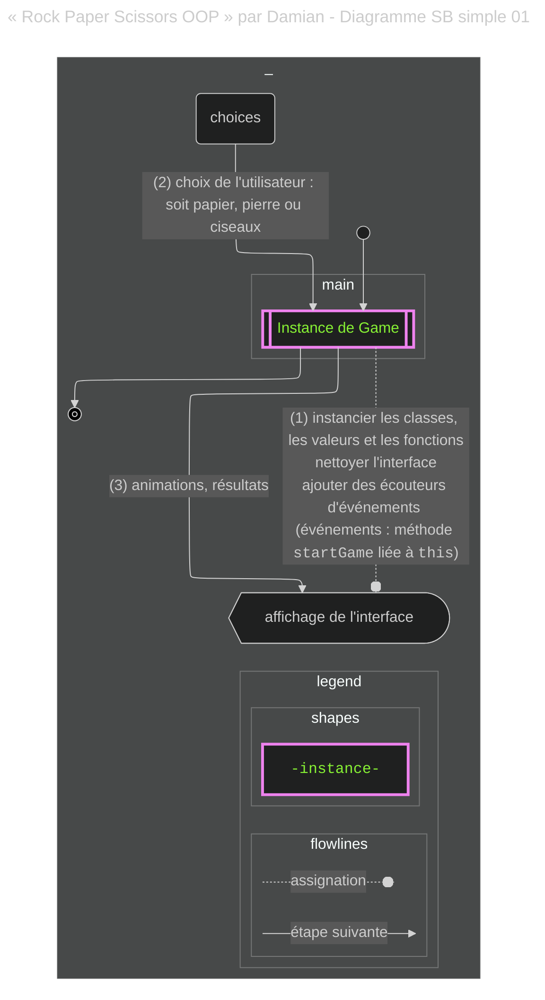


Encore une fois, nous pouvons voir des aspects de ce flux de travail qui coïncident avec ce que nous avons trouvé dans les projets précédents – mais cette fois, ces similitudes sont plus difficiles à capturer. Comme dans le code précédent, le **modèle de contrôleur** est prévalent dans ce code, mais au lieu d'être associé à une fonction anonyme ou globale, il est maintenant un **module de classe**.

L'instanciation de la classe exécute le constructeur qui inclut l'assignation immédiate des gestionnaires d'événements de clic dans l'interface (comme avec les autres projets). Ils utilisent un module de la classe, le module `startGame`, comme fonction de rappel.

L'approche (syntactique) que Damian a choisie ajoute des complexités supplémentaires au code en termes de définition de portée. Vous pouvez repérer certaines des complexités en réalisant la nécessité d'utiliser la méthode `bind` de JavaScript afin de garder le contexte `this` de la fonction module identique à celui de l'instance lors de l'assignation à l'événement.

```javascript
class Game {
  constructor() {
    this.optionsImg = document.querySelectorAll('.img');
    this.optionsBtns = document.querySelectorAll('button');
    
    this.optionsBtns.forEach(option => option.addEventListener('click', 
                                                                this.startGame.bind(this) // voir le bind ici
                                                                )
                            )

    this.youWins = document.querySelector('.results > .you-win');
    this.draw = document.querySelector('.results > .draw');
    this.PcWins = document.querySelector('.results > .pc-win');

    this.stats = new Stats(0, 0, 0);

    this.render.call(this, this.stats.getStats());
  }
```

Pour représenter cela, j'ai utilisé un lien coloré, indiquant que l'instance de jeu (via le constructeur) est définie pour être le contexte `this` du module.

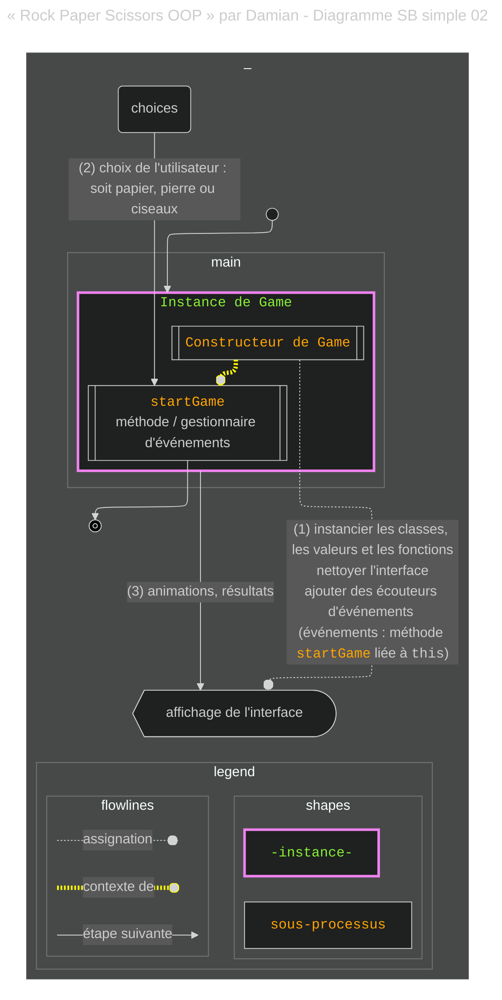


#### Affinement

En ajoutant l'évaluation des classes, le diagramme de flux devient plus détaillé mais aussi plus compliqué.

Damian a défini 4 classes pour ce projet : `Result`, qui était juste une méthode statique, `Choice`, `Stats` et `Game` :

```javascript
class Result {
  static whoWin(yourChoice, PCchoice) {
    ...
  }
}

class Choice {
  constructor(yourChoice) {
    ...
  }

  getYourChoice = () => this.yourChoice;
  getPcChoice = () => this.PCchoice;

  drawPcChoice() {
    ...
  }
}

class Stats {
  constructor(wins, draws, loses) {
    ...
  }
  getStats = () => this.status;

  refreshStats(result) {
    ...
  }
}

class Game {
  constructor() {
    ...
  }

  startGame(e) {
    ...
  }

  render(stats) {
    ...
  }
}

const newGame = new Game();
```

La meilleure façon de garder le diagramme plus simple est de ne pas détailler toutes les étapes des fonctionnalités. Mais puisque je mentionne les instances, j'ai également ressenti l'urgence de les relier à la classe correspondante. Je l'ai fait en utilisant un type et une couleur de ligne différents.

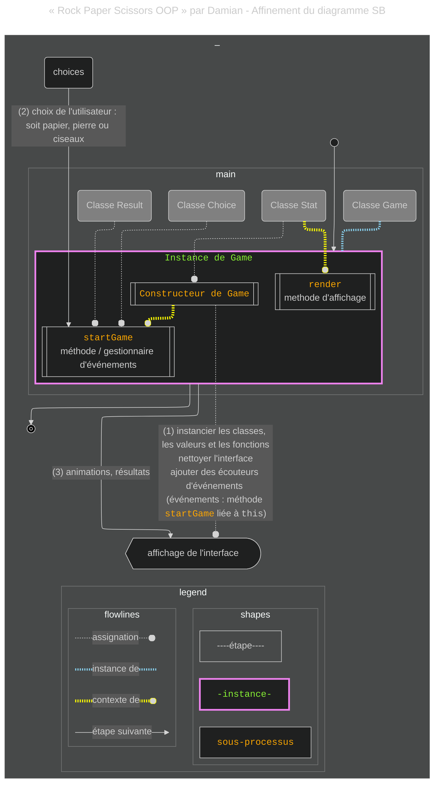


Avec le diagramme ci-dessus, j'ai essayé de mettre en évidence certains aspects exceptionnels de l'architecture de ce code. À un moment donné, une instance de la classe `Stats` sera le contexte pour la méthode `render` de l'instance de la classe `Game`. J'ai ajouté des connexions entre les classes et le flux de travail pour indiquer que les classes étaient utilisées à ces étapes du flux de travail.

#### Encapsulation OOP

Une façon d'améliorer le SoC de votre projet est par l'encapsulation. L'**encapsulation** est un concept généralement lié à l'OOP et il s'agit de garder les données et les méthodes qui travaillent avec ces données regroupées dans la même classe.

Ce projet montre des efforts pour atteindre l'encapsulation :

* L'instance `Stats` est celle qui stockera les données, et les méthodes sont en accord avec sa tâche :

```javascript
class Stats {
  constructor(wins, draws, loses) {
    this.status = {
      wins: wins,
      draws: draws,
      loses: loses,
    }
  }
  getStats = () => this.status;

  refreshStats(result) {
    switch (result) {
      case "win":
        this.status.wins++;
        break;
      case "draw":
        this.status.draws++;
        break;
      case "lose":
        this.status.loses++;
        break;
    }
  }
}
```

* L'instance `Choice` sera dédiée au calcul des choix, et contient donc des méthodes qui répondent à cette tâche :

```javascript
class Choice {
  constructor(yourChoice) {
    this.yourChoice = yourChoice;
    this.PCchoice = this.drawPcChoice();
  }

  getYourChoice = () => this.yourChoice;
  getPcChoice = () => this.PCchoice;

  drawPcChoice() {
    const options = ["rock", "paper", "scissors"];

    return options[Math.floor(Math.random() * options.length)];
  }
}
```

#### Finalisation du diagramme et comparaison avec les projets précédents

Pour le diagramme final du projet, je voulais :

* Souligner l'importance des **méthodes** dans les classes en les mentionnant dans leur classe correspondante, et

* Indiquer l'importance apparente de l'instance `Stats` dans le flux de travail.

Voici le diagramme final de ce projet :

```mermaid
---
title: « Rock Paper Scissors OOP » par Damian - Diagramme SB final
config:
    theme: dark
    layout: "elk"
    flowchart:
        nodeSpacing: 50
        rankSpacing: 50
---
flowchart TD
subgraph _
subgraph main
    subgraph gameInst[<code>Instance de Game</code>]
        subgraph gameConstrt["<code style="color:orange;">Constructeur de Game</code>"]
            init@{shape: hex, label: "Paramètres initiaux"} --> statInst@{shape: fr-rect, label: "<code>Instance de Stat</code>"}
        end
        subgraph eventHandler["<code style="color:orange;">startGame</code><br/>méthode / gestionnaire d'événements"]
            step01[étape01 - animation] --> step02[étape02 - calculer le choix de l'ordinateur]
            step02 --> step03[étape03 - préparer l'affichage]
            step03 --> step04[étape04 - calculer le gagnant et mettre à jour les données]
            step04 --> step05[étape05 - montrer le résultat]
        end
        gameConstrt -.-o eventHandler
        statInst -.-o |"utiliser le gagnant calculé pour mettre à jour <code style='color:#f1ce32'>status</code> en exécutant <code style="color:orange;">refreshStats</code>"| step04
        render@{shape: fr-rect, label: "<code style="color:orange;">render</code>\nmethode d'affichage"}
    end
    classGame@{shape: rounded, label: "Classe Game<br/>---------------"} -.- gameInst
    classStat@{shape: rounded, label: "Classe Stat<br/>-----------------------<br/>+status (obj / data)<br/>-----------------------<br/>+refreshStats()<br/>+getStats(result)"} -.- statInst
    classResult@{shape: rounded, label: "Classe Result<br/>--------------------------<br/>+<u>whoWin(yourCh, pcCh)</u>"} -.-o |"utiliser la méthode <code style='color:orange'>static</code> de Result pour calculer le gagnant"| step04
    classChoice@{shape: rounded, label: "Classe Choice<br/>--------------------<br/>+yourCh, pcCh<br/>--------------------<br/>+getYourChoice()<br/>+getPcChoice()<br/>+drawChoice()"} -.-o |utiliser <code style="color:#87f134;">Instance de Choice</code> pour dessiner le choix du PC| step02
    statInst -.-o render
    render -.-o |"prendre le <code style='color:#f1ce32'>status</code> de Stat et montrer <code style='color:#f1ce32'>yourCh</code> / <code style='color:#f1ce32'>pcCh</code><br/>dernier score"| step05
end
gameConstrt -.-o |"(1) instancier les classes, les valeurs et les fonctions<br>nettoyer l'interface<br>ajouter des écouteurs d'événements (événements : méthode <code style="color:orange;">startGame</code> liée à <code>this</code>)"|interface
eventHandler --> stop@{shape: framed-circle}
start@{shape: start} --> init
choices@{shape: rounded} --> |"(2) choix de l'utilisateur : soit papier, pierre ou ciseaux"| eventHandler
eventHandler --> |"(3) animations, résultats"| interface@{shape: curv-trap, label: "affichage de l'interface"}
subgraph legend
      direction LR
      subgraph flowlines
        start1[ ] -->|"étape suivante"| stop1[ ]
        style start1 height:0px;
        style stop1 height:0px;
        start2[ ] -.-o|"assignation"| stop2[ ]
        style start2 height:0px;
        style stop2 height:0px;
        start3[ ] --o|"contexte de"| stop3[ ]
        linkStyle 20 stroke:yellow, stroke-width:5px
        style start3 height:0px;
        style stop3 height:0px;
        start4[ ] -.-|"instance de"| stop4[ ]
        linkStyle 21 stroke:skyblue, stroke-width:4px
        style start4 height:0px;
        style stop4 height:0px;
      end
      subgraph shapes
      variable["variable"]
      style variable width:135px, fill:none, stroke:none, color:#f1ce32
      subprocess[<code style="color:orange;">sous-processus</code>]
      instance[<code style="color:#87f134;">-instance-</code>]
      style instance stroke:violet, stroke-width: 3px;
      stepLegend["----étape----"]
      style stepLegend fill:#474949, stroke: #CCC, color:#CCC
      end
end
end
interface ~~~ legend

style start fill:black
style stop fill:black, fill-stroke:white
classDef isaclass fill:grey
class classGame,classChoice,classResult,classStat isaclass
classDef subProc fill:#1f2020, stroke: #CCC, color:#CCC
class eventHandler,gameConstrt subProc
classDef step fill:#474949, stroke: #CCC, color:#CCC
class init,step01,step02,step03,step04,step05 step
classDef inst fill:#1f2020, color:#87f134, stroke:violet, stroke-width: 3px
class statInst,gameInst inst
linkStyle 5,11 stroke:yellow, stroke-width: 5px
linkStyle 7,8 stroke:skyblue, stroke-width:4px
```


Ce qui rend ce code similaire aux précédents est ce qui suit :

* L'ordre des étapes est très similaire

* Une étape initiale est prise pour définir les variables aux stades initiaux et enregistrer une fonction de gestionnaire d'événements pour les événements de clic correspondants

* Ce projet est également impératif dans sa conception

Ce projet partage plus de similitudes avec le projet de Brad Traversy.

* La conception du gestionnaire d'événements est plus proche d'un modèle de contrôleur

* Par conséquent, la modularité et le SoC semblent être des concepts qui ont guidé la conception.

* Le traitement des opérations est organisé selon la programmation procédurale.

C'est là que s'arrêtent les similitudes.

* L'initialisation du jeu se fait par l'instanciation d'une classe :

```javascript
const newGame = new Game();
```

Différent de tous les projets précédents, le gestionnaire d'événements/contrôleur est maintenant une méthode de la classe instanciée. La méthode est ensuite enregistrée comme gestionnaire d'événements des événements de clic directement à partir du constructeur lorsque la classe est instanciée.

* La modularité se fait par l'appel de méthodes de classes instanciées, au lieu de (fonctions déclarées globalement).

* En utilisant le paradigme OOP, ce projet montre un niveau plus élevé de SoC en ajoutant l'encapsulation.

* Il y a des cas particuliers dans ce code où il a été nécessaire de lier au contexte this approprié. Des exemples sont la liaison des méthodes de la classe `Game`.

### 5. « Recurrent Neural Network – Rock, Paper, Scissors » par Andrew Worcerster : Un projet implémentant l'IA

%[https://codepen.io/amwmedia/pen/maowdm]

Andrew Worcester n'a pas été un contributeur régulier à CodePen mais a créé environ 50 projets depuis 2013. Le projet que nous allons analyser a été créé en 2019, un an après la première sortie de `brain.js`.

Ce code implémente une version plus avancée du jeu "Pierre, Papier, Ciseaux", qui utilise des réseaux de neurones (via la bibliothèque `brain.js`) pour prédire le prochain mouvement du joueur et même simuler des émotions pour l'adversaire informatique en fonction de ses schémas de victoire/défaites.

Ce code crée une version engageante et pilotée par l'IA du jeu "Pierre, Papier, Ciseaux" avec des fonctionnalités avancées comme la prédiction des mouvements et la simulation d'émotions utilisant des réseaux de neurones.

Les principales caractéristiques de ce projet sont :

* **Réseau de neurones pour la prédiction** : un modèle pour prédire le prochain mouvement du joueur basé sur l'historique de ses mouvements crée une expérience de jeu adaptative, où le CPU ajuste sa stratégie.

* **Simulation d'émotions** : un autre modèle simulant des émotions basées sur les résultats du jeu (historique de victoires/défaites), et il affiche des emojis appropriés comme `😫`, `😊`, et ainsi de suite, à côté de ses mouvements.

* **UI interactive** : Le jeu utilise la manipulation du DOM pour afficher le mouvement du joueur, le mouvement du CPU, le résultat et l'état émotionnel du CPU après chaque tour.

* **Scoring dynamique** : Les scores du joueur et du CPU sont mis à jour et affichés après chaque tour.

### Analyse du projet

#### Découverte rapide du début et de la fin du flux de travail

À un niveau élevé de généralisation, ce code suit le même schéma que les autres projets, bien que la complexité des fonctionnalités ait augmenté :

* Encore une fois, les variables et les états sont initialisés une fois que le projet est accessible.

* En plus de cela, un gestionnaire d'événement de clic est assigné portant une fonction anonyme comme fonction de rappel. Le **modèle de contrôleur** semble réapparaître dans ce projet également.

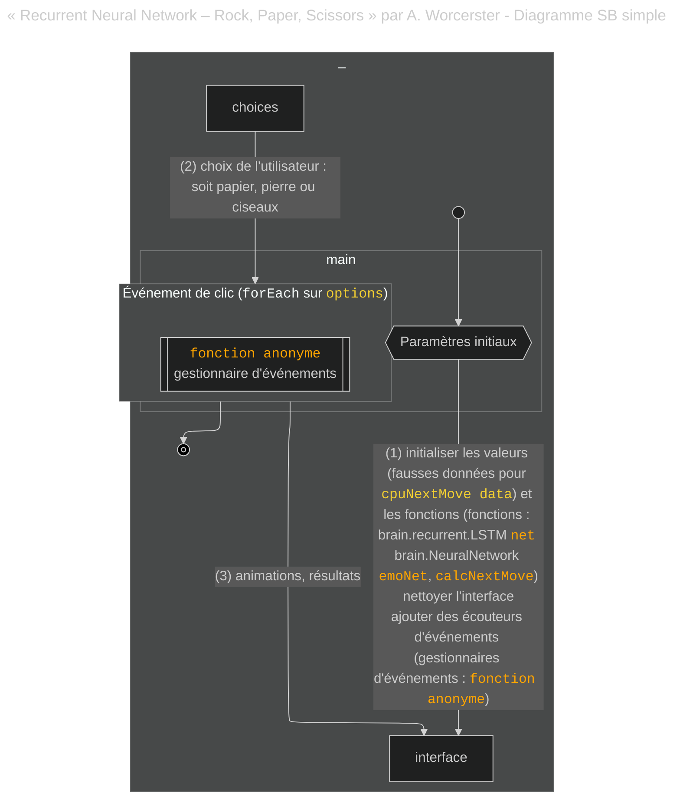


Une différence clé par rapport aux projets précédents est **l'entraînement des opérations du réseau de neurones**. Certaines de ces fonctionnalités sont initialisées à un état initial même avant que l'utilisateur ne clique.

#### Affinement

Si nous gardons toujours un niveau élevé de généralisation, nous pouvons voir que plusieurs des responsabilités du flux de travail seront prises en charge par des fonctions et même des opérations en dehors du gestionnaire d'événements.

Le projet dispose de plusieurs fonctionnalités `brain.js` en place. Les plus évidentes sont :

* Le LSTM (Long Short Term Memory), qui est un réseau de neurones conçu pour capturer des associations et des motifs qui sont séparés dans le temps ou l'espace – et il est celui associé à la prédiction du prochain mouvement de l'utilisateur.

* Un réseau de neurones feed-forward par défaut d'une seule couche, conçu pour comparer des motifs immédiats, et il est celui associé à la simulation des émotions.

Le LSTM est utilisé par une autre fonction, `calcNextMove`, pour fournir un résultat immédiat même avant que l'utilisateur n'interagisse avec l'événement de clic : une valeur pour la variable `cpuNextMove`.

`cpuNextMove` est en effet le **calcul du choix de l'ordinateur** et il se produit *avant* que l'utilisateur ne clique, commençant par une valeur par défaut basée sur de fausses données.

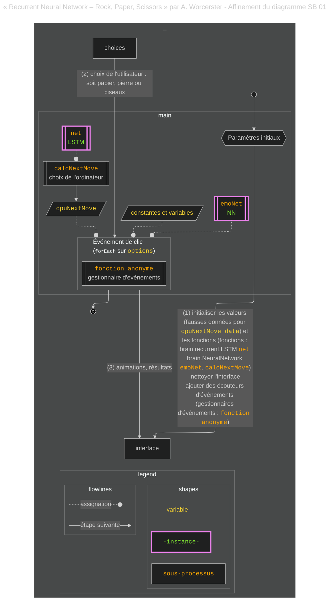


#### Affinement supplémentaire

Ce projet présente certaines complexités non vues dans les projets précédents, donc je vais essayer de le parcourir lentement. Voyons d'abord un autre niveau d'affinement où les étapes sont montrées :

```mermaid
---
title: « Recurrent Neural Network – Rock, Paper, Scissors » par A. Worcerster - Affinement du diagramme SB 02
config:
    theme: dark
    layout: "elk"
    flowchart:
        nodeSpacing: 50
        rankSpacing: 50
---
flowchart TD
subgraph _
subgraph main
init
constvar@{shape: lean-r, label: "<span style="color:#f1ce32">constantes et variables</span>"} -.-o clickEventListener
step05 --> data@{shape: lean-r, label: "<code style="color:#f1ce32">data</code>"}
data -.-o calcNextMove
subgraph step00["stepInit - calculer le choix de l'ordinateur"]
    calcNextMove@{shape: fr-rect, label: "<code style="color:orange">calcNextMove</code><br/>choix de l'ordinateur"} --> cpuNextMove@{shape: lean-r, label: "<code style="color:#f1ce32">cpuNextMove</code>"}
    LSTM@{shape: fr-rect, label: "<code style="color:orange">net</code><br/>instance LSTM"} -.-o calcNextMove
    cpuNextMove -.-o Dout((A))
    cpuNextMove -.-o Eout((B))
end
NN@{shape: fr-rect, label: "<code style="color:orange">emoNet</code><br/>instance NN"} -.-o step03
subgraph clickEventListener["Événement de clic<br/>(<code style="font-size:13px">forEach</code> sur <code style="color:#f1ce32">options</code>)"]
    subgraph eventHandler["<code style="color:orange">fonction anonyme</code><br/>gestionnaire d'événements"]
        step01["étape01 - préparer un tableau de score pour cette option spécifique"] --> step02["étape02 - calculer le gagnant et mise à jour de l'historique du CPU"]
        step02 --> step03["étape03 - calculer l'émotion du CPU"]
        step03 --> step04["étape04 - gestion des résultats et présentation : Gagnant"]
        step04 --> step05["étape05 - mettre à jour les données"]
        step05 --> step06["étape06 - recalculer le gagnant et préparer l'affichage"]
        step06 --> step07["étape07 - calculer le prochain mouvement ; gestion des résultats et présentation : Scores"]
        Din((A)) -.-o step02
        Ein((B)) -.-o step06    
    end
end
end
init --> |"(1) initialiser les valeurs (fausses données pour <code style="color:#f1ce32">cpuNextMove data</code>) et les fonctions (fonctions : brain.recurrent.LSTM <code style="color:orange">net</code> brain.NeuralNetwork <code style="color:orange">emoNet</code>, <code style="color:orange">calcNextMove</code>)<br>nettoyer l'interface<br>ajouter des écouteurs d'événements (gestionnaires d'événements : <code style="color:orange">fonction anonyme</code>)"|interface
clickEventListener --> stop@{shape: framed-circle}
start@{shape: start} --> init@{shape: hex, label: "Paramètres initiaux"}
choices --> |"(2) choix de l'utilisateur : soit papier, pierre ou ciseaux"| clickEventListener
clickEventListener --> |"(3) animations, résultats"| interface

subgraph legend
      direction LR
      subgraph flowlines
        start1[ ] -->|"étape suivante"| stop1[ ]
        style start1 height:0px;
        style stop1 height:0px;
        start2[ ] -.-o|"assignation"| stop2[ ]
        style start2 height:0px;
        style stop2 height:0px;
      end
      subgraph shapes
      variable["variable"]
      style variable width:135px, fill:none, stroke:none, color:#f1ce32
      subprocess[<code style="color:orange;">sous-processus</code>]
      instance[<code style="color:#87f134;">-instance-</code>]
      style instance stroke:violet, stroke-width: 3px;
      end
end
end
interface ~~~ legend

style start fill:black
style stop fill:black, fill-stroke:white
classDef subProc fill:#1f2020, stroke: #CCC, color:#CCC
class eventHandler,gameConstrt subProc
classDef inst fill:#1f2020, color:#87f134, stroke:violet, stroke-width: 3px
class NN,LSTM inst
classDef step fill:#474949, stroke: #CCC, color:#CCC
class step00,step01,step02,step03,step04,step05,step06,step07 step
classDef connectorcpuNextMove fill:skyblue, color:black
class Dout,Din,Eout,Ein connectorcpuNextMove
```


Nous pouvons voir à partir du diagramme que :

1. Le `cpuNextMove` est pré-calculé, et donc le calcul du choix de l'ordinateur se produit *avant* le prochain clic de l'utilisateur. J'ai fait référence à cette étape comme étant « stepInit » pour indiquer que le premier calcul se produit à l'initialisation.

2. Après que le choix de l'utilisateur est capturé, sa valeur et la valeur de `cpuNextMove` sont finalement utilisées pour calculer le gagnant. Le résultat est stocké pour garder l'historique des scores de l'ordinateur.

3. L'historique des scores de l'ordinateur est l'entrée utilisée pour le calcul des émotions en utilisant le `emoNet`.

4. Le choix de l'utilisateur est ensuite utilisé pour créer la prochaine entrée pour les données, qui conserve l'historique des scores de l'utilisateur dans les `data` dans un format dédié.

5. Après avoir calculé le gagnant et affiché les résultats, le projet utilisera les données pour calculer le `cpuNextMove` *avant* que l'utilisateur ne clique à nouveau.

#### Finalisation du diagramme et comparaison avec les projets précédents

Nous aurions pu terminer avec le diagramme précédent car il est largement affiné, mais je voulais pratiquer un autre niveau d'affinement pour révéler le rôle que le *flux de données* a dans ce projet. Cela a abouti à un diagramme plus complexe que ceux précédemment montrés :

```mermaid
---
title: « Recurrent Neural Network – Rock, Paper, Scissors » par A. Worcerster - Diagramme SB final
config:
    theme: dark
    layout: "elk"
    flowchart:
        nodeSpacing: 50
        rankSpacing: 50
---
flowchart TD
subgraph _
subgraph main
init
constvar@{shape: lean-r, label: "<span style="color:#f1ce32">constantes et variables</span"} -.-o clickEventListener
step05 --> data@{shape: lean-r, label: "<code style="color:#f1ce32">data</code>"}
cpuWinLoss@{shape: lean-r, label: "<code style="color:#f1ce32">cpuWinLoss</code>"} -.-o Aout((A))
cpuWinLoss@{shape: lean-r, label: "<code style="color:#f1ce32">cpuWinLoss</code>"} -.-o Bout((B))
cpuWinLoss@{shape: lean-r, label: "<code style="color:#f1ce32">cpuWinLoss</code>"} -.-o Cout((C))
subgraph step00["stepInit - calculer le choix de l'ordinateur"]
    calcNextMove@{shape: fr-rect, label: "<code style="color:orange">calcNextMove</code><br/>choix de l'ordinateur"} --> cpuNextMove@{shape: lean-r, label: "<code style="color:#f1ce32">cpuNextMove</code>"}
    LSTM@{shape: fr-rect, label: "<code style="color:orange">net</code><br/>instance LSTM"} -.-o calcNextMove
    cpuNextMove -.-o Dout((A))
    cpuNextMove -.-o Eout((B))
end
data -.-o calcNextMove
delay01 --> calcNextMove  
NN@{shape: fr-rect, label: "<code style="color:orange">emoNet</code><br/>instance NN"} -.-o step03
subgraph clickEventListener["Événement de clic<br/>(<code style="font-size:13px">forEach</code> sur <code style="color:#f1ce32">options</code>)"]
    subgraph eventHandler["<code style="color:orange">fonction anonyme</code><br/>gestionnaire d'événements"]
        scoreValues@{shape: lean-r, label: "<code style="color:#f1ce32">scoreValues</code>"}
        step01["étape01 - préparer un tableau de score pour cette option spécifique"] --> step02["étape02 - calculer le gagnant et mise à jour de l'historique du CPU"]
        step01 -.-o scoreValues
        subgraph step03["étape03 - calculer l'émotion du CPU"]
           likely@{shape: fr-rect, label: "<code style="color:orange">brain.likely</code><br/>fonction d'estimation"} ~~~ nonode01[ ]
           style nonode01 height:0px;
        end

        Din((A)) -.-o step02
        scoreValues -.-o step02
        step02 --> step03
        step03 --> step04["étape04 - gestion des résultats et présentation : Gagnant"]
        scoreValues -.-o step04
        step04 --> step05["étape05 - mettre à jour les données"]
        step05 --> step06["étape06 - recalculer le gagnant et préparer l'affichage"]
        subgraph step07["étape07 - calculer le prochain mouvement"]
             delay01@{shape: delay, label: outer setTimeout}
            subgraph step08["étape08 - gestion des résultats et présentation : Scores"]
                delay02@{shape: delay, label: inner setTimeout}
            end
        end

        Cin((C)) -.-o delay02
        step06 --> delay01
        delay02 -.-o delay01
        Ain((A)) -.-o step02
        Bin((B)) -.-o likely
        Ein((B)) -.-o step04

    end
end
end
init --> |"(1) initialiser les valeurs (fausses données pour <code style="color:#f1ce32">cpuNextMove data</code>) et les fonctions (fonctions : brain.recurrent.LSTM <code style="color:orange">net</code> brain.NeuralNetwork <code style="color:orange">emoNet</code>, <code style="color:orange">calcNextMove</code>)<br>nettoyer l'interface<br>ajouter des écouteurs d'événements (gestionnaires d'événements : <code style="color:orange">fonction anonyme</code>)"|interface
eventHandler --> stop@{shape: framed-circle}
start@{shape: start} --> init@{shape: hex, label: "Paramètres initiaux"}
choices --> |"(2) choix de l'utilisateur : soit papier, pierre ou ciseaux"| clickEventListener
clickEventListener --> |"(3) animations, résultats"| interface

subgraph legend
      direction LR
      subgraph flowlines
        start1[ ] -->|"étape suivante"| stop1[ ]
        style start1 height:0px;
        style stop1 height:0px;
        start2[ ] -.-o|"assignation"| stop2[ ]
        style start2 height:0px;
        style stop2 height:0px;
      end
      subgraph shapes
      variable["variable"]
      style variable width:135px, fill:none, stroke:none, color:#f1ce32
      subprocess[<code style="color:orange;">sous-processus</code>]
      instance[<code style="color:#87f134;">-instance-</code>]
      style instance stroke:violet, stroke-width: 3px;
      end
end
end
interface ~~~ legend

style start fill:black
style stop fill:black, fill-stroke:white
classDef subProc fill:#1f2020, stroke: #CCC, color:#CCC
class eventHandler,gameConstrt subProc
classDef step fill:#474949, stroke: #CCC, color:#CCC
class step00,step01,step02,step03,step04,step05,step06,step07,step08 step
classDef inst fill:#1f2020, color:#87f134, stroke:violet, stroke-width: 3px
class LSTM,NN inst
classDef connectorcpuWinLoss fill:white, color:black
class Aout,Ain,Bout,Bin,Cout,Cin connectorcpuWinLoss
classDef connectorcpuNextMove fill:skyblue, color:black
class Dout,Din,Eout,Ein connectorcpuNextMove
```


Je pense que l'utilisation des données dans ce projet méritait une explication supplémentaire. En fait, ce n'est pas seulement l'utilisation de procédures d'apprentissage automatique qui rend ce projet plus complexe – mais aussi son utilisation associée de structures de données plus avancées.

Voici une sélection de certaines valeurs possibles pour certaines des variables utilisées pour collecter des données à différents points du flux de travail :

```javascript
structures de données :

"cpuNextMove : " "👊"

"cpuEmotions : " // [object Array] (4)
["😟","😨","😕","🤨"]

"data : " // [object Array] (3)
[// [object Array] (4)
["270CFE0F","👊","270B","270CFE0F"],// [object Array] (4)
["👊","270B","270CFE0F","270CFE0F"],// [object Array] (4)
["270B","270CFE0F","270CFE0F","270B"]]

"scoreValues : " // [object Object] 
{
  "270B": 0.3,
  "270CFE0F": 1,
  "👊": 0
}

"cpuWinLoss : " // [object Array] (5)
[0.3,0.3,0.3,1,0]
```

La manière dont `data` est fait (un tableau de tableaux) est une exigence pour l'algorithme LSTM dans ce cas particulier.

Également intéressant est l'utilisation de l'objet `scoreValues`.

```javascript
		const scoreValues = {
			[options[myMoveIdx]]: 0.3,         // égalité
			[options[(myMoveIdx + 1) % 3]]: 1, // le CPU gagne
			[options[(myMoveIdx + 2) % 3]]: 0  // le CPU perd
		};
```

Remarquez comment le choix de l'utilisateur (`myMoveIdx`) est utilisé pour calculer les différents choix possibles de l'**ordinateur** en tant que clé, les valeurs associées à chaque clé étant le résultat potentiel **pour l'ordinateur** étant donné ce choix de l'utilisateur. Les valeurs ont la forme d'un « score » :

* 0 si l'ordinateur a perdu le match

* 0.3 s'il y a eu une égalité

* 1 si l'ordinateur a gagné le match

Avec cet objet, trouver si l'ordinateur a gagné, perdu ou fait match nul consiste à trouver la valeur, ou le score, dont la clé est égale à `cpuNextMove`. En d'autres termes, `scoreValues` est un modèle utilisé pour calculer le gagnant.

Le score de l'ordinateur sera ensuite enregistré dans un tableau, `cpuWindLoss` :

```javascript
cpuWinLoss.push(scoreValues[cpuNextMove]);
```

Les valeurs du tableau `cpuWinLoss` seront finalement utilisées pour calculer les émotions. `cpuEmotions` est un tableau de prédictions d'émotions basées sur les 4 derniers scores du CPU. Les prédictions sont obtenues à partir d'un « tableau d'émotions » qui a été arbitrairement suggéré par l'auteur (l'objet `emo`).

Les aspects de ce projet que nous pouvons relier aux projets précédents sont :

* Il est réalisé en utilisant la programmation impérative.

* L'existence d'un gestionnaire d'événements avec une faible modularité le rend plus comparable à la manière dont le gestionnaire d'événements a été conçu dans les projets moins avancés, où le gestionnaire d'événements assumait la plupart des responsabilités des opérations et les variables et utilitaires étaient déclarés dans la portée globale.

* À un niveau élevé de généralisation, les étapes essentielles de la conception du jeu restent les mêmes :

* une fonction (`calcNextMove`) calcule le choix de l'ordinateur.

* une autre fonctionnalité (les opérations autour du calcul des émotions) participe à la réalisation de l'« animation » associée à l'affichage correspondant des résultats.

* Une opération pour calculer le gagnant est également présente.

* Ce projet a également une logique de gestion des données, bien que beaucoup plus avancée que les projets précédents

Mais la manière dont certaines de ces étapes sont réalisées est très différente dans ce projet :

* Le choix de l'ordinateur est basé sur l'historique des scores de l'utilisateur, et non sur une fonction aléatoire.

* Le calcul du choix de l'ordinateur se produit *avant* que l'utilisateur ne clique. Bien que le calcul aurait pu être effectué avant l'interaction de l'utilisateur dans les projets précédents sans affecter leurs résultats (en supposant que l'utilisateur n'aurait pas eu accès à la valeur du choix de l'ordinateur avant de jouer), le faire au moment du clic ici aurait pu causer des problèmes de performance en raison de sa demande CPU plus élevée par rapport au simple `Math.random`. Ainsi, la performance a probablement influencé les choix de conception.

* Le calcul du gagnant n'est pas basé sur un flux de contrôle conditionnel typique (`if-else`) ou même un opérateur ternaire, mais plutôt obtenu à partir d'une recherche dans une structure de données personnalisée.

* Au lieu d'utiliser une logique qui génère des retours indépendamment des résultats précédents, ce jeu utilise un processus plus avancé qui prend en compte à la fois le mouvement de l'ordinateur et l'historique récent du jeu pour générer des retours d'interface utilisateur contextuels après chaque tour.

* Les différentes implémentations des opérations réalisées par ce projet ont nécessité différents types de structures de données avec différents niveaux de complexité, donc la gestion des données était plus complexe.

Si vous avez pu suivre l'analyse spécifiquement pour ce projet et souhaitez le comparer à un projet similaire implémentant le même jeu, consultez [l'exemple fourni par l'équipe de brain.js](https://rockpaperscissors-ai.vercel.app/). Vous devrez peut-être avoir une connaissance de base de Vue.js.

## Réflexions finales

En tant que développeur, vous serez exposé à de nombreuses lignes de code créatif. Ou comme Robert C. Martin l'a souligné dans son livre « Clean Code » :

> « En effet, le ratio de temps passé à lire par rapport à écrire est bien supérieur à 10 contre 1. Nous lisons constamment du vieux code dans le cadre de l'effort pour écrire du nouveau code. »

Ainsi, apprendre à comprendre le code des autres est une compétence essentielle que tout programmeur devrait développer. Et cet apprentissage ne se fait qu'en étudiant le code des autres et en essayant de révéler leurs astuces et bugs.

C'est pourquoi trouver de bonnes façons de révéler des motifs lors de la comparaison de code est si important. Et cela a été le principal objectif de ce projet.

Lorsque j'ai commencé, je n'étais toujours pas sûr de ce à quoi m'attendre de cette approche. Permettez-moi de partager avec vous ce que j'ai appris.

Ce que j'ai trouvé limitant dans cette approche :

* Plus le code est complexe, plus le diagramme devient complexe, ce qui le rend difficile à lire. Et plus le diagramme est difficile, plus il est difficile de travailler sur un diagramme avec Mermaid.js. Vous devrez également faire plus de définitions, ajouter plus de couleurs, utiliser plus d'astuces, etc., afin de chercher la clarté. Et plus vous avez de « solutions » à trouver pour clarifier votre diagramme, plus le risque de le rendre moins clair est élevé.

* Cela prend du temps et de la pratique. Ce type de technique n'est pas quelque chose que vous apprenez d'un seul coup. Vous pourriez vous retrouver à faire beaucoup de changements avant d'obtenir le résultat « correct ». Si vous faites cela avec Mermaid.js ou tout autre outil de script, vous devrez également apprendre à scripter avec eux.

* Cette approche ne concerne pas la visualisation des algorithmes ou de la syntaxe. Je suspecte que si vous lisez les analyses de cet article sans connaissance de l'apprentissage automatique ou de la programmation orientée objet, cette analyse ne vous a probablement pas appris à faire de l'apprentissage automatique ou de l'OOP. Pour comprendre ces projets, vous devez déjà avoir internalisé les « motifs » sur la façon de faire soit de l'OOP soit de l'apprentissage automatique, ou être au bon moment de votre courbe d'apprentissage, afin de pouvoir extraire quelque chose du code.

Ce que j'ai trouvé bénéfique dans cette approche :

* Une chose que j'ai apprise à la dure est que la *bonne* programmation ne concerne pas seulement les algorithmes et la syntaxe : elle concerne aussi la structure et l'organisation. Et cette approche vous donnera beaucoup d'informations à ce sujet.

* Elle vous aide à décomposer le code en opérations fonctionnelles. Vous adoptez une approche « diviser pour mieux régner » pour étudier le code.

* Même si vous ne visualisez pas les algorithmes, vous apprenez les algorithmes. Pourquoi ? Parce que l'approche vous force à comprendre le code. Pour trouver ces opérations fonctionnelles, vous vous retrouverez forcé d'étudier ce que certaines sections du code font. Vous devrez donc étudier plus de code.

* Vous apprenez par comparaison. C'est un sous-produit intéressant : une fois que vous avez trouvé différentes implémentations pour une opération fonctionnelle similaire, vous apprenez par leurs différences. Les diagrammes vous guideront alors vers les sections du code qui résolvent *ce* problème spécifique qui vous intéresse et vous pourrez le comparer dans le contexte d'une base de code plus large.

* Les diagrammes agissent comme des artefacts mnémotechniques pour se souvenir de morceaux de code. Vous pouvez utiliser ces diagrammes pour rappeler un morceau de code qui vous a intéressé, et ensuite vous pourrez le trouver plus facilement que si vous deviez parcourir tout le code à nouveau.

Ce que j'ai trouvé le plus intéressant dans cette approche, ce sont les nombreuses questions qui me sont venues à l'esprit pendant et après avoir fait les analyses :

* *Pourquoi l'auteur a-t-il suivi cette approche ?*

* *Qu'est-ce qui a motivé ses décisions ?*

* *Comment pourrais-je mieux l'organiser si je travaillais dessus ?*

* *Quelles techniques aimerais-je combiner ?*

* *Qu'est-ce que je devrais éviter pour ce projet ?*

Et ainsi de suite.

Un autre effet a été le sentiment que je pouvais maintenant facilement reconnaître le même « modèle » dans d'autres projets sans avoir à faire les diagrammes. Cela commence à devenir plus naturel.

Si vous sentez que vous voulez implémenter cette approche la prochaine fois que vous rencontrerez plusieurs bases de code que vous souhaitez comparer, je vous recommande de faire ce qui suit :

* **Ne vous limitez pas aux visuels**. Combinez cela avec d'autres outils. Ce n'est qu'une partie du processus global. Par exemple, utilisez l'IA pour obtenir une description textuelle du code et utilisez les diagrammes pour visualiser le flux.

* **Allez toujours au code car c'est la « source de vérité »**. Vous (ou l'IA, si vous l'utilisez) avez peut-être eu tort à certains points, alors vérifiez toujours.

* **Mieux vaut comparer des exemples de code qui sont à votre niveau ou juste un peu plus élevés, et soyez prêt à vous challenger en étudiant de nouveaux concepts**. Par exemple, si vous avez juste les bases de l'OOP claires dans votre tête mais que vous n'avez pas encore commencé à travailler dessus, trouvez des exemples simples à votre niveau actuel et quelques autres faits en OOP qui résolvent des problèmes similaires et comparez les approches. Je vous assure que vous commencerez à trouver les motifs.

* **Posez des questions**. L'analyse peut révéler des structures et des flux de travail et vous aider à entrer dans de nouvelles techniques de programmation, mais elle ne vous dira pas si ces structures ou techniques étaient la solution « correcte ». Vous devez enquêter davantage à partir de ce point. Ensuite, vous pouvez comparer la théorie avec la pratique. Et ensuite, vous aurez plus de questions !

* Sélectionnez des projets qui ne sont pas sujets à changement.

* **Ne vous souciez pas de l'ancienneté des projets**. La syntaxe n'est pas ce que vous cherchez à apprendre de cette analyse. Il s'agit de la structure du code, de l'organisation et de la logique. La « carte dans l'esprit du développeur ».

* **Gardez cela réel**. Si votre objectif est d'apprendre à coder et que votre temps est limité, gardez à l'esprit que ce type d'analyses prendra du temps supplémentaire. Cela ne donnera pas de code concret non plus. Cela pourrait être une bonne planification pour analyser de nouvelles bases de code à un niveau élevé de généralisation. Mais même si c'est trop général, je vous assure que le temps que vous y consacrez en vaudra la peine.