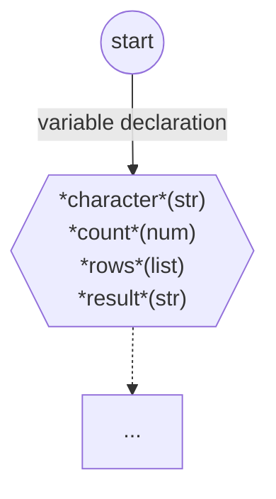
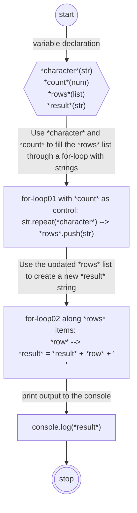
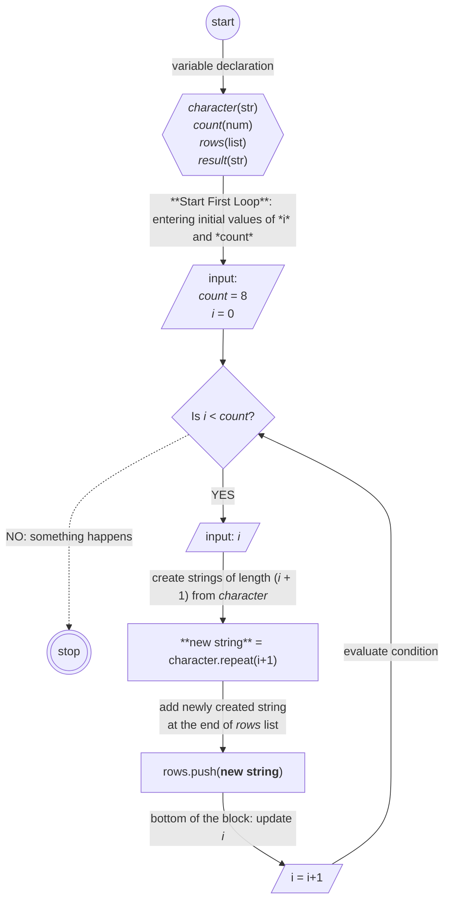
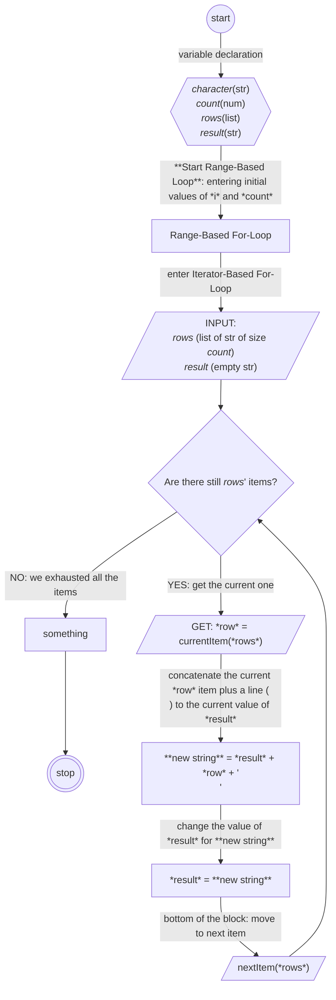
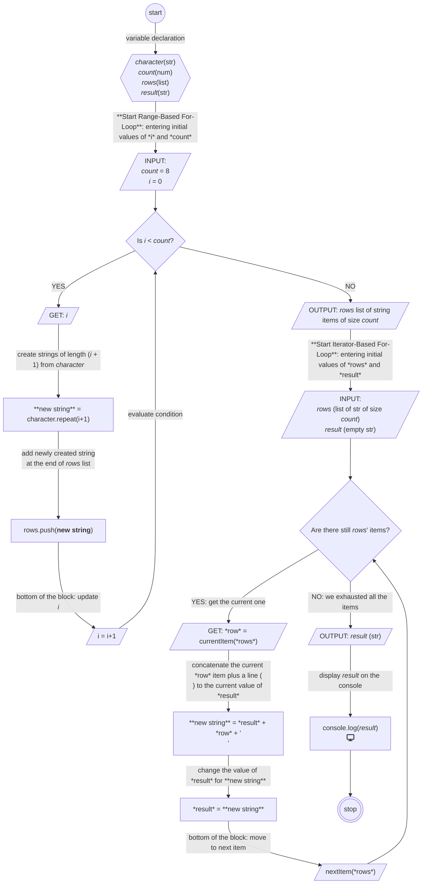
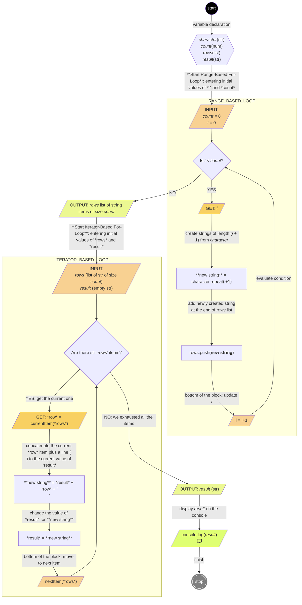

Le codage peut être intense. Surtout lorsque vous êtes plongé dans le débogage ou que vous essayez de cartographier des projets complexes. Pour de nombreux développeurs - novices et professionnels - il n'est pas rare de passer des heures à fixer du code, à la recherche de réponses qui ne viennent pas.

Vous avez peut-être essayé tous les trucs que vous connaissez, mais vous vous sentez toujours perdu. Mais avez-vous essayé de créer une représentation visuelle du problème pour voir comment le code fonctionne réellement ?

Je parle de l'utilisation d'un **organigramme**.

Dans cet article, vous apprendrez comment fonctionnent les organigrammes ainsi que quelques symboles et étiquettes courants que vous pouvez utiliser dans vos organigrammes. Nous discuterons également de quelques outils de diagrammation populaires que vous pouvez utiliser pour créer des organigrammes plus facilement. Enfin, nous passerons en revue comment construire réellement un organigramme afin que vous puissiez commencer à les utiliser dans vos projets.

### Table des matières

* [Qu'est-ce qu'un organigramme ?](#heading-quest-ce-quun-organigramme)
  
* [Symbologie d'un organigramme, les limitations des symboles et les solutions](#heading-symbologie-dun-organigramme-les-limitations-des-symboles-et-les-solutions)
  
* [Symboles et étiquettes courants utilisés dans les organigrammes](#heading-symboles-et-etiquettes-courants-utilises-dans-les-organigrammes)
  
* [Comment ajouter des formes à votre organigramme : Généralisation vs Affinement](#heading-comment-ajouter-des-formes-a-votre-organigramme-generalisation-vs-affinement)
  
* [Outils de diagrammation populaires pour créer des organigrammes](#heading-outils-de-diagrammation-populaires-pour-creer-des-organigrammes)
  
* [Comment construire un organigramme - Méthodologie et exemple](#heading-comment-construire-un-organigramme-methodologie-et-exemple)
  
* [Conclusion](#heading-conclusion)
  

## Qu'est-ce qu'un organigramme ?

Simplement, un organigramme est une représentation diagrammatique d'un algorithme. Il est appelé *organigramme* car il représente non seulement les étapes mais aussi la direction dans laquelle le "travail" s'écoule à mesure que les tâches sont transférées à l'entité suivante.

Dans de nombreux cas, un organigramme est considéré comme faisant partie d'une famille plus large de diagrammes, généralement appelés **diagrammes de flux**. Et bien que les deux noms soient couramment utilisés, nous allons nous en tenir à l'utilisation des organigrammes pour représenter des algorithmes pour l'instant.

Voici un exemple d'organigramme :


Vous remarquerez qu'il utilise certaines formes et couleurs différentes - nous en discuterons plus en détail ci-dessous.

### À quel point les organigrammes sont-ils courants de nos jours ?

"*Ne sont-ils pas de l'époque de, genre, Cobol ?*" pourriez-vous demander. Eh bien, oui, ils le sont - et même avant cela. Les diagrammes de flux étaient assez populaires depuis leur introduction dans les années 1920 jusqu'aux années 1970. Mais leur utilisation a commencé à décliner peu après.

Vous pourriez donc vous demander : les développeurs utilisent-ils réellement des organigrammes - ou tout type de diagramme - de nos jours ? J'ai fait quelques recherches rapides dans différents chats de communautés de développeurs. J'ai découvert que, bien que tous les développeurs ne disent pas qu'ils utilisent des organigrammes, beaucoup d'entre eux ont mentionné qu'ils étaient importants pour les aider à *esquisser une visualisation* du code ou du système.

J'ai également découvert que les développeurs seniors étaient moins intéressés par l'utilisation de diagrammes car ils connaissaient généralement les algorithmes ou la base de code presque par cœur. Mais les nouveaux développeurs qui étaient exposés à une base de code pour la première fois, qui revisitaient un algorithme oublié, ou ceux qui devaient partager du code avec d'autres, avaient tendance à utiliser des organigrammes plus souvent.

### Pourquoi les développeurs utilisent-ils des organigrammes ?

Voici quelques-unes des raisons les plus courantes pour lesquelles les développeurs utilisent des organigrammes de nos jours :

* **Concentration** : Une ressource visuelle pour vous aider à réfléchir à un problème.
  
* **Planification** : Cartographier vos étapes avant de plonger.
  
* **Partage de processus standards** : Comme un outil pour faciliter la lecture des processus standards.
  
* **Communication et enseignement** : Expliquer votre code à la fois aux personnes techniques et non techniques.
  
* **Documentation** : Garder une trace de votre travail de manière facile à suivre.
  
* **Analyse de code existant** : Décomposer votre code et celui des autres pour voir ce qui se passe vraiment.
  

Bien sûr, il existe d'autres méthodes que vous pourriez utiliser pour faire face aux situations listées ci-dessus. Mais il y a des avantages à utiliser des organigrammes par rapport à d'autres méthodes qui ont à voir avec la manière dont nous traitons l'information dans notre cerveau.

Cependant, la création d'organigrammes est un processus intellectuel qui comporte certains risques, en particulier lorsqu'il s'agit de clarifier l'information. Nous avons donc besoin des bons outils et d'une méthodologie pour travailler avec eux.

Dans les sections suivantes, nous aborderons tous ces points plus en détail :

* La sémiotique de l'organigramme - c'est-à-dire l'utilisation de symboles pour transmettre des informations. Nous discuterons également du rôle de l'organigramme en tant qu'outil d'information, de ses limitations et de la manière de les aborder.
  
* Les symboles les plus courants, leurs significations et comment les utiliser
  
* Les processus intellectuels de construction des organigrammes et leurs risques
  
* Une méthodologie pour vous aider à réduire ces risques
  
* Les outils disponibles pour créer des organigrammes avec une rapide introduction à celui que nous utiliserons pour nos exemples
  

## Symbologie d'un organigramme, les limitations des symboles et les solutions

Plus tôt, j'ai défini un organigramme comme un diagramme de séquences d'étapes, ou **flux de travail**, d'un algorithme. Mais nous pouvons aussi comprendre l'organigramme comme un "langage" : lorsque nous utilisons un organigramme, nous traduisons la description d'un algorithme d'un langage verbal/textuel à un langage plus symbolique.

En d'autres termes, nous pouvons définir un organigramme comme une visualisation d'un flux de travail rationalisé où nous identifions les étapes et les relations en substituant des symboles significatifs aux descriptions verbales/textuelles.

### Comment fonctionnent les symboles

Quels sont les avantages de l'utilisation d'une visualisation basée sur des symboles pour comprendre un algorithme ?

Physiquement, notre cerveau doit faire plus d'efforts pour extraire du sens d'un texte ou de nombres que de caractéristiques visuelles et de formes. Par exemple, après un certain apprentissage et dans le contexte pertinent, il est facile de comprendre le sens de ce panneau de signalisation :


Ce panneau peut fonctionner mieux que d'écrire un tableau expliquant que les conducteurs doivent être prudents car des enfants traversent la route.

Dans notre exemple, si vous devez vous arrêter pour lire le tableau explicatif, au moment où vous apprenez ce que le message est, il pourrait être trop tard. Mais notre cerveau fait une évaluation plus rapide de la situation lorsqu'il est présenté avec le panneau après un certain entraînement.

De plus, les caractéristiques visuelles et les formes peuvent non seulement se référer à des objets concrets et tangibles, mais aussi à des *concepts et actions*. Par exemple, si vous avez déjà fait des arithmétiques, vous connaîtrez la signification des symboles suivants :


Lorsque nous utilisons un symbole pour transmettre un sens, qu'il soit concret ou intangible, nous parlons généralement de [**sémiose**](https://en.wikipedia.org/wiki/Semiosis). La sémiose est le processus de production et d'interprétation de signes et de symboles pour transmettre un sens. Elle implique l'interaction entre un symbole, sa signification et la personne ou la machine qui l'interprète. Ce processus est central pour la communication, la compréhension et la création de connaissances chez les personnes et les machines.

La communication symbolique tire parti de nos compétences innées de traitement visuel. Cela aide à réduire le besoin d'explications longues et fastidieuses car l'observateur a appris d'une manière ou d'une autre ce que le signe signifie. Au lieu de "sémiose", certaines personnes préfèrent le terme **abstraction** pour désigner le même processus.


C'est ce que nous faisons avec les organigrammes : abstraire des significations à travers des symboles.

La valeur de la sémiotique dans une visualisation est substantielle. L'utilisation de symboles significatifs dans une visualisation telle qu'un organigramme permet à vous et à votre public de *vous concentrer sur les motifs* que le texte écrit, tel que le code ou un script, ne peut pas facilement raconter ou décrire.

Et c'est là que réside la puissance des visualisations comme les organigrammes.

Mais les symboles des organigrammes ne sont pas des opérateurs comme ceux que vous trouveriez en mathématiques. Ce sont plutôt des *représentations*. En fait, ils peuvent représenter quelque chose de *spécifique à la personne qui les dessine*.

À cause de cela, les symboles seuls sont souvent insuffisants pour transmettre pleinement des concepts abstraits. Par exemple, le terme "base de données" peut représenter de nombreux types de systèmes ou de technologies, et peut avoir de nombreuses configurations et utilisations différentes. De plus, à mesure que la technologie évolue, certains symboles peuvent perdre leur pertinence.

Pour remédier à cela, des explications textuelles claires doivent accompagner les formes, garantissant que l'organigramme reste significatif et évite le flou. Vous pouvez également ajouter du style et même des images pour renforcer la signification des symboles.

## Symboles et étiquettes courants utilisés dans les organigrammes

Lors de la création d'un organigramme, vous pouvez utiliser des symboles personnalisés, mais il est généralement bon de respecter certaines conventions. Les conventions garantissent une meilleure communication ainsi qu'une cohérence des messages à travers différents organigrammes.

Les normes [ANSI/ISO](https://the9000store.com/articles/iso-9000-tips-iso-9001-flowchart-basics/) répertorient plus de 30 formes d'organigrammes **reconnues**, bien que leur utilisation ne soit pas strictement réglementée. Cela permet aux fournisseurs et aux développeurs de convenir des meilleures pratiques.

Puisque ces symboles nécessitent un support textuel et stylistique de toute façon, certains développeurs soutiennent que vous pouvez réduire le nombre de formes à quelques formes "nécessaires" polyvalentes. Je fais référence à celles-ci comme des "jokers". Les jokers peuvent représenter des abstractions plus larges lorsqu'ils sont associés à un texte clair et/ou à un style. Mais n'hésitez pas à utiliser d'autres symboles standard si vous pensez qu'ils apportent plus de clarté à votre organigramme.

Pour notre exemple, nous nous concentrerons sur les formes les plus courantes. Certaines des formes les plus courantes et les plus polyvalentes sont :


Comme vous pouvez le voir dans le tableau ci-dessus, nous avons les formes suivantes :

* Ovale (un point de départ ou de fin)
  
* Flèche (un connecteur qui montre les relations entre les formes)
  
* Parallélogramme (une entrée ou une sortie)
  
* Rectangle (un processus)
  
* Losange (une décision)
  

Passons en revue chacune de ces formes et examinons comment elles fonctionnent et comment les utiliser.

### La forme Terminateur (Ovale)

Il s'agit de la forme ovale, appelée forme de début/fin. Elle marque les points de départ et de fin du processus/système. L'ovale indique le début ou le résultat final du flux de travail, et les résultats potentiels d'un chemin.

De nombreux développeurs utilisent la forme ovale, ainsi que les mots "début" et "fin/arrêt/fin" pour plus de clarté.


Certaines personnes préfèrent utiliser un seul cercle pour représenter le début et un double cercle pour représenter la fin d'un organigramme :


Personnellement, je préfère le cercle - mais c'est à vous de choisir. Assurez-vous simplement d'en choisir un et de vous y tenir pour la cohérence.

### La forme Flèche ou Ligne de flux

Également appelée lien ou arête par les fournisseurs et les praticiens, cette forme représente la connexion entre deux étapes. Selon sa forme, elle peut également indiquer si ce flux est interrompu, a échoué, ou s'il s'agit d'un chemin ou d'un processus alternatif, etc.

La représentation la plus courante est la **flèche**, qui indique la direction du flux de travail entre deux étapes. La flèche pointe dans la direction de l'étape suivante dans le processus.


Lorsque je travaille avec des organigrammes, j'accompagne les lignes de flux en forme de flèche et toute autre ligne de flux avec des descriptions concises sur l'étape suivante, parfois avec des informations sur les variables et, lorsque cela a du sens, l'état actuel.


### La forme Processus (Rectangle)

Vous pouvez représenter un processus à l'aide d'un rectangle dans un organigramme. Il est également appelé une boîte :


Une boîte peut représenter une **seule étape**, comme une expression (par exemple, `x = y*x²`), un **bloc d'instructions entier**, comme "`parcourir le tableau et mettre à jour les valeurs en multipliant par 2`", ou un **sous-processus entier**, comme une fonction existante ou même un module.


La forme de processus est un joker approprié et peut se transformer en de nombreuses choses, il est donc important d'ajouter une étiquette et d'utiliser du texte ou d'autres ressources comme la mise en forme pour clarifier sa signification.

### La forme Décision (Losange)

La décision est représentée par un losange. C'est une abstraction pour un **test de condition**, une question OUI/NON, ou VRAI/FAUX. C'est l'équivalent d'une instruction IF/ELSE en codage.

Le texte accompagnant cette forme est une question formulant une comparaison entre une valeur entrante et une valeur de contrôle. L'organigramme se divise généralement en différentes branches en fonction de la réponse ou des conséquences après avoir utilisé la forme de décision :


Le résultat de la boîte de décision détermine l'étape suivante dans le flux de travail du processus. Il est généralement déclaré pour ne répondre qu'à une simple question, mais vous pouvez abstraire la question pour qu'elle ressemble à une instruction de contrôle IF/ELSE IF/.../ELSE en codage, avec des lignes représentant différentes décisions.

Lorsque l'un des flux revient à la forme de décision d'où il est parti, nous parlons d'une **boucle** :


L'interprétation est comme demander à tester à nouveau la condition après avoir parcouru certaines étapes le long d'une branche spécifique du flux de travail, puis vérifier si la réponse a changé.

### La forme Entrée/Sortie (Parallélogramme)

Vous pouvez utiliser la forme de parallélogramme comme une abstraction pour les données disponibles pour l'entrée ou la sortie ou pour les ressources utilisées ou générées. Elle indique que certaines informations sont requises à ce stade du flux de travail.

La forme d'entrée/sortie est généralement accompagnée du texte suivant :

* Soit "entrée" ou "sortie", pour que vous sachiez ce qui est représenté. Vous pouvez également écrire d'autres mots similaires comme "obtenir" / "mettre", "in" / "out", etc.
  
* Une entrée ou une sortie pourrait être liée à une variable que vous prévoyez ou que vous avez déjà dans votre code. Si cette variable doit avoir un type attendu lorsqu'elle entre en tant qu'entrée ou sortie, j'ajouterais également le type.
  
* Son état correspondant, tant qu'il apporte plus de clarté à l'organigramme.
  
* Optionnellement, il serait également utile de mentionner la source de l'entrée / sortie. Est-ce un ensemble de données ? Une entrée manuelle ? Un formulaire ? Sera-t-elle imprimée dans la console ?
  

Remarquez que le but de l'utilisation de cette forme est de tracer l'entrée ou la sortie des données dans ou hors du processus. Par conséquent, cette forme est précieuse lorsque vous souhaitez avoir au moins une idée de l'échange de données.


Enfin, un symbole moins courant, mais que j'utilise souvent est...

### Le symbole de préparation (Hexagone)

Le symbole de préparation est représenté par un hexagone et il abstrait la configuration pour l'étape suivante. J'utilise généralement cette forme pour déclarer toutes les conditions initiales lorsque le flux de travail commence. J'accompagne cette forme d'une liste de variables, de leurs types, et même de fonctions ou de paramètres d'événements initiaux, comme les écouteurs d'événements, ainsi que leurs valeurs initiales.


## Comment ajouter des formes à votre organigramme : Généralisation vs Affinement

Maintenant que vous comprenez les bases des symboles, vous vous demandez peut-être comment les insérer dans le diagramme.

Surtout pour les grands diagrammes, vous voudrez être très intentionnel quant à l'ajout de formes. Vous devrez prendre des décisions prudentes concernant le placement et le nombre de formes que vous utiliserez, sinon votre organigramme pourrait devenir illisible.

Vous devrez prendre des décisions concernant des choses comme :

* où placer les formes pour obtenir un organigramme soigné.
  
* quelles formes sont essentielles à la compréhension du flux de travail, et lesquelles ne le sont pas.
  

Le placement est peut-être la tâche la plus difficile de la création d'un organigramme. Si vous construisez manuellement votre organigramme, malheureusement, il n'existe pas de formule simple qui vous indique où placer les formes pour éviter les chevauchements. C'est à vous de résoudre visuellement le placement et de décider quand un chevauchement rend votre diagramme illisible.

Comme vous le verrez plus tard, il existe des solutions basées sur le calcul pour le placement des formes. Mais il existe une règle simple qui s'applique à tous les cas : plus l'organigramme est petit, plus il est facile de placer les formes. Donc, réduire le nombre de formes et n'inclure que les formes clés est essentiel pour créer un organigramme clair.

Gardez à l'esprit que je ne suggère pas que vous essayiez de créer l'organigramme le plus minimaliste possible. Essayez simplement de faire le plus simple qui transmette suffisamment d'informations pour vous aider à comprendre le flux de travail.

### Comment choisir les formes à utiliser

Décider quelles formes utiliser peut devenir un processus itératif d'ajout, de déplacement ou de suppression de texte ou de symboles dans ou hors de l'organigramme.

Il existe deux tendances concurrentes ici : la **généralisation** et l'**affinement**.

Par exemple, la figure suivante montre trois organigrammes différents qui démontrent comment utiliser une machine à café :


Sur l'image ci-dessus, vous pouvez voir que l'exemple de gauche est celui avec le moins d'explications et le moins de formes, tandis que celui de droite a plus de détails.

De la même manière, selon vos besoins et les détails spécifiques que vous souhaitez obtenir de la visualisation, l'organigramme peut être plus généralisé ou plus affiné. En fait, il peut acquérir certains éléments de subjectivité, qui reposent généralement sur la **quantité d'informations et de connaissances** que vous avez sur le processus **avant** de regarder l'organigramme.

#### Généralisation :

Dans le cas des organigrammes, la **généralisation**, également connue sous le nom de *lifting*, consiste à enfermer plusieurs étapes en quelques mots et/ou symboles. Il y a deux raisons d'utiliser une approche plus généralisée :

1. Vous et votre public êtes suffisamment compétents pour compléter les informations non fournies par l'organigramme.
  
2. Vous et votre public ne connaissez pas beaucoup cette étape spécifique.
  

Dans le second cas, il y a deux situations que vous pourriez rencontrer :

1. Même si vous ne connaissez pas beaucoup cette partie du processus, vous pouvez garder cette étape généralisée car cette étape joue un petit rôle dans la fourniture d'informations essentielles pour vous. Ou,
  
2. Le point est crucial pour que vous compreniez le processus, mais vous et votre public ne savez simplement pas plus.
  

C'est dans la deuxième situation que vous devez essayer d'ouvrir la boîte. Et cela se fait par l'affinement.

#### Affinement :

L'**affinement** consiste à ajouter plus d'étapes, de mots et de symboles afin d'ajouter plus de détails à une procédure. Il suit généralement la recherche et l'étude.

Lorsque vous affinez votre organigramme, cela ne signifie pas nécessairement que vous ne savez absolument rien sur la procédure. Ce que vous cherchez, c'est quelque chose qui vous permet de pointer vers des détails spécifiques, et ce qui vient avant et ce qui vient après.

Mais combien de généralisation est utile ? Et combien d'affinement ?

Lorsque votre organigramme est trop général, il en résulte une visualisation plus simple mais il ne contient pas beaucoup d'informations. Vous devrez peut-être utiliser plus de mots ou vous appuyer sur des connaissances internes afin d'expliquer ce que le graphique ou une étape signifie. Le premier organigramme de l'image précédente est le plus généralisé de tous.

Le risque de la sur-généralisation est la *non-information*.

Le processus d'affinement implique le risque opposé, et est, à mon avis, plus dangereux. Si vous ne contrôlez pas le processus d'affinement, vous pourriez vous retrouver avec un désordre absolu, comme ceci :


Le diagramme ci-dessus n'est pas un organigramme, mais le risque est le même. Le risque d'un affinement excessif est le *bruit*.

Il existe plusieurs règles et mécanismes qui vous aident à éviter d'atteindre un niveau inutile soit d'affinement soit d'abstraction. C'est ce que nous allons apprendre dans les prochaines sections. Mais d'abord, jetons un rapide coup d'œil aux outils disponibles que vous pouvez utiliser pour faire des diagrammes et des organigrammes.

## Outils de diagrammation populaires pour créer des organigrammes

Maintenant que vous connaissez les formes, à quoi elles servent et que vous avez une idée de la manière de les utiliser, vous pouvez commencer à construire un organigramme.

Mais avant de le faire, je vais faire un petit détour pour parler des outils que vous pouvez utiliser pour construire des organigrammes.

De nos jours, les options sont nombreuses. Vous pouvez utiliser des ressources en ligne ainsi que hors ligne. Certaines sont spécialisées pour la construction de diagrammes, tandis que d'autres sont plus générales. Certaines sont accessibles gratuitement, et d'autres sont plus destinées aux opérations d'entreprise et s'accompagnent de frais élevés.

Ci-dessous, vous trouverez un tableau rapide catégorisant certains des outils dédiés que j'ai utilisés dans le passé ou que j'ai investigués récemment.

| **Solutions dédiées pour dessiner des organigrammes** |
| --- |

| CATÉGORIE | COMMENT | EXEMPLES (gratuits) |
| --- | --- | --- |
| Glisser-déposer | Les formes sont glissées manuellement dans un écran d'éditeur, liées avec des connecteurs et remplies avec le texte pertinent. | draw.io |
| Scriptable | Un script est écrit avec une syntaxe dédiée pour les formes, les relations et le texte. L'organigramme est automatiquement rendu et mis à jour après avoir modifié le script. | Mermaid, PlantUML |
| Basé sur l'IA | Une invite descriptive ou même du code est fourni à l'IA. L'IA analyse le contenu, généralement en le recodant dans un diagramme scriptable avant de le rendre. | codetoflow.ai, plugins ChatGPT |
| Analyseur | Mapper (binaire) le code dans des solutions graphiques dédiées basées sur des règles de syntaxe établies. | drgarbagetools pour Java dans Eclipse, graphdracula pour JQuery |

#### Outils sans code ou à faible code :

La grande majorité des outils de diagrammation spécialisés existants sont conçus pour aider les personnes sans compétences en codage.

Lorsque vous utilisez ces types d'outils, vous devez construire manuellement le diagramme en **glissant-déposant** des formes dans un éditeur (en ligne) : vous sélectionnez la forme et la déplacez jusqu'à ce que vous trouviez l'emplacement préféré sur l'écran. Il existe des fonctionnalités pour dessiner les lignes de flux (« connecteurs ») également par une action de glissement, et vous pouvez toujours éditer les formes pour ajouter du texte ou du style.

#### Outils basés sur des scripts :

Mais il existe également des outils moins connus qui existent depuis un certain temps et qui gagnent en popularité maintenant : les options **basées sur des scripts**. Avec ces types d'outils, vous décrivez les formes et les relations en les scriptant selon la syntaxe de l'outil.

Ces types d'outils ont l'avantage relatif que le diagramme sera dessiné pour vous sur un écran de rendu ou une image. Un algorithme essaiera de trouver le meilleur endroit pour vos formes sur l'écran sans que vous ayez à les placer manuellement.

#### Outils d'IA :

Ensuite, il y a les outils d'**IA**. Beaucoup de ces outils sont basés sur les outils de scriptage. Certains d'entre eux fonctionnent comme suit :

1. l'IA interprète soit une invite descriptive soit le code lui-même
  
2. Ensuite, elle traduit l'invite en un script en utilisant un outil de diagrammation scriptable
  
3. Le diagramme est rendu selon le code généré par l'IA.
  

J'ai trouvé que ces outils d'IA ne sont pas encore tout à fait à la hauteur pour des projets plus complexes - mais ils peuvent être pratiques si vous voulez simplement une solution rapide. Celui que j'ai utilisé est codetoflow.io, mais il y a aussi (devinez quoi...) des plugins ChatGPT que vous pouvez utiliser.

#### Analyseurs

Même avant l'arrivée des outils d'IA, il y avait les analyseurs. Ils mappent les étapes et les relations en formes basées sur des règles de syntaxe bien établies. Certains de ces analyseurs se tournent vers l'IA, car les générateurs d'IA sont plus faciles à programmer et nécessitent moins de maintenance. Mais parfois, les analyseurs basés sur des règles peuvent être plus précis si les règles sur lesquelles ils sont basés restent inchangées.

Certains de ces outils lisent le code binaire, ce qui est un meilleur proxy pour suivre le flux de travail complet, quelque chose que les outils d'IA populaires ne sont pas capables de faire. Certains IDE, comme Eclipse, vous permettent d'ajouter des plugins pour dessiner un organigramme de votre code basé sur des binaires. Un exemple est [drgarbagetools](https://sourceforge.net/projects/drgarbagetools/) qui fonctionne uniquement pour Java dans Eclipse.

#### Outils polyvalents :

En plus de ces outils dédiés, vous pouvez toujours utiliser d'autres outils qui ne sont pas spécifiquement conçus pour la diagrammation. J'ai utilisé PowerPoint et Google Slides dans le passé, et il existe d'autres applications de présentation qui supportent le catalogue de formes ANSI / ISO. Vous pouvez également utiliser des outils comme Figma, Miro, ou d'autres. Il y en a trop pour les lister ici.

Et enfin, il y a toujours le stylo et le papier.

### Notre exemple : Utilisation de Mermaid.js

Pour l'exemple de ce tutoriel, j'utiliserai l'un des outils de scriptage appelé Mermaid. Une raison d'utiliser un outil basé sur des scripts est la facilité avec laquelle vous pouvez mettre à jour l'organigramme en cours de route. Et cela sera utile lorsque nous atteindrons l'étape de généralisation / affinement.

Bien que d'autres outils n'entravent pas le processus de généralisation/affinement, le fait que vous deviez peut-être refaire tout l'organigramme manuellement pourrait devenir assez chronophage. Avec un outil basé sur des scripts, vous pouvez vous concentrer principalement sur l'écriture des bonnes relations et formes, tout en laissant le programme placer les formes pour vous.

Bien que j'utilise Mermaid ici, je ne prescris pas l'utilisation d'un outil particulier pour les exemples à venir. Vous pouvez utiliser celui qui répond à vos besoins et avec lequel vous vous sentez le plus à l'aise. Aucun d'entre eux n'est parfait, et ils ont tous leurs propres mérites.

Mais si vous voulez en savoir plus sur Mermaid, [j'ai écrit un autre tutoriel pour vous](https://www.freecodecamp.org/news/use-mermaid-javascript-library-to-create-flowcharts) qui vous donnera un aperçu général de l'outil et comment l'utiliser. Je fournirai également la syntaxe que j'utilise pour créer les exemples afin que vous puissiez l'essayer vous-même.

## Comment construire un organigramme - Méthodologie et exemple

Lors de la construction d'un organigramme, vous pouvez suivre ces étapes :

1. Définir la portée de votre organigramme
  
2. Trouver le début du flux de travail
  
3. Tracer le flux de travail jusqu'à la fin tout en utilisant des niveaux élevés de généralisation pour les étapes
  
4. Sélectionner ce qui doit être affiné et ce qui peut être laissé généralisé
  
5. Itérer : Rechercher. Affiner. Tester. Rechercher. Affiner ou Généraliser. Tester. Rechercher. Affiner ou Généraliser...
  
6. Améliorer
  
7. Étendre (facultatif)
  

### Étape 1 : Définir la portée de votre organigramme

Il est important d'être clair sur ce que vous voulez faire avec votre organigramme. Représente-t-il une base de code complète ou juste un fragment de script ? Est-ce un algorithme que vous souhaitez étudier ou une analyse de code existant ? Voulez-vous une explication détaillée d'un flux de travail ou simplement examiner les relations ?

Avoir un objectif clair pour votre organigramme vous aidera à guider sa construction.

Pour cet exemple, nous allons utiliser un exercice du programme de freeCodeCamp :

```javascript
const character = "#";
const count = 8;
const rows = [];

for (let i = 0; i < count; i = i + 1) {
  rows.push(character.repeat(i + 1))
}

let result = ""

for (const row of rows) {
  result = result + row + "\n";
}

console.log(result);
```

Notre objectif ici est de comprendre ce code, en particulier pour obtenir plus d'informations sur les boucles for.

### Étape 2 : Trouver le début du flux de travail

Une fois que vous avez une idée de ce que vous voulez faire avec votre organigramme, essayez de déterminer le point à partir duquel le flux de travail commence. Si cela implique d'analyser du code existant, gardez à l'esprit que le début du flux de travail ne se trouve peut-être pas au début de votre code cible. Gardez simplement à l'esprit que ce qui déclenche toute la procédure est une indication que le "début" se trouve là.

Le flux de travail commence généralement par la définition des déclarations et valeurs initiales, donc nous pourrions dire que notre organigramme pourrait commencer comme ceci pour cet exemple :




### Étape 3 : Tracer le flux de travail jusqu'à la fin et utiliser des niveaux élevés de généralisation dans chaque étape

Une fois que vous avez trouvé le point de départ, essayez de tracer systématiquement les étapes du flux de travail du début à la fin. S'il y a des procédures en cours de route, vous pouvez les compacter en étapes plus généralisées en utilisant pas plus de deux formes.

La forme la plus courante pour dépeindre une étape généralisée est la **forme de processus**. Les candidats à garder généralisés sont les fonctions, les blocs d'instructions de contrôle comme les boucles ou les instructions if, les modules, ou même les bibliothèques. Les étiquettes de ces étapes doivent consister en des descriptions générales des choses qui se passent ou qui devraient se passer à cette étape.

Pour notre exemple, nous pouvons représenter notre flux de travail et en particulier les boucles for à un niveau général comme ceci :




### Étape 4 : Déterminer ce qui nécessite un affinement et ce qu'il faut laisser généralisé

Arrêtez-vous un moment et passez en revue le schéma que vous avez créé. Une fois que vous avez une image de l'ensemble du flux de travail, vous voudrez décider quelles sections pourraient nécessiter plus de détails.

Dans notre cas, nous allons affiner les parties de l'organigramme qui traitent des deux boucles for. Décrire une boucle for est un exemple typique lors de l'apprentissage de la création d'organigrammes, mais j'ai également réalisé que les deux boucles for de notre exercice ne sont pas du même type. J'ai donc pensé qu'il serait intéressant de voir si l'organigramme peut révéler comment elles se comparent.

### Étape 5 : Temps d'itérer (Rechercher, Affiner ou Généraliser. Tester. Répéter.)

Ce que vous avez préparé jusqu'à l'étape 4 est une esquisse générale du flux de travail. Il est maintenant temps de creuser dans les zones où plus de détails sont nécessaires. Au cours de ce processus, vous vous retrouverez parfois à revenir à une abstraction tout en cherchant le chemin le plus clair pour votre organigramme.

Il y a deux choses qui vous aideront dans ce processus :

1. **Nouvelles Formes** : c'est le moment où vous pourriez vouloir utiliser d'autres formes. Commencez par les plus courantes. Utilisez d'autres formes tant que vous pouvez leur donner un rôle clair dans votre organigramme et qu'elles vous aident à réduire une longue explication sur ce que fait la forme remplacée.
  
2. **Texte** : Étendez l'utilisation du texte pour expliquer le flux de travail. Il doit être plus spécifique à l'algorithme lui-même.
  

Ce processus se termine lorsque vous êtes satisfait de la clarté et du niveau de détail de votre organigramme. Mais il existe des bonnes pratiques qui vous permettent de contrôler le processus :

* Essayez de tout garder sur une seule page.
  
* Gardez le nombre de formes à environ 20 par page.
  
* Évitez de croiser les lignes plus de 4 fois. Utilisez des connecteurs lorsque cela se produit. Devoir expliquer 5 connexions ou plus n'est probablement pas une bonne chose.
  

Après tout changement, testez votre organigramme. **Le test** est l'aspect le plus subjectif de la méthodologie. Il n'y a peut-être pas de moyen de tester le résultat de l'organigramme par rapport à un résultat tangible.

Si cela vous met mal à l'aise, essayez de penser de la manière suivante : l'organigramme peut être vu comme une sorte de liste de tâches ordonnée ou de notes de brainstorming décrivant ce que le code ou le système doit faire pour accomplir une tâche souhaitée.

Un organigramme est similaire à cette liste de tâches. Mais au lieu d'écrire toutes ces étapes sous forme de commentaires ou même de pseudo-code, vous utilisez des symboles (conventionnels).

Mais en dehors des avancées de l'IA ou de toute utilisation de la [programmation basée sur les flux](https://en.wikipedia.org/wiki/No-code_development_platform), les commentaires ne sont pas du code, peu importe à quel point ils sont détaillés.

Ainsi, la décision de savoir si l'organigramme fonctionne ou non est laissée à vous et à votre public. La question la plus importante à résoudre ici est : les informations fournies par l'organigramme sont-elles suffisantes pour comprendre ce que vous devez comprendre sur le processus ? Révèle-t-il quelque chose de nouveau ? Vous aide-t-il à organiser vos idées plus clairement ?

Si vous n'êtes toujours pas satisfait, répétez le processus. Mais ne vous sentez pas obligé de vous en tenir à ce processus seul. Vous pouvez toujours arrêter cet effort et chercher un autre moyen d'expliquer vos procédures si vous trouvez qu'un organigramme ne fonctionnera pas pour vous.

Vous pourriez faciliter l'affinement et la clarté de la sortie en faisant quelques recherches supplémentaires. Essayez de trouver comment d'autres personnes décrivent la procédure sur laquelle vous allez travailler. Y a-t-il quelque chose concernant le langage que vous devriez garder à l'esprit ? Dans la mesure du possible, ne partez pas de zéro.

De plus, essayez d'être fidèle autant que possible à la manière réelle dont la procédure doit être codée, surtout si vous affinez. Mais n'oubliez pas que c'est une représentation. N'hésitez pas à travailler sur un brouillon lorsque suffisamment d'informations ne sont pas disponibles.

Revenons à notre exemple. J'ai fait quelques recherches rapides pour découvrir comment d'autres pourraient interpréter une boucle for dans un organigramme. J'ai trouvé [cette référence utile](https://en.wikipedia.org/wiki/For_loop#/media/File:For_loop_example.svg) pour guider ma propre description :


Cette approche semble être assez standard et j'essaierai d'inclure certaines de ces étapes dans mon organigramme. J'ai également trouvé que selon la documentation JavaScript, le type de boucle for que nous allons représenter se répète [jusqu'à ce qu'une condition spécifiée évalue à faux](https://developer.mozilla.org/en-US/docs/Web/JavaScript/Guide/Loops_and_iteration), tout comme dans l'organigramme ci-dessus.

Commençons par travailler uniquement sur la première boucle for :




Parfait.

Concentrons-nous maintenant sur la deuxième boucle for. Il s'avère qu'elle est syntaxiquement différente de la précédente. Et en fait, il existe [différents types de boucles en programmation](https://en.wikipedia.org/wiki/For_loop). Celle que nous avons affinée plus tôt est généralement connue comme la boucle "traditionnelle", ou mieux, une boucle for de type *plage numérique*. La seconde est une boucle for de type *itérateur*.

Un [itérateur](https://refactoring.guru/design-patterns/iterator) est une fonctionnalité qui se déplace de manière incrémentielle le long d'un groupe de valeurs ou d'*éléments*. Cette fonctionnalité peut avoir des sous-processus pour initialiser l'itérateur - un pour obtenir la valeur actuelle vers laquelle l'itérateur pointe, ainsi qu'un sous-processus pour passer au suivant.

De plus, rappelez-vous qu'une boucle for arrête de répéter une branche de flux de travail dès que la condition évalue à `false`.

Essayons de refléter toutes ces connaissances lors de l'affinement de la deuxième boucle for. Je vais généraliser la première boucle for pour plus de clarté :




Maintenant, nous avons un organigramme clair pour chacune des boucles for ! Nous avons d'abord dû comprendre de quoi traitaient les boucles, puis nous avons dû trouver un moyen de les représenter. Nous avons utilisé l'affinement et la généralisation pour développer / contracter les informations rendues par l'organigramme.

À la fin, nous devons simplement accepter que ce ne sont encore que des approximations - pour comprendre comment ces boucles for *fonctionnent vraiment*, nous devrions aller apprendre davantage sur JavaScript, probablement en parcourant le code source de JavaScript, ou même plus près de la machine en analysant les binaires. Mais je suis personnellement satisfait des informations que j'ai obtenues de l'analyse.

Maintenant, après avoir apporté ces modifications, nous pouvons revenir et fusionner les deux organigrammes (pour chacune des boucles for) pour compléter la représentation complète du code :




### Étape 6 : Améliorer l'organigramme

Parfois, surtout avec les grands organigrammes, l'utilisation répétée de formes similaires nécessite une amélioration supplémentaire pour fournir plus de clarté. Normalement, vous ne saurez pas vraiment ce que vous devez améliorer jusqu'à ce que vous ayez une image complète de quelque chose de plus final.

Une façon de faire cela est de regrouper des sections du flux de travail. Pour cela, vous pouvez utiliser le style, comme colorier les formes, pour mettre en évidence des étapes similaires ou liées. Il peut également être utile de mettre en évidence les éléments du flux de travail qui jouent vraiment un rôle fondamental dans l'analyse.

Vous pouvez également créer des groupes de sous-procédures en les encadrant (c'est-à-dire en plaçant une boîte autour des éléments liés de l'organigramme).

Appliquons quelques améliorations à notre organigramme final en encadrant et en coloriant :




### Étape 7 : Étendre l'organigramme

Cette étape est facultative. Si vous avez fait tout ce que vous pouvez pour garder l'organigramme aussi clair que possible - mais que vous trouvez qu'il a encore besoin de plus d'affinement - vous pourriez avoir affaire à un processus complexe.

Dans ce cas, il est temps de penser à un organigramme séparé pour continuer ou étendre celui sur lequel vous travaillez. Il existe des moyens d'indiquer la connexion entre les pages. Vous pouvez également montrer une section d'un organigramme comme une généralisation et montrer un organigramme plus affiné sur des pages séparées en utilisant des références.

Je ne vais pas entrer dans les détails de la manière de faire cela ici, car cet article est déjà assez long. Et dans ce cas, je pense que nous pouvons garder notre organigramme à une seule page, donc je ne vais pas aller plus loin dans la création de nouvelles pages pour celui-ci.

Nous avons donc terminé !

## Conclusion

Lorsque nous créons un organigramme, nous ne cherchons pas à imiter notre code. Nous cherchons plutôt à le *comprendre*. Cela signifie que l'organigramme doit être *clair*.

Et si vous utilisez correctement vos organigrammes, avec les bons outils, ils peuvent vous aider à révéler des motifs et des opérations cachées, ainsi qu'à rester organisé, réduire le sentiment de surcharge et, en fin de compte, rendre le codage plus gérable. Cela améliorera finalement vos compétences en codage et votre état d'esprit.

Alors, essayez les organigrammes - vous pourriez être surpris de voir à quel point ils peuvent vous aider.