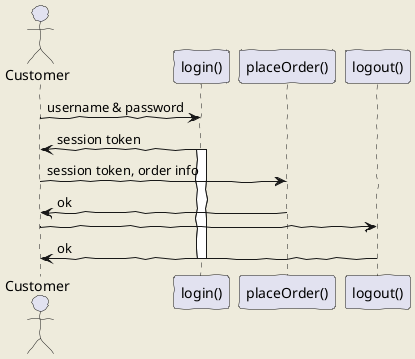
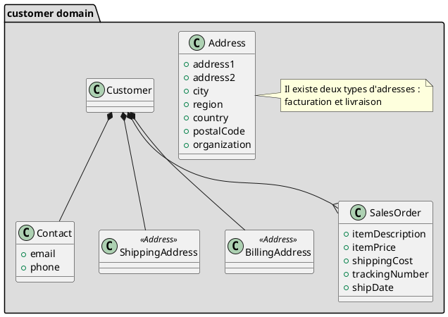
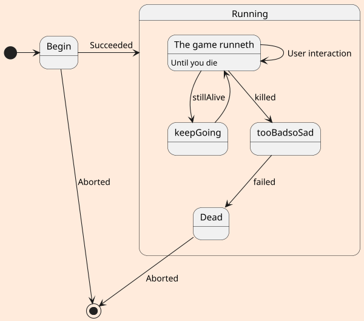

Par Jeff M Lowery

Détestez-vous dessiner des [diagrammes](https://en.wikipedia.org/wiki/Sequence_diagram) pour la documentation technique ? Il semble que dès que vous terminez un brouillon, de nouvelles améliorations arrivent, vous obligeant à modifier non seulement le texte mais aussi l'image. Si vous utilisez un outil de dessin traditionnel, cela peut être fastidieux.

## UML

UML est l'acronyme de Universal Modeling Language, un effort pour standardiser une iconographie pour la conception de logiciels apparu il y a 25 ans. Bien qu'il n'ait peut-être pas répondu aux [ambitions plus larges](https://www.eclipse.org/umlgen/) de ses [concepteurs](https://www.pearson.com/us/higher-education/program/Booch-Unified-Modeling-Language-User-Guide-The-2nd-Edition/PGM206461.html), il offre toujours une manière cohérente de visualiser divers aspects de la conception de logiciels.

### PlantUML

Dessiner des diagrammes UML est fastidieux, mais que se passerait-il si vous pouviez plutôt décrire un diagramme UML textuellement, de manière à pouvoir l'inclure directement dans un document basé sur Markdown, voir à la fois les diagrammes et le texte formaté dans un aperçu pendant que vous l'éditez, et en plus exporter le Markdown en HTML ou PDF ? Votre texte et vos diagrammes sont intégrés de manière transparente dans un seul fichier. C'est là que [PlantUML](http://plantuml.com/) entre en jeu...

## VS Code

Visual Studio Code (a.k.a. VS Code) est devenu un éditeur populaire pour divers langages informatiques, y compris [**Markdown**](https://en.wikipedia.org/wiki/Markdown). Avec une seule extension, vous pouvez visualiser des diagrammes UML dans le panneau d'aperçu de VS Code.

Cette extension s'appelle **plantuml**, et vous pouvez l'installer soit en la recherchant dans le panneau des extensions (cliquez sur l'icône d'extension) :


puis en cliquant sur installer, ou simplement en exécutant la commande suivante depuis un terminal (Ctrl+' pour en obtenir un) :

`ext install plantuml`

Vous devrez également avoir une version de Java installée, avec la variable d'environnement `JAVA_HOME` définie ou un chemin d'exécution contenant l'emplacement du binaire **java**.

## Ajout de PlantUML à votre Markdown

Avec l'extension installée, vous pouvez maintenant insérer des diagrammes UML en utilisant le langage PlantUML. Un exemple :

```markdown
## uml: diagramme de séquence
Ici, je vais intégrer le balisage PlantUML pour générer un diagramme de séquence.

Je peux inclure autant de segments plantuml que je le souhaite dans mon Markdown, et les diagrammes peuvent être de n'importe quel type supporté par PlantUML.


```

Et maintenant, lorsque j'ouvre le panneau d'aperçu de VS Code :


_Document Markdown à gauche, Aperçu à droite_

De plus, le diagramme dans le panneau d'aperçu est synchronisé avec l'UML tel que décrit dans le document Markdown. Pas besoin de rafraîchir le panneau d'aperçu.

C'est génial, mais que faire si vous souhaitez exporter un diagramme depuis le Markdown ? Pour cela, vous aurez besoin d'un peu d'aide de vos amis...

## Exportation en SVG ou PNG

Pour exporter des diagrammes individuels, je dois installer **[GraphViz](https://www.graphviz.org/)**, qui est un "logiciel de visualisation de graphes open source". Il fonctionne en conjonction avec l'extension **plantuml** installée précédemment. Contrairement à plantuml, ce n'est pas une extension VS Code, mais un [exécutable](https://graphviz.gitlab.io/download/).

Pour exporter en SVG ou PNG :

1. placez votre curseur dans le texte PlantUML souhaité,
2. ouvrez la palette de commandes (Ctrl-Shift-P sur mon PC) ; ou cliquez avec le bouton droit et sélectionnez Palette de commandes...
3. Choisissez "PlantUML: Export Current Diagram"

Vous pouvez choisir PNG, SVG ou d'autres formats. Voici les versions PNG et SVG du diagramme montré dans le panneau d'aperçu, ci-dessus :


_PNG_


_SVG_

Vous avez également la possibilité d'exporter tous les diagrammes d'un document Markdown (option de la palette de commandes "PlantUML: Export Current File Diagrams"), ce qui créera des fichiers image séparés pour chaque diagramme. Par exemple, mon document Markdown s'appelle `basic.md` et lorsque j'export tous les diagrammes (il y en a trois) en SVG, trois fichiers image sont générés :

* basic.svg  (le diagramme de séquence déjà montré)
* basic-1.svg (un diagramme de classe)

```
### uml: diagramme de classe

```


* basic-2.svg (un diagramme d'état)

```
## uml: diagramme d'état

```


---

** D'autres formats que j'ai essayés d'exporter en utilisant uniquement cette extension sont HTML, ce qui a échoué avec une erreur Java :

`java.lang.UnsupportedOperationException: HTML`

et PDF, qui échoue avec une erreur similaire. Pas de souci ! J'ai des solutions de contournement, comme cela sera montré.

## Fonctionnalités supplémentaires

Il existe une autre extension utile pour VS Code appelée **[Markdown Preview Enhanced](https://shd101wyy.github.io/markdown-preview-enhanced/#/)**. Cela ajoute un deuxième panneau d'aperçu en plus du panneau d'aperçu natif de VS Code.

Pour une raison quelconque, deux versions apparaissent dans mon panneau d'extension lorsque je l'ai recherché ; j'ai choisi la plus récente :


Maintenant, vous verrez deux contrôles d'aperçu au-dessus de votre document Markdown :


_Ce premier icône active le nouveau panneau Markdown Preview Enhanced_

Avec le panneau ouvert, vous pouvez maintenant cliquer avec le bouton droit dessus et exporter vers divers formats, tels que HTML ou PDF.

### Exportation en PDF

Markdown Preview Enhanced est capable de travailler avec le navigateur Chrome pour générer des documents PDF, via le pilote [Puppeteer](https://developers.google.com/web/tools/puppeteer/). Tout ce que vous avez à faire est de fournir une _matière première_ dans votre markdown qui dirige Puppeteer sur la manière de disposer le PDF :

```
---
puppeteer:
    landscape: true
    format: "letter"
    timeout: 3000 # <= attendre 3 secondes avant le rendu dans le navigateur
---

# Aperçu
Cela passe en revue quelques cas d'utilisation, les liant à des "classes", qui sont soit des objets de données simples, soit des objets avec des méthodes.

---
# Diagrammes UML
...

```

La matière première n'apparaîtra ni dans le panneau d'aperçu régulier de VS Code, ni dans le panneau Markdown Preview Enhanced.

Pour exporter, il suffit de cliquer avec le bouton droit dans le panneau Markdown Preview Enhanced et de sélectionner Chome (Puppeteer) -> PDF :


Cela prend quelques secondes, mais le PDF sera finalement généré et votre navigateur par défaut s'ouvrira (pas nécessairement Chrome) avec le document PDF affiché.

---

UML est un langage riche, et [PlantUML supporte une grande partie de celui-ci, en plus de certains diagrammes non-UML](http://plantuml.com/). Vous n'avez pas besoin d'être un expert UML pour transmettre des idées à travers des diagrammes, mais vous trouverez vos diagrammes plus faciles à modifier via du texte que via un outil de dessin. En plus de cela, la capacité d'intégrer des diagrammes dans votre documentation Markdown et de l'exporter dans différents formats est un grand avantage.