Si vous avez récemment recherché un outil de diagrammation en ligne, vous avez peut-être remarqué que la plupart d'entre eux reposent sur une fonctionnalité de glisser-déposer. Bien que cela soit utile pour les personnes qui ne savent pas coder, cela peut être difficile à maintenir. Il peut également être un peu difficile à manipuler, devant déplacer toutes ces formes dans un éditeur, et ce n'est pas aussi intuitif lorsque vous essayez d'arranger des lignes et des boîtes pour qu'elles ne se chevauchent pas.

Heureusement, il existe des solutions qui ont pris un chemin différent. Elles sont basées sur des bibliothèques qui peuvent organiser les formes et les lignes pour vous. Ce que vous devez faire à la place est de fournir un script conçu spécifiquement pour cet outil décrivant le type de formes que vous souhaitez voir et leurs relations.

Dans cet article, nous parlerons d'un outil de diagrammation basé sur des scripts populaire appelé Mermaid. Vous apprendrez comment fonctionne Mermaid et comment vous pouvez l'utiliser pour créer des organigrammes. Nous aborderons également comment styliser vos organigrammes dans Mermaid. À la fin, vous devriez être en mesure d'utiliser cet outil utile pour créer vos propres organigrammes.

### Table des matières

* [Qu'est-ce que Mermaid ?](#heading-quest-ce-que-mermaid)
    
* [Prise en main de Mermaid](#heading-prise-en-main-de-mermaid)
    
* [Comment démarrer votre organigramme dans Mermaid](#heading-comment-demarrer-votre-organigramme-dans-mermaid)
    
* [Nœuds et formes dans Mermaid](#heading-noeuds-et-formes-dans-mermaid)
    
* [Comment ajouter du style avec Mermaid](#heading-comment-ajouter-du-style-avec-mermaid)
    
* [Conclusion](#heading-conclusion)
    

## Qu'est-ce que Mermaid ?

[**Mermaid**](https://mermaid.js.org/) est une bibliothèque JavaScript qui *traduit les déclarations écrites d'entités et de relations en diagrammes*. C'est comme coder un diagramme. Les instructions sont également compatibles avec Markdown.

Mermaid n'est pas le seul outil de ce type. Il en existe d'autres, comme [PlantUML](https://plantuml.com/), qui existent depuis plus longtemps. Mais le scripting avec Mermaid a une courbe d'apprentissage très douce, et il se distingue des outils similaires de nombreuses manières :

* Contrairement à d'autres outils comme PlantUML, Mermaid est *conçu pour le web*. Il est compatible avec Node, et les diagrammes s'affichent sous forme de SVGs modifiés avec des objets "[foreign objects](https://developer.mozilla.org/en-US/docs/Web/SVG/Element/foreignObject)" insérés. Ceux-ci sont plus conformes aux frameworks HTML et CSS.
    
* Comparé à d'autres bibliothèques de scripting, les graphiques résultants sont plus visuellement attrayants, car ils utilisent des algorithmes avancés pour placer les formes et les flèches.
    
* Mermaid utilise également fortement Markdown pour l'étiquetage, et a récemment commencé à utiliser un formatage de type objet JavaScript pour la déclaration des formes.
    
* Il bénéficie également d'un fort support, est activement maintenu, et utilise des bibliothèques graphiques JS bien connues et robustes comme [d3.js](https://d3js.org/), [cytospace.js](https://cytoscape.org/what_is_cytoscape.html), et [dagre-d3](https://github.com/dagrejs/dagre-d3).
    

Comparé aux types les plus courants d'outils de diagrammation par glisser-déposer, Mermaid présente les mêmes avantages que les autres outils de diagrammation basés sur des scripts. Avec un script, nous pouvons parler de **contrôle de version, réutilisabilité, et de nombreux autres termes** associés à la programmation et à l'automatisation qui pourraient ne pas être possibles avec les outils de glisser-déposer.

### Défis avec Mermaid

Bien sûr, ce n'est pas un outil parfait. L'un des principaux défis avec Mermaid – et avec de nombreux outils de diagrammation basés sur des scripts – est qu'il s'agit d'un outil WYSIWYG : les résultats de Mermaid sont presque impossibles à prédire, et après cela, ils sont difficiles à personnaliser.

De plus, pour chaque diagramme que vous pouvez créer avec Mermaid, il existe des formes et des flèches prescrites – l'introduction de nouvelles formes ou relations est limitée.

Quelques autres limitations sont :

* Comme avec d'autres outils basés sur des scripts, le script n'est pas facile à déboguer, et pour les grands diagrammes, le script peut devenir très désordonné.
    
* Même si la syntaxe est généralement très intuitive, vous devez apprendre une syntaxe différente pour chaque type de diagramme.
    
* Spécifiquement pour Mermaid, si vous souhaitez post-traiter le diagramme résultant, vous devez trouver des outils appropriés qui peuvent lire les SVGs modifiés de Mermaid.
    

Mais si vous utilisez Mermaid pour les cas où il performe bien, vous aurez un excellent outil à votre service.

Mermaid vous permet de créer environ 21 types de diagrammes, chacun avec ses propres règles syntaxiques. Dans ce tutoriel, nous examinerons de plus près la syntaxe des organigrammes, avec laquelle j'ai travaillé récemment. Ce guide est destiné à ceux qui sont à l'aise avec le scripting, cherchant à construire des organigrammes, et recherchant une référence rapide à la syntaxe Mermaid avant de plonger plus profondément dans la documentation complète.

Pour garder ce contenu axé sur la syntaxe Mermaid, je vais éviter d'entrer dans les détails sur l'utilisation de JavaScript en combinaison avec Mermaid et vais plutôt me référer à la documentation Mermaid pertinente lorsque cela est applicable.

Je vais également souligner quelques problèmes mineurs que j'ai remarqués en utilisant la dernière version de l'outil (version 11) pour vous aider à éviter les pièges potentiels.

Enfin, si vous avez besoin de plus de conseils sur la création d'organigrammes en général, [j'ai créé un article séparé](https://www.freecodecamp.org/news/how-to-make-flowcharts-with-mermaid) qui vous guide à travers le processus étape par étape. Bien que les exemples dans cet article utilisent Mermaid, son utilisation est entièrement facultative.

## Prise en main de Mermaid

Vous pouvez utiliser Mermaid de plusieurs manières différentes.

**Pour ceux qui sont à l'aise avec les technologies web**, vous pouvez installer Mermaid en tant que package ou plugin et l'intégrer dans des applications en utilisant l'API Mermaid, l'interface de ligne de commande (CLI), ou des plugins.

Une fois installé, vous pouvez rendre les diagrammes Mermaid partout où la syntaxe Mermaid est incluse dans vos fichiers HTML ou Markdown. La documentation officielle fournit un exemple de rendu de diagrammes en utilisant un CDN (style ESM) :

```xml
<html>
  <body>
    Voici un diagramme mermaid :
    <pre class="mermaid">
            graph TD
            A[Client] --> B[Load Balancer]
            B --> C[Server1]
            B --> D[Server2]
    </pre>

    Et en voici un autre :
    <pre class="mermaid">
            graph TD
            A[Client] -->|tcp_123| B
            B(Load Balancer)
            B -->|tcp_456| C[Server1]
            B -->|tcp_456| D[Server2]
    </pre>

    <script type="module">
      import mermaid from 'https://cdn.jsdelivr.net/npm/mermaid@11/dist/mermaid.esm.min.mjs';
      mermaid.initialize({ startOnLoad: true });
    </script>
  </body>
</html>
```

Si vous utilisez GitHub, Mermaid est supporté dans le Markdown de GitHub. De plus, [Zaira Hira a écrit un guide utile](https://www.freecodecamp.org/news/diagrams-as-code-with-mermaid-github-and-vs-code/) pour les utilisateurs de Visual Studio Code. Vérifiez votre IDE pour les plugins et extensions disponibles.

<div data-node-type="callout">
<div data-node-type="callout-emoji">💡</div>
<div data-node-type="callout-text"><strong>Note importante sur les collisions CSS : </strong>Lors de l'installation de Mermaid dans votre projet, surveillez les conflits de noms CSS. Mermaid (version 11) utilise des classes et des IDs fixes pour rendre les SVGs, ce qui peut chevaucher les styles de votre projet, provoquant des erreurs difficiles à détecter.</div>
</div>

Si vous n'êtes pas intéressé par l'intégration directe de Mermaid dans votre codage, les éditeurs en ligne et les outils cloud sont une excellente option. Mermaid fournit deux outils clés : **Mermaid Chart** et **Mermaid Live**.

* [Mermaid Chart](https://www.mermaidchart.com/) est un gestionnaire de projet basé sur le cloud conçu pour la collaboration et le partage. Il offre des fonctionnalités comme des modèles, un historique des versions et des capacités de présentation, ce qui le rend idéal pour la gestion de projet.
    
* [Mermaid Live](https://mermaid.live/) est idéal pour des diagrammes rapides et ponctuels. Vous pouvez voir une vue de Mermaid Live sur mon ordinateur dans l'image ci-dessous. Vous pouvez sélectionner un diagramme parmi les options d'exemple, modifier son code dans l'éditeur sous l'onglet **"</> Code"**, ou coller votre propre script. Les modifications apparaissent instantanément dans la fenêtre Diagramme, et les diagrammes peuvent être exportés en PNG ou SVG à partir du menu **Actions**.
    


Bien que Live soit pratique, ce n'est pas un moyen fiable de suivre vos scripts, alors sauvegardez votre travail en externe. Il existe d'autres éditeurs en ligne similaires à Mermaid Live, et [l'article de Zaira Hira](https://www.freecodecamp.org/news/diagrams-as-code-with-mermaid-github-and-vs-code/) fournit des informations sur l'un d'eux.

Pour les explications suivantes, toute installation que vous choisissez fonctionnera de la même manière, car nous allons mettre l'accent sur le code. Alors choisissez vos outils et examinons quelques syntaxes d'organigrammes Mermaid.

## Comment démarrer votre organigramme dans Mermaid

Pour créer votre premier diagramme Mermaid, vous devez indiquer à Mermaid quel type de diagramme vous souhaitez créer. Nous créons un organigramme, donc pour en commencer un, vous pouvez simplement écrire ceci :

```mermaid
flowchart
```

Mermaid peut distribuer les formes dans deux directions : de haut en bas (par défaut) ou de gauche à droite. Si vous souhaitez être spécifique sur la direction de la disposition, vous devez écrire TD pour de haut en bas :

```mermaid
flowchart TD
```

et LR pour de gauche à droite :

```mermaid
flowchart LR
```

Gardez simplement à l'esprit que vous ne pouvez sélectionner qu'une seule direction pour votre organigramme (soit TD soit LR).

### Comment écrire un commentaire

Maintenant, avant de commencer à utiliser des formes, voyons comment écrire un commentaire dans un organigramme Mermaid. Un commentaire ne sera pas rendu sur le graphique – ils sont juste là pour vous aider. Vous savez probablement à quel point ils sont utiles en tant que développeur.

Pour écrire un commentaire, il suffit de précéder le texte du commentaire par « `%%` » :

```mermaid
flowchart
%% Ceci est un commentaire !!!
```

### Comment configurer votre organigramme

Il existe (ou existait) au moins trois façons de configurer vos organigrammes dans Mermaid. La première, utilisant des directives, est obsolète mais fonctionne encore pour certains cas. La deuxième est une configuration frontmatter. L'autre est par le biais d'un fichier de configuration.

Si vous utilisiez d'anciennes versions de Mermaid (<10.5.0), vous auriez pu configurer votre graphique en utilisant des [directives](https://mermaid.js.org/config/directives.html). Vous le faites en déclarant une instruction de type objet JavaScript enfermée entre des symboles de pourcentage (« `%%…%%` »), généralement après avoir déclaré le type de diagramme, comme suit :

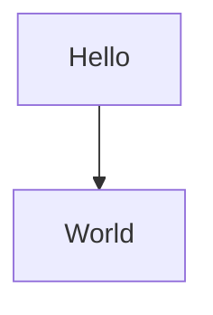

<div data-node-type="callout">
<div data-node-type="callout-emoji">💡</div>
<div data-node-type="callout-text">Au moment de la rédaction de cet article, la documentation Mermaid fait parfois encore référence aux directives comme moyen de configurer votre diagramme. Mais gardez à l'esprit que l'utilisation de directives ne fonctionne pas correctement dans certains moteurs de rendu.</div>
</div>

La méthode de configuration frontmatter a remplacé la méthode des directives depuis la version 10.5.0. Elle est basée sur le format YAML. Dans ce cas, vous devez utiliser un bloc YAML avant d'initialiser votre organigramme :

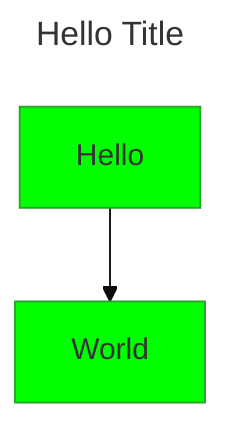

Les directives et les frontMatters sont limités en portée par rapport à d'autres méthodes de configuration. Ils s'appliquent uniquement au graphique situé sous l'instruction de configuration.

Pour les développeurs qui installent le package Mermaid, la méthode recommandée pour la configuration est l'utilisation de JavaScript. Mermaid est également configurable via un fichier de configuration JSON qui existe dans le dossier de la bibliothèque. Pour plus de détails sur ces méthodes, consultez le [chapitre de la documentation sur l'utilisation de l'API](https://mermaid.js.org/config/usage.html#configuration).

Vous pouvez trouver une liste des attributs et propriétés que vous pouvez affecter lors de la configuration de votre diagramme sur [cette page de la documentation Mermaid](https://mermaid.js.org/config/schema-docs/config.html).

Je n'entrerai pas dans les détails de la configuration dans cet article, bien que je puisse m'y référer quelques fois juste pour clarifier quelques points qui ne peuvent être faits qu'en configurant l'outil.

## Nœuds et formes dans Mermaid

Dans toute la documentation Mermaid, les **nœuds** sont utilisés comme un terme générique pour désigner toute étape ajoutée à l'organigramme. La documentation Mermaid introduit ensuite les **formes**, également appelées **formes de nœuds**. Elles sont les représentations de ce qui se passe dans ce nœud.

### Comment créer votre premier nœud (la forme de processus)

Ajouter un nœud à un organigramme avec Mermaid est très facile. Il suffit de penser à un nom unique – ou son **ID** selon la documentation Mermaid. Pour plus de clarté, je vais également me référer à cet ID comme étant l'**ID du nœud**.

L'ID du nœud doit être un mot unique sans espace et de préférence sans autres caractères que des caractères alphanumériques. L'ID du nœud sera valable pour le reste du script et vous l'utiliserez pour rappeler cette forme dans d'autres parties du script.

Ensuite, l'ajout du nœud consiste simplement à écrire l'ID du nœud sous la déclaration du type de diagramme (ici, c'est `A`) :

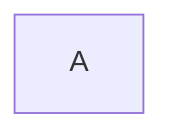


Remarquez que jusqu'à présent nous n'avons déclaré aucune forme pour ce nœud. Lorsqu'aucune forme n'est déclarée, la forme par défaut est un rectangle, qui est également la **forme de processus**.

<div data-node-type="callout">
<div data-node-type="callout-emoji">💡</div>
<div data-node-type="callout-text">Dans la syntaxe des organigrammes Mermaid, il n'y a aucun moyen de déclarer un nœud sans déclarer au moins une forme (la forme de processus)</div>
</div>

Le texte qui apparaît à l'intérieur de la forme est son **libellé**. Il existe différentes façons de libeller votre forme. Si vous ne libellez pas la forme, l'ID est utilisé comme libellé.

Vous pouvez être aussi descriptif que vous le souhaitez avec votre ID de nœud. Vous pouvez fournir un nom plus significatif qui peut également être lu comme un libellé :

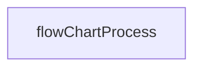


<div data-node-type="callout">
<div data-node-type="callout-emoji">💡</div>
<div data-node-type="callout-text">L'indentation n'est pas requise lors du scripting avec Mermaid, mais je le fais afin de garder le script organisé.</div>
</div>

En règle générale, le nom doit être un mot unique, avec certaines limitations lors de l'utilisation de caractères non alphanumériques. Par exemple, l'utilisation de certains caractères tels que les espaces n'est pas autorisée, comme dans ce cas : `flowChart Process`. Ici, le rendu entraînerait une erreur.

<div data-node-type="callout">
<div data-node-type="callout-emoji">💡</div>
<div data-node-type="callout-text">Il existe des mots et caractères réservés, tels que le mot « end » ou les parenthèses « (…) », qui ne peuvent pas être utilisés comme identifiant car ils ont des utilisations spécifiques. Mais vous pouvez utiliser n'importe quel mot réservé comme libellés lorsque les libellés sont spécifiés, tant que le libellé est enfermé entre guillemets.</div>
</div>

### Comment déclarer des formes et des libellés de formes avec Mermaid : deux syntaxes différentes

Dans Mermaid, vous déclarez un nœud avec un ID. Ensuite, vous définissez une **forme pour ce nœud**.

Vous devrez être conscient des deux syntaxes différentes disponibles lors de la déclaration de formes avec Mermaid. Elles sont toutes deux actives et peuvent coexister dans le même script tant que l'interpréteur est mis à jour à la dernière version.

Examinons les différentes façons de déclarer ces formes. Les exemples suivants montrent les deux syntaxes disponibles. Vous pouvez voir comment elles sont utilisées dans l'exemple suivant pour rendre des résultats similaires :

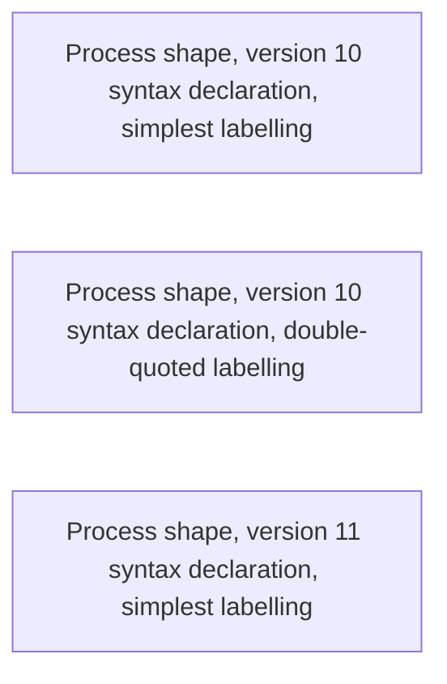


Remarquez que dans l'exemple ci-dessus, le premier nœud déclaré n'a pas nécessité de guillemets. C'est parce qu'il n'y avait pas de caractères spéciaux.

<div data-node-type="callout">
<div data-node-type="callout-emoji">💡</div>
<div data-node-type="callout-text">Dès que vous devez inclure des caractères ou mots réservés dans votre libellé, vous devez utiliser des guillemets.</div>
</div>

Les deux premiers nœuds déclarés sont des exemples de la syntaxe originale. Même si ce n'est pas complètement exact, nous nous référerons à ce type de syntaxe comme étant la **syntaxe version 10**.

Comme vous pouvez le voir à partir du script ci-dessus, la déclaration version 10 contient toujours :

1. le nom id,
    
2. suivi d'une combinaison de caractères qui décrivent la forme et qui agissent comme des caractères **d'ouverture** et **de fermeture** de la forme,
    
3. avec un texte de libellé entre les caractères de la forme.
    

Les caractères d'ouverture et de fermeture d'une forme sont principalement une combinaison de caractères de ponctuation. Des exemples de caractères spéciaux d'encadrement/ouverture de forme sont les parenthèses, les crochets, les accolades, « inférieur à », « supérieur à », et les barres obliques. La manière dont vous combinez les caractères d'encadrement déterminera le type de forme que vous souhaitez. Par exemple, dans le cas précédent, la forme Process a été déclarée comme `ID[<LABEL>]`.

<div data-node-type="callout">
<div data-node-type="callout-emoji">💡</div>
<div data-node-type="callout-text">Lors de la déclaration de formes avec la syntaxe version 10, vous devez toujours fournir un libellé. Si vous ne le faites pas, cela générera une erreur.</div>
</div>

À partir de la version 11.3, Mermaid a introduit des mises à jour de syntaxe visant une plus grande flexibilité. Le dernier exemple de notre script ci-dessus est écrit en utilisant cette nouvelle syntaxe.

Pour la déclaration version 11, vous utiliseriez une syntaxe de type objet JavaScript de cette manière : `ID@{shape: shape-alias, label: "Ceci est un libellé"}`. Nous nous référerons à ce type de syntaxe comme étant la **syntaxe version 11**. Avec cette version, les deux propriétés sont facultatives. Si aucune forme n'est fournie, elle affichera un rectangle à la place. Si vous n'ajoutez pas de libellé, alors le moteur de rendu utilisera l'ID du nœud comme libellé.

La documentation fournit une liste des **noms propres** pour chaque forme. De plus, vous pouvez utiliser plusieurs **alias** au lieu du nom propre comme valeur de forme. Dans ce projet, pour simplifier, nous nous en tiendrons à une seule option pour la nomination sans référence à savoir s'il s'agit d'un nom propre ou d'un alias. Si vous souhaitez obtenir la liste complète, consultez simplement [la documentation](https://mermaid.js.org/syntax/flowchart.html#expanded-node-shapes-in-mermaid-flowcharts-v11-3-0).

<div data-node-type="callout">
<div data-node-type="callout-emoji">💡</div>
<div data-node-type="callout-text">Que vous utilisiez la version 10 ou la version 11, vous devez définir les libellés et les formes <em>une seule fois</em> dans votre script.</div>
</div>

En d'autres termes, si vous avez un nœud qui est utilisé dans plus d'une relation dans votre script, vous n'aurez besoin de définir la forme que pour l'un de ces appels d'ID de nœud, comme dans l'exemple suivant :

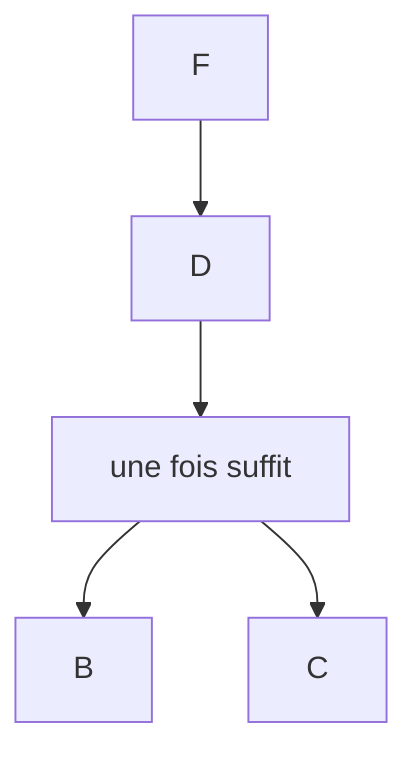


Mais remarquez dans cet exemple que j'ai commenté l'une des lignes. Si vous décommentez cette ligne, le libellé et la forme seront mis à jour avec les nouvelles définitions pour le nœud **A**. En général, si vous définissez différentes formes ou libellés pour le même nœud dans différentes parties du script, la dernière définition prendra le dessus.

J'ai remarqué que, lors de l'utilisation de la déclaration moderne, vous devez ajouter un espace après les deux-points (« : ») avant le texte, sinon l'interpréteur ne trouvera pas le texte.

> J'ai trouvé que celui-ci était incorrect (pas d'espace entre `shape` et `text`) :
> 
> {shape:text, label:text}
> 
> Et celui-ci était correct (un espace après `shape:`) :
> 
> {shape: text, label: text}

### Un aperçu rapide des formes les plus typiques

Il existe plus de 40 formes disponibles pour les organigrammes, comme le rapporte [la documentation Mermaid sur les formes](https://mermaid.js.org/syntax/flowchart.html#node-shapes). Dans la documentation Mermaid, les formes sont nommées en fonction de leur géométrie mais aussi en fonction de leur signification. Certaines de ces formes sont nommées uniquement en fonction de leur signification, surtout lorsqu'il n'existe pas de mot facile dans la terminologie géométrique que vous pouvez utiliser pour décrire la forme.

<div data-node-type="callout">
<div data-node-type="callout-emoji">💡</div>
<div data-node-type="callout-text">Au cas où vous souhaiteriez simplement une liste de formes essentielles pour commencer à travailler sur votre organigramme mais que vous ne savez pas lesquelles choisir, vous pouvez consulter mon article sur les organigrammes, où je vous donne quelques idées.</div>
</div>

Voici les formes les plus courantes que vous utiliserez généralement lors de la création d'un organigramme :


Comme vous pouvez le voir dans le tableau ci-dessus, nous avons les formes suivantes :

* Un point de départ ou de fin (certaines personnes représentent ces types de points avec des ovales, mais dans la documentation Mermaid, le point de départ est représenté par un cercle, tandis que le point de fin est représenté par deux cercles imbriqués)
    
* Flèche (un connecteur qui montre les relations entre les formes)
    
* Parallélogramme (une entrée ou une sortie)
    
* Rectangle (un processus)
    
* Losange (une décision)
    

Passons en revue chacune de ces formes maintenant et voyons comment les créer avec Mermaid.

### La forme Terminateur

Comme mentionné ci-dessus, Mermaid utilise des cercles comme représentation du point de départ et du point de fin au lieu de l'ovale. Les points de départ et de fin marquent les points de début et de fin du processus/système.

Si nous nous en tenons à la documentation Mermaid, la façon de les créer dans Mermaid en utilisant les versions 10 et 11 est la suivante :

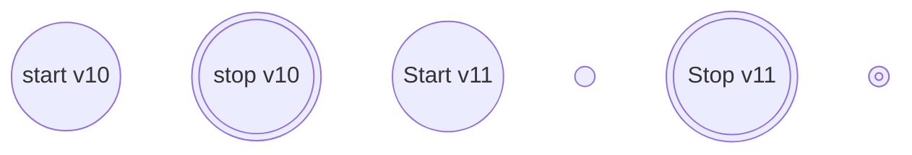


Dans Mermaid v11, il existe deux types de cercles que vous pouvez utiliser comme points de départ et de fin : une petite forme et une forme régulière. Les petites formes ne rendent pas le libellé.

Si vous décidez d'utiliser l'ovale comme terminal (points de départ/fin), le simple cercle peut acquérir d'autres significations. Par exemple, il peut devenir une **forme de connecteur** (celui qui est le point de sortie d'un organigramme qui continue dans un organigramme séparé ou un autre point du même organigramme). Ou il peut devenir un autre type de connecteur qui rassemble plusieurs lignes de flux en une seule ligne de flux (non pas comme une jonction multiprocessus, mais juste une qui réduit le nombre de liens lorsque vous cherchez de la clarté).

Si vous préférez utiliser l'ovale (qui dans Mermaid est appelé la **forme terminale**), vous pouvez le créer avec le code suivant :

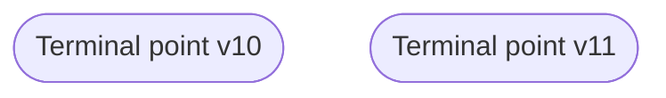


### La forme Flèche (Rectangle)

Nous en parlerons plus tard dans cet article.

### La forme Entrée/Sortie (Parallélogramme)

Vous pouvez utiliser la forme parallélogramme comme une abstraction pour les données disponibles pour l'entrée ou la sortie ou pour les ressources utilisées ou générées. Elle indique que certaines informations sont requises à ce stade du flux de travail.

Vous pouvez créer cette forme avec Mermaid en utilisant les versions existantes comme suit :

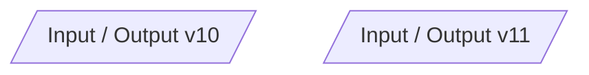


### La forme Processus (Rectangle)

Vous pouvez représenter un processus à l'aide d'un rectangle dans un organigramme. Il représente une **étape unique** dans votre flux de travail, comme une expression (par exemple, `x = y*x²`), un **bloc d'instructions entier**, comme « `parcourir le tableau et mettre à jour les valeurs en multipliant par 2` », ou un **sous-processus entier**, comme une fonction existante ou même un module.

Il est également appelé une boîte (en utilisant les deux versions) :

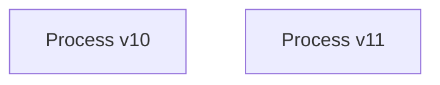


### La forme Décision (Losange)

Une décision est représentée par un losange. C'est une abstraction pour un **test de condition**, une question OUI/NON, ou VRAI/FAUX. C'est l'équivalent d'une instruction IF/ELSE en codage.

En utilisant les versions 10 et 11, vous pouvez faire un losange comme suit :

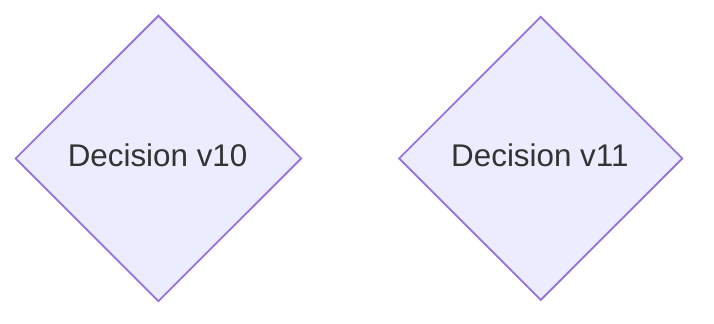


### Markdown et HTML dans Mermaid

L'une des fonctionnalités les plus utiles de Mermaid est qu'il accepte la syntaxe Markdown pour son étiquetage, ainsi que HTML. Je vous conseillerais d'utiliser la notation Markdown, car la notation HTML peut entraîner des erreurs silencieuses.

L'utilisation de guillemets doubles et de Markdown vous permet d'utiliser des caractères spéciaux dans vos étiquettes. Mais avec la syntaxe Markdown, vous pouvez également accéder à diverses fonctionnalités Markdown.

Pour utiliser Markdown, vous devez enfermer votre texte entre guillemets doubles (" ") suivis d'un backtick (\`), comme suit :

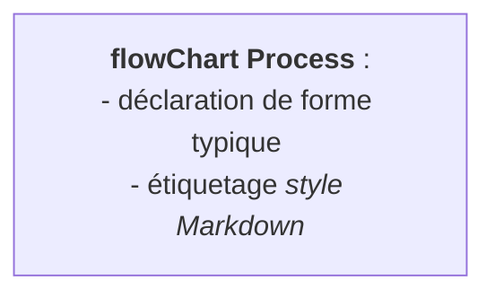


<div data-node-type="callout">
<div data-node-type="callout-emoji">💡</div>
<div data-node-type="callout-text">Soyez conscient que toutes les fonctionnalités Markdown ne sont pas reconnues.</div>
</div>

Maintenant que vous savez comment utiliser certaines formes de base ainsi que comment utiliser Markdown dans Mermaid, passons à l'étape suivante : comment dessiner des relations entre les formes.

### Arêtes (Relations) et étiquettes d'arêtes dans Mermaid

Les **arêtes**, également appelées **flèches** ou **liens** dans la documentation de Mermaid, sont les connexions entre les nœuds. Elles sont officiellement appelées **forme de ligne de flux** par la norme ANSI. Cela est dû au fait qu'un lien peut ne pas être une flèche dans certaines situations.

<div data-node-type="callout">
<div data-node-type="callout-emoji">💡</div>
<div data-node-type="callout-text">Je vais les appeler arêtes ou liens ici, pas flèches.</div>
</div>

Dessiner des relations entre deux nœuds est aussi facile qu'ajouter des nœuds. Pour dessiner un simple lien de flèche entre deux formes, vous devez simplement faire ce qui suit :

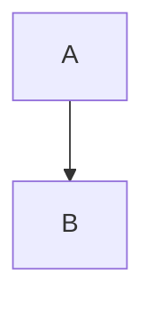


Techniquement, un lien dans Mermaid est la combinaison d'une **ligne** et d'un **marqueur**. Le marqueur est la petite icône ajoutée à la fin de la ligne. Il existe plusieurs types de liens/arêtes que vous pouvez dessiner en combinant les différents types de lignes et de marqueurs que Mermaid fournit :

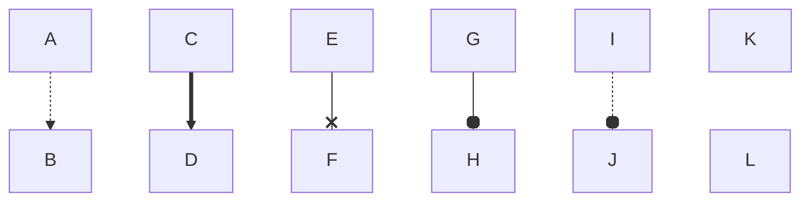


<div data-node-type="callout">
<div data-node-type="callout-emoji">💡</div>
<div data-node-type="callout-text">Soyez conscient que "o" et "x" deviennent des caractères réservés lorsqu'ils sont utilisés comme marqueurs. Si vous devez les utiliser comme premier caractère de l'ID du nœud, laissez un espace après l'opérateur de bord, ou utilisez des lettres majuscules.</div>
</div>

Les arêtes peuvent également être bidirectionnelles, par exemple :

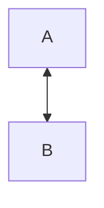


Lors du dessin des arêtes, vous pouvez utiliser du "sucre syntaxique" dans votre script pour réduire la redondance lors de la définition des relations entre les nœuds. Par exemple, si vous avez un nœud **B** situé au milieu d'une séquence, vous pouvez simplifier votre script en enchaînant les relations au lieu de spécifier à plusieurs reprises les connexions entre **B** et ses nœuds précédents et suivants. De plus, les opérateurs peuvent indiquer des relations croisées entre les mêmes nœuds.

Le script suivant illustre la différence entre une syntaxe verbeuse (montrée comme commentaires) et une syntaxe simplifiée utilisant l'enchaînement et les opérateurs :

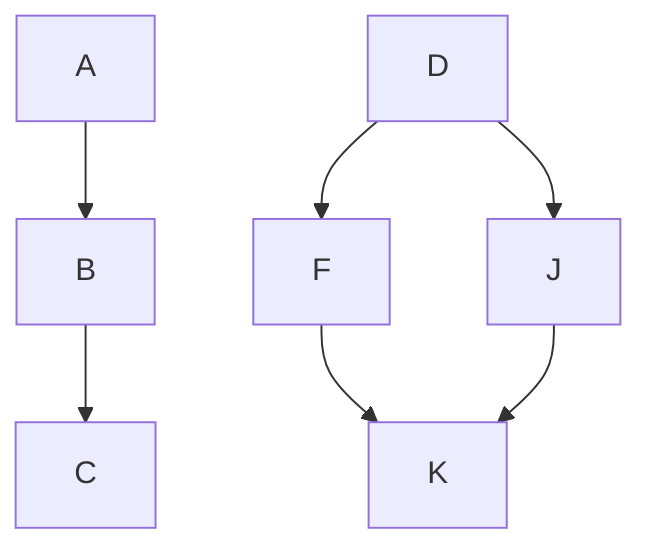


L'étiquetage des liens est également possible avec la syntaxe Mermaid, et c'est très facile à faire. Il existe différentes façons d'étiqueter une seule flèche, comme expliqué dans les commentaires du script : soit en insérant l'étiquette entre l'opérateur de ligne (`—`), soit en utilisant des **barres verticales** (`|...|`) placées après le marqueur (ou lorsqu'il n'y a pas de marqueur, après l'opérateur de ligne) et avant de déclarer le nœud :

```mermaid
flowchart TD
    %% insertion de l'étiquette entre l'opérateur de lien
    A --"Ceci est une étiquette **entre l'opérateur de lien**"--> B

    %% ajout d'une étiquette de lien entre des barres verticales, |...|
    A --> |"Ceci est une étiquette **entre des caractères spéciaux**"| B
```


Les deux formats acceptent l'étiquetage simple entre guillemets doubles ou de style Markdown. J'ai trouvé plus confortable d'ajouter des étiquettes aux liens en utilisant les barres verticales.

<div data-node-type="callout">
<div data-node-type="callout-emoji">💡</div>
<div data-node-type="callout-text">L'étiquetage des arêtes est soumis aux mêmes restrictions que l'étiquetage des formes lors de l'utilisation de caractères et de mots réservés.</div>
</div>

Maintenant, avant de passer à la section suivante, examinons un exemple rapide utilisant ce que nous avons appris jusqu'à présent ! J'utiliserai le format de syntaxe typique pour l'exemple. Le voici :

```mermaid
flowchart TD
    A["Processus A"] --> |"Le processus A est suivi du processus B"|B["Processus B"]
    C["Processus C"] -.-> |"Le processus C est lié au processus B"| B
    D["Processus D"] --> |"Le processus D est suivi du processus C"| C
```


### Sous-graphes

Dans Mermaid, vous pouvez également regrouper des sections de nœuds sous des sous-graphes. Voici un exemple directement issu de la documentation Mermaid sur la façon de créer la syntaxe pour un sous-graphe :

```mermaid
flowchart LR
  subgraph TOP
    direction TB
    subgraph B1
        direction RL
        i1 -->f1
    end
    subgraph B2
        direction BT
        i2 -->f2
    end
  end
  A --> TOP --> B
  B1 --> B2
```


Remarquez que dans cet exemple, nous avons également pu déclarer différentes directions de flux pour les différents (sous) graphes.

Mais la documentation Mermaid précise également un avertissement : si un nœud à l'intérieur d'un sous-graphe est connecté à un autre nœud à l'extérieur de ce sous-graphe, toute déclaration de direction de sous-graphe sera remplacée par celle déclarée pour le sous-graphe parent le plus externe. Voici un exemple directement issu de la documentation Mermaid :

```mermaid
 flowchart LR
    subgraph subgraph1
        direction TB
        top1[top] --> bottom1[bottom]
    end
    subgraph subgraph2
        direction TB
        top2[top] --> bottom2[bottom]
    end
    outside --> subgraph1
    outside ---> top2
```


Dans le cas ci-dessus, le `subgraph2` a été déclaré comme un sous-graphe de haut en bas, mais a hérité de la direction du sous-graphe externe qui a été déclaré comme un sous-graphe de gauche à droite. Cela s'est produit à cause de la connexion entre deux nœuds appartenant à différents sous-graphes à différents niveaux de déclaration (le `subgraph2` est à l'intérieur du sous-graphe "global"). Dans ce cas, `subgraph2` est un enfant du sous-graphe global, donc il hérite de sa direction.

## Comment ajouter du style avec Mermaid

Le style dans Mermaid est très conforme à CSS.

Commençons par le style des formes. Une façon de le faire est d'utiliser la commande `style`. Elle fonctionne comme suit :

1. Utilisez le mot réservé `style`,
    
2. suivi du nom ID de la forme que vous souhaitez styliser,
    
3. puis indiquez les propriétés que vous souhaitez modifier et leurs nouvelles valeurs.
    

Nous mettrons en œuvre ce modèle dans l'exemple suivant. Supposons que je souhaite différencier en utilisant différentes couleurs, et changer la couleur des lettres des étiquettes :

```mermaid
flowchart TD
    A([ceci devrait être noir avec des lettres blanches]) --> B([ceci devrait être gris avec des lettres blanches])
    style A fill: black, color: white
    style B fill:grey, color:#fff
```


Il est important de comprendre que dans Mermaid, le style est lu au niveau du nœud, pas au niveau de la forme. Vous pouvez également appliquer différents styles pour le même nœud. Ils sont lus séquentiellement dans l'ordre d'apparition, donc pour deux styles en compétition, le dernier sera le valide.

Vous pouvez placer l'expression `style` n'importe où dans votre code, mais je vous recommande de le faire à la fin du script afin que vous puissiez suivre tous les changements.

<div data-node-type="callout">
<div data-node-type="callout-emoji">💡</div>
<div data-node-type="callout-text">Gardez à l'esprit que si, lors du stylage, vous faites référence à un ID de nœud inexistant, Mermaid créera un nouveau nœud sans vous avertir.</div>
</div>

Une autre façon utile d'ajouter du style à vos organigrammes, surtout lorsque vous souhaitez ajouter le même style à plus d'un nœud, est de *définir des classes*. Pour cela, vous pouvez utiliser le mot spécial `classDef` comme suit :

1. Écrivez `classDef` sur une ligne
    
2. suivi du nom que vous avez choisi pour la classe
    
3. suivi des attributs de style que vous souhaitez modifier et de leurs nouvelles valeurs.
    

Pour appliquer la classe :

1. Trouvez les nœuds pour lesquels vous souhaitez implémenter le changement
    
2. ajoutez trois deux-points (`:::`) à la fin de la déclaration du nœud, et si vous étiquetez, à la fin de l'expression d'étiquetage
    
3. ajoutez le nom de la classe.
    

L'exemple suivant montre comment ajouter des classes aux formes :

```mermaid
flowchart TD
    A[étiquette A, sans classe] --> B[étiquette B, classe bar]:::bar
    B --> C[étiquette C, classe foo]:::foo
    C --> D[étiquette D, classe bar]:::bar
    C --> E[étiquette E, classe foo]:::foo
    classDef foo fill:green, color:#fff
    classDef bar fill:orange, color:#666
```


<div data-node-type="callout">
<div data-node-type="callout-emoji">💡</div>
<div data-node-type="callout-text">Comme pour la déclaration de forme, les classes peuvent être attribuées à un nœud une seule fois, peu importe où dans l'organigramme. Mais vous ne pouvez ajouter qu'une seule classe par nœud.</div>
</div>

Malheureusement, ce type de `classDef` n'est applicable qu'aux **formes** utilisant la **syntaxe version 10**.

Une chose que la documentation ne mentionne pas est que vous pouvez également styliser les sous-graphes. En fait, le nom que vous donnez à un sous-graphe devient son ID.

Les formats de style applicables aux formes fonctionnent presque de la même manière pour les sous-graphes. Mais l'utilisation de la commande `classDef` ne fonctionne que si le sous-graphe est également un nœud dans le diagramme.

L'exemple suivant montre l'application de la commande `style` et de la commande `classDef` et comment vous pouvez les utiliser pour ajouter du style aux sous-graphes :

```mermaid
 flowchart LR
    %% l'application d'une classe comme suit donnera une erreur :
    %% "subgraph subgraph1:::asNode"
    subgraph subgraph1
        direction TB
        top1[top] --> bottom1[bottom]
    end
    subgraph subgraph2
        direction TB
        top2[top] --> bottom2[bottom]
    end
    outside:::asNode --> subgraph1:::asNode
    outside ---> top2
    
    style subgraph2 fill:orange
    classDef asNode fill:grey, color:orange
```


Si vous souhaitez styliser les arêtes, vous devez procéder différemment. Ce qui a réellement fonctionné pour moi est l'utilisation d'un autre mot réservé, `linkStyle`, qui style la **ligne** de l'arête.

Le problème avec les arêtes est qu'elles n'ont pas d'IDs : elles sont traitées davantage comme faisant partie d'un tableau, donc elles doivent être référencées avec un index – qui ne correspondra pas toujours à l'arête que vous souhaitez. Voici un exemple, basé sur [cette discussion](https://forum.obsidian.md/t/styling-links-in-mermaid/38789/2) :

```mermaid
flowchart TD

A --> B
B --> C
B --> D
D --> E
D --> F

linkStyle default stroke:red
linkStyle 0 stroke-width:4px,stroke:green
linkStyle 3 stroke:blue
linkStyle 4 stroke:blue
```


L'autre problème avec le style des arêtes est que les marqueurs sont découplés des lignes. Donc cette méthode n'affectera pas le marqueur.

En général, j'ai trouvé que l'adoption d'un style cohérent pour les arêtes n'est pas simple avec Mermaid. Mais il se peut que pour la plupart de vos projets, le style des arêtes ne soit pas nécessaire.

Outre la décision du style de la ligne, la documentation suggère que nous pouvons appliquer un certain style à la courbure de la ligne en configurant le diagramme à l'aide de directives :

```mermaid
%%{ init: { 'flowchart': { 'curve': 'stepBefore' } } }%%
graph LR
A --> B
B --> C
B --> D
D --> E
D --> F
```

Le changement devrait s'appliquer à toutes les arêtes de l'organigramme et il devrait être basé sur la [bibliothèque d3-shape](https://d3js.org/d3-shape/curve). Mais à ce jour, je n'ai pas pu configurer de manière fiable la courbure en utilisant soit la méthode des directives, soit la méthode frontMatter.

Gardez à l'esprit que les utilitaires pour styliser les arêtes avec Mermaid pourraient s'améliorer à l'avenir. En attendant, je vous suggère de demander à des communautés dédiées comment mieux styliser les liens avec Mermaid si c'est quelque chose que vous aimeriez implémenter pour vos diagrammes. Partagez vos découvertes avec moi pour compléter cet article !

Enfin, une autre façon dont nous pouvons ajouter plus de style en affectant **les thèmes, les dispositions et les apparences**, qui sont des formats de style pré-établis que vous pouvez modifier. Ils affecteront le style de l'ensemble du diagramme.

Par exemple, extrait de la documentation Mermaid sur la syntaxe générale, voici [ce script utilisant la méthode frontMatter](https://mermaid.js.org/intro/syntax-reference.html) :

```mermaid
---
config:
  layout: elk
  look: handDrawn
  theme: dark
---
flowchart TB
  A[Start] --> B{Decision}
  B -->|Yes| C[Continue]
  B -->|No| D[Stop]
```


Il existe d'autres façons d'ajouter du style, mais elles sont plus avancées. Pour simplifier, je ne discuterai pas de ces solutions plus avancées et vous inviterai plutôt à explorer la documentation Mermaid.

### Directives ou frontMatter ?

Comme je l'ai expliqué précédemment dans cet article, vous pouvez configurer certains attributs de l'organigramme avec des directives ou un frontMatter YAML. La documentation suggère que les directives sont obsolètes.

Ces méthodes peuvent être utilisées pour configurer l'apparence du champ entier du diagramme et/ou certaines propriétés de l'organigramme.

Mais j'ai pu modifier certaines propriétés de l'organigramme avec frontMatter ainsi qu'avec des directives. Par exemple, jetez un coup d'œil aux deux exemples suivants, où l'attribut `fill` est défini en fonction d'un modèle `theme`, et l'attribut `nodeSpacing` est également modifié :

```mermaid
---
title: Hello Chart
config:
    theme: base
    flowchart:
        nodeSpacing: 200
---
flowchart LR
A --> B
B --> C
B --> D
D --> E
D --> F
```


```mermaid
%%{init:{'theme': 'base', 'flowchart':{'nodeSpacing': 200}}}%%
graph LR
A --> B
B --> C
B --> D
D --> E
D --> F
```


Les résultats des deux sont presque les mêmes, bien que cette fois-ci je n'ai pas pu ajouter de titre à celui utilisant une directive. Il doit y avoir certains avantages à préférer l'approche YAML frontMatter, mais sachez que vous pouvez toujours utiliser les deux pour certains cas.

Pour plus de détails sur les propriétés configurables des organigrammes en utilisant ces méthodes et JavaScript, [visitez la documentation Mermaid](https://mermaid.js.org/config/schema-docs/config-defs-flowchart-diagram-config.html). Si vous souhaitez des exemples sur la façon de configurer les thèmes, [suivez cette ressource](https://mermaid.js.org/config/theming.html). Au moment de la rédaction de cet article, la configuration via des directives ou frontMatter est quelque chose que je n'ai pas exploré en profondeur. Je vous invite à essayer et à me faire savoir ce que vous découvrez.

### Interactivité

Une autre chose que vous pouvez faire avec Mermaid est [ajouter une simple interactivité](https://mermaid.js.org/syntax/flowchart.html#interaction). Vous pouvez le faire en utilisant le modèle suivant, en utilisant les mots réservés `click`, `call` et `callback`, où `callback` est le nom d'une fonction de rappel :

```mermaid
click nodeId callback "Info-bulle au survol"
click nodeId externalLink "Info-bulle au survol"
click nodeId call callback() "Info-bulle au survol"
```

Ce type d'interactivité est applicable lorsque vous avez rendu l'organigramme Mermaid en HTML et que vous avez un fichier JavaScript associé. Mais pour des solutions simples, vous pouvez également faire des appels à des pages externes en utilisant le modèle suivant, comme suggéré par la documentation :

```mermaid
flowchart LR
    A-->B
    B-->C
    C-->D
    click A callback "Info-bulle pour un rappel"
    click B "https://www.github.com" "Ceci est une info-bulle pour un lien"
    click C call callback() "Info-bulle pour un rappel"
```

Soyez conscient que la configuration *du projet entier*, et non seulement la configuration Mermaid, peut vous empêcher d'utiliser les fonctionnalités interactives avec succès. Par exemple, le script donné ci-dessus ne peut pas fonctionner à partir de cet article.

Visitez la ressource recommandée par la documentation elle-même pour un exemple fonctionnel pour les info-bulles, mais pas de liens : [https://jsfiddle.net/yk4h7qou/2/](https://jsfiddle.net/yk4h7qou/2/). Consultez les exemples dans la documentation Mermaid pour voir comment fonctionnent les liens, mais les info-bulles ne fonctionneront pas : [https://mermaid.js.org/syntax/flowchart.html#interaction](https://mermaid.js.org/syntax/flowchart.html#interaction).

Si c'est quelque chose que vous souhaitez essayer, lisez attentivement la documentation pour plus d'informations sur ce que vous devez prendre en considération lors de la mise en œuvre de ce type de solution.

### Mermaid, CSS et SVG

<div data-node-type="callout">
<div data-node-type="callout-emoji">💡</div>
<div data-node-type="callout-text">La documentation Mermaid ne fait aucune référence à la manière dont les SVGs sont structurés. Ici, j'ai fait une rapide revue sur la manière dont les SVGs sont rendus dans les versions les plus récentes.</div>
</div>

Vous pouvez aller plus loin que les fonctionnalités fournies par Mermaid en agissant sur les SVGs que l'outil produit. Le SVG résultant peut être stylisé, les formes peuvent être modifiées, et ainsi de suite en fonction de vos propres besoins et exigences.

Jusqu'à présent, j'ai trouvé que Mermaid produit un SVG qui a une structure de niveau supérieur comme suit :

```bash
svg -----
        |
        (group)
        |
        markers and defs
        |
        group: class root ----
                              |
                              group: clusters (subgraphs)
                              |
                              group: edgePaths (edges)
                              |
                              group: edgeLabels (edge labels)
                              |
                              group: nodes
```

Tous ces éléments SVG peuvent contenir d'autres groupes pour chaque nœud, étiquette, arête ou sous-graphe que vous ajoutez au diagramme. Pour chacun d'eux, Mermaid attribue une nomenclature spéciale, qui n'est pas strictement dynamique. Par exemple, il peut utiliser le même nom d'ID pour tous les organigrammes que vous créez sur la même page.

Mais vous pouvez toujours intervenir dans le SVG et ajouter des modifications spécifiques. Par exemple, si vous n'avez pas d'autre SVG sur la même page sur laquelle vous travaillez, vous pouvez modifier toutes les formes de processus en utilisant le style suivant sur votre page :

```xml
<style>
  .cssClass > rect {
    fill: #ff0000;
    stroke: #ffff00;
    stroke-width: 4px;
  }
</style>
```

Remarquez que cela concerne davantage le SVG que Mermaid, et approfondir cela dépasse le cadre de cet article. Je vous conseille de lire davantage sur les SVGs si vous souhaitez savoir comment post-traiter les diagrammes Mermaid avec des fonctionnalités supplémentaires une fois que vous avez créé un diagramme.

Je recommande également de lire la [section d'utilisation de l'API Mermaid](https://mermaid.js.org/config/usage.html) dans la documentation Mermaid pour mieux comprendre comment appliquer JavaScript aux configurations Mermaid et à la manipulation de diagrammes.

## Conclusion

Cet article vous a introduit aux bases de Mermaid pour créer des organigrammes. Nous avons couvert un aperçu de Mermaid, la syntaxe des organigrammes, les formes, les liens, les sous-graphes, les thèmes et les options de style. Des conseils clés et des exemples, y compris certains non trouvés dans la documentation, sont inclus pour vous aider à apprendre la syntaxe.

Avec ce guide, vous devriez vous sentir confiant dans l'utilisation de Mermaid pour intégrer des organigrammes dans votre flux de travail. Les organigrammes sont un outil visuel précieux pour améliorer la compréhension, et Mermaid rend leur création rapide et facile.

Pour explorer davantage, envisagez de plonger plus profondément dans la bibliothèque Mermaid pour d'autres types de diagrammes, une personnalisation avancée et une interactivité. Si vous avez besoin de plus d'aide, consultez mon autre article sur la construction d'organigrammes. Bon codage !